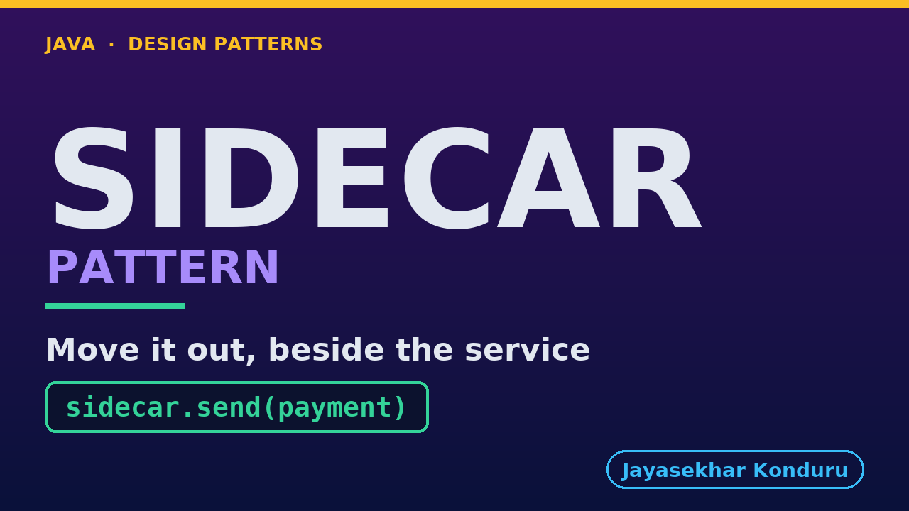

# YouTube — Sidecar Pattern

Everything needed to publish `video/sidecar-pattern-explained.mp4`. Copy the fields straight out of this file.

Chapter timings are generated from the video's `.srt`. Re-run `python3 docs/make_youtube_docs.py sidecar` after any change to the narration, or they will be wrong.

## Title

```
Sidecar Pattern in Java - Retry Code Moves Out
```

46 characters — under the 60 YouTube shows before truncating in search results.

## Description

The first two lines are what a viewer sees above the fold, so they carry the hook rather than the boilerplate.

```
Learn the Sidecar pattern in Java 21, starting from an online shop that charges cards in four places — checkout, refunds, subscription billing and marketplace payouts — with one payment provider behind all four. Each of the four teams had to decide the same four things before going live: how many times to retry, when to give up, which TLS profile to present, and what to count. Sixteen copies of four decisions, and not one of them a fact about the shop. When the provider changes its retry policy in March, the change lands in three services and misses the fourth — not through carelessness, but because there was no fourth place to look. Three weeks later, at two in the morning, that stale copy spends half the account's attempt allowance and a completely correct service is refused. Then we stand a proxy beside each service, state the policy once, and run the same night clean. Then the bill, which is most of the second half: twice as many processes to run and patch, a second thing that can be down and takes every call with it, and one millisecond on every call — the arithmetic that decides whether a service mesh belongs in your system. Finishing with the admission most write-ups skip: in one program this structure is Decorator, and what makes it a different pattern is not the code but where the code runs. No prior design-pattern knowledge needed, and no Docker, Kubernetes or network — it all runs in one JVM. Full source code and written notes are in the repository.

CHAPTERS
00:00 Introduction
01:24 The Scenario
02:21 Sixteen Copies of Four Decisions
03:40 March — The Change Lands Three Times
05:02 The Incident Is an Absence, Not a Mistake
05:57 Two In The Morning, Three Weeks Later
07:21 The Pattern
08:26 Who Does What
09:46 What Is Left In The Service
10:50 The Same Night, With A Proxy Beside Each Service
11:53 The Bill, Part One — Twice As Many Things To Run
13:05 The Bill, Part Two — A Second Thing That Can Be Down
14:11 The Bill, Part Three — One Millisecond, On Every Call
15:25 The Admission — This Is Decorator, Until You Deploy It
16:40 What to Take Away
17:53 Thanks for Watching

SOURCE CODE, WRITTEN NOTES AND AN INTERACTIVE ANIMATION
https://github.com/jk-boot-up/java-design-patterns/tree/main/gradle-java/platform-design-patterns/sidecar-pattern

WHAT YOU NEED FIRST
Java 21 and a working knowledge of classes and interfaces. No prior design-pattern knowledge is assumed. The full prerequisites are in docs/prerequisites.md in the repository.
```

## Chapters

YouTube renders these as chapters only if there are at least three and the first is at `00:00`.

```
00:00 Introduction
01:24 The Scenario
02:21 Sixteen Copies of Four Decisions
03:40 March — The Change Lands Three Times
05:02 The Incident Is an Absence, Not a Mistake
05:57 Two In The Morning, Three Weeks Later
07:21 The Pattern
08:26 Who Does What
09:46 What Is Left In The Service
10:50 The Same Night, With A Proxy Beside Each Service
11:53 The Bill, Part One — Twice As Many Things To Run
13:05 The Bill, Part Two — A Second Thing That Can Be Down
14:11 The Bill, Part Three — One Millisecond, On Every Call
15:25 The Admission — This Is Decorator, Until You Deploy It
16:40 What to Take Away
17:53 Thanks for Watching
```

## Tags

```
sidecar pattern, service mesh java, nginx proxy, design patterns, java design patterns, gang of four, java 21, software design, clean code, object oriented design, java tutorial, ecommerce, programming tutorial
```

210 characters, under YouTube's 500 limit.

## Thumbnail



**Upload `docs/thumbnail.png`** — 1280×720, the size YouTube recommends, generated by `docs/make_thumbnails.py`. It is deliberately not the same image as the video's opening frame: a thumbnail is judged at about 360 pixels wide in a search result, so this one carries only the pattern name, one line of promise and one short piece of code, each set large enough to survive the shrink.

`video/poster.png` is the 1920×1080 opening frame, produced by the video build. It stays in the repository as the title card; it is not what gets uploaded.

YouTube will not pick the thumbnail up on its own — upload it under **Details → Thumbnail → Upload file**. A custom thumbnail requires a verified channel.

## Upload checklist

- [ ] Upload `video/sidecar-pattern-explained.mp4` (1080p, H.264, 30 fps, AAC 48 kHz — already YouTube's recommended settings, no re-encode needed)
- [ ] Set the video language to **English** first, or the subtitle option may not appear
- [ ] Add subtitles: *Video elements → Add subtitles → Upload file → With timing* → `video/sidecar-pattern-explained.srt`
- [ ] Upload `docs/thumbnail.png` as the thumbnail — do not let YouTube auto-pick a frame
- [ ] Paste the title, description and tags from above
- [ ] Add to the **Java Design Patterns** playlist, in learning order
- [ ] Wait for 1080p processing before sharing the link — code slides are unreadable at 360p

## Cards and end screen

End screen links to whichever pattern video goes up next — set it at upload time rather than assuming an order.

Add a card partway through pointing at the playlist, so a viewer who arrives at this pattern from search can find the rest of the series.

## Runtime

Approximately 18:35, narrated at 145 words per minute.
