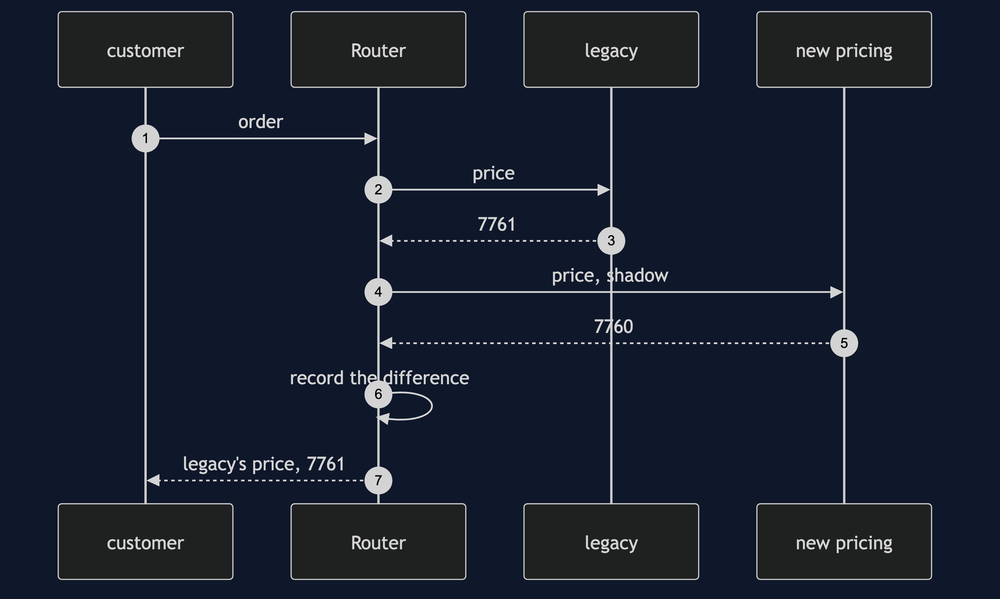

# Strangler Fig Pattern

```
src/main/java/com/jk/explore/stranglerfig/
├── MigrationDemo.java               composition root — the six acts
│
├── domain/                          ← what the checkout does
│   ├── Order.java  Line.java  Pricing.java  Result.java
│   └── Capability.java  Pricer.java  StockKeeper.java  Payer.java  Mailer.java
├── legacy/
│   └── LegacyCheckout.java           one large class: pricing, stock, payment and email
├── fresh/                           ← the rewrite, one capability at a time
│   ├── NewPricing.java  NewStock.java  NewPayment.java  NewMailer.java
├── route/                           ← the pattern
│   ├── Router.java                   a switch per capability, and shadow reads
│   └── Route.java                    LEGACY, NEW, or SHADOW
└── migration/
    ├── BigBang.java                  the rewrite, and its all-or-nothing Monday
    ├── Orders.java                   a fixed-seed stream of orders
    └── StallModel.java               the migration that stops half-finished
```

**Replace a system by growing the new one around the old, one capability at a time, behind a router that can send each capability to either.**

This is the last project in [platform-design-patterns](..), and it reads best after the others: the router is the kind of proxy [Sidecar](../sidecar-pattern) and [Backends for Frontends](../backends-for-frontends-pattern) already showed. The subject is the shape of a system as it changes over time. It also names the outcome nobody warns you about: the migration that stalls half-finished.

## Run

```bash
./gradlew run
```

Six acts. Orders come from a fixed-seed generator, so every count is the same every run. The costs in act six are a stated model, not a measurement.

```
STRANGLER FIG — replacing the checkout without a cutover weekend

ONE. The big-bang rewrite.
  26 weeks of work in parallel with production. orders the new code served in that time: 0.
  no feedback from real traffic for half a year, and then a cutover weekend.
  Monday: 1 of 4 capabilities is faulty: payment declines large orders.
  the only rollback is all-or-nothing, so 4 of 4 go back, including the three that were fine.

TWO. The pattern: a router, and one switch per capability.
  every capability starts on the legacy checkout: PRICING=LEGACY STOCK=LEGACY PAYMENT=LEGACY EMAIL=LEGACY
  pricing moves first: PRICING=NEW STOCK=LEGACY PAYMENT=LEGACY EMAIL=LEGACY
  an order through the router: priced by the new code, everything else by legacy. succeeded: true
  the customer saw no cutover. the checkout never stopped.

THREE. Shadow reads: move on evidence, not on hope.
  201 orders served by legacy, and priced by the new code as well, and compared.
  they disagreed on 29. the first three:
    order 7: legacy Pricing[subtotalPence=6467, vatPence=1294, deliveryPence=0, totalPence=7761], new Pricing[subtotalPence=6467, vatPence=1293, deliveryPence=0, totalPence=7760]
    order 12: legacy Pricing[subtotalPence=3794, vatPence=758, deliveryPence=495, totalPence=5047], new Pricing[subtotalPence=3794, vatPence=759, deliveryPence=495, totalPence=5048]
    order 23: legacy Pricing[subtotalPence=5427, vatPence=1086, deliveryPence=0, totalPence=6513], new Pricing[subtotalPence=5427, vatPence=1085, deliveryPence=0, totalPence=6512]
  two causes, both found before a customer paid a penny differently: VAT rounded per line against once,
  and free delivery from fifty pounds against over fifty pounds.
  after the team decides to reproduce legacy exactly: 0 differences in 201. now pricing can move.

FOUR. Rollback: one capability, not the whole checkout.
  payment is on the new code, and misbehaves on a large order. succeeded: false, charge: null.
  one switch flipped: payment alone goes back to legacy. succeeded: true, charge: L-1.
  routes now: PRICING=NEW STOCK=LEGACY PAYMENT=LEGACY EMAIL=LEGACY. pricing stayed on the new code the whole time.

FIVE. The bill: two systems, and two versions of the truth.
  stock moved to the new service, and an order took 5 of SKU-2.
  the new service says 395 on hand. the legacy table, which its reports and its invoices still read, says 400.
  two tables claim to be the truth, and someone must decide which, and keep them in step until legacy is gone.
  and every business rule that changes while both are live is changed twice: in legacy, and in the new code.

SIX. The failure mode that actually happens: the migration stalls.
  a cost model, stated as one. all legacy costs 100 a quarter, all new costs 60. while both are live there is an extra 35 for running two.
  quarter   stalled: moved  running  total     finished: moved  running  total
  1                  1      125      155                1      125      155
  2                  2      115      145                2      115      145
  3                  2      115      115                3      105      135
  4                  2      115      115                4      60       90
  5                  2      115      115                4      60       60
  6                  2      115      115                4      60       60
  six quarters, cumulative: stalled 760, finished 645.
  budget goes elsewhere after quarter 2. two of four capabilities moved, and it stays that way.
  the stalled state costs 115 a quarter, more than all legacy (100) and more than all new (60). two checkouts, forever, is worse than either endpoint.
  verdict: use it, but treat the end date and the decommissioning of legacy as part of the migration, not a later job.
  where you have met this: an API gateway or proxy sending one path to the old service and another to the new.
```

## Test

```bash
./gradlew test
```

2 test classes, 9 test methods, offline, offline, with nothing installed.

## Technologies and versions

| What | Version | Why it is here |
| --- | --- | --- |
| Java | 21 | The repository standard, via the Gradle toolchain block |
| Gradle | 9.2.1 | The wrapper in this directory; no separate install needed |
| JUnit 5 | 5.10.2 | Test runner |

No framework. A hand-built project stays plain Java so the mechanism is the whole lesson.

## Learning Material

| Document | What it covers |
| --- | --- |
| [`docs/problem-statement.md`](docs/problem-statement.md) | The legacy checkout, and the big bang |
| [`docs/strangler-fig-pattern-explained.md`](docs/strangler-fig-pattern-explained.md) | The router, shadow reads, the bill, the stall, and the verdict |
| [`docs/class-diagram.md`](docs/class-diagram.md) | The types |
| [`docs/architecture-diagram.md`](docs/architecture-diagram.md) | A router with a switch per capability |
| [`docs/data-flow-diagram.md`](docs/data-flow-diagram.md) | One capability in shadow mode |
| [`docs/sequence-diagram.md`](docs/sequence-diagram.md) | Written for a listener with the screen off |
| [`docs/uml-diagram.md`](docs/uml-diagram.md) | Four sequences |
| [`docs/animation.html`](docs/animation.html) | The six acts in a browser |
| [`docs/prerequisites.md`](docs/prerequisites.md) | What you need to know |
| [`docs/session.md`](docs/session.md) | A one-hour taught session |
| [`docs/spec.md`](docs/spec.md) | The generated specification |
| [`docs/youtube.md`](docs/youtube.md) | Title, description and chapters |

### The pattern in one picture


### Where each piece sits


### How one request moves


### Who calls whom, in order



### All four sequences


### Video

Built from [`video/scenes.py`](video/scenes.py) by
[`video/build_video.sh`](video/build_video.sh). The rendered file is not
committed; see the repository README for why.

## Tier 2: the router as a real nginx

[`real/`](real/) runs the router as **nginx in Docker**, in front of two real HTTP services that are Tier 1's own classes. It is
optional, it is not on the path of `./gradlew test`, and [`real/README.md`](real/README.md) holds the transcript, captured from
a real run. It shows a route moving with a config edit and a reload, and a shadow request reaching the new service, with no
container restarted.

```bash
cd real && ./demo.sh
```

## Where you have already met this

Every "we are moving to the new platform, one team at a time" migration, and every `/api/v2` running next to a `/api/v1`.

## When this is too much

For a system small enough to rewrite in a few weeks, the seam and the router cost more than they save.

## Where this sits

This is the last project in [`platform-design-patterns`](..). The router is the kind of proxy [Sidecar](../sidecar-pattern) and [Backends for Frontends](../backends-for-frontends-pattern) showed.
