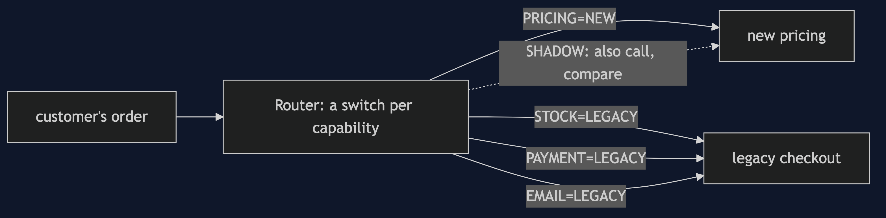
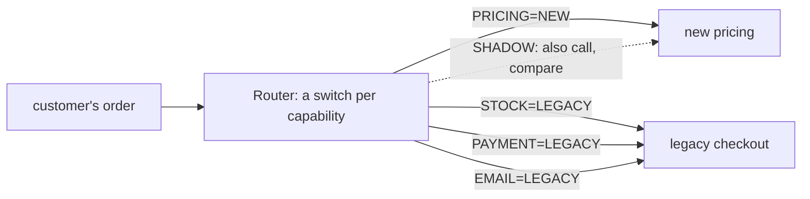

# Strangler Fig Pattern — Architecture Diagram

One router. The customer sees one checkout, whichever side answers.

Mermaid source

```mermaid
flowchart LR
    C["customer's order"] --> R["Router: a switch per capability"]
    R -->|PRICING=NEW| NP["new pricing"]
    R -->|STOCK=LEGACY| L["legacy checkout"]
    R -->|PAYMENT=LEGACY| L
    R -->|EMAIL=LEGACY| L
    R -.->|SHADOW: also call, compare| NP
```

