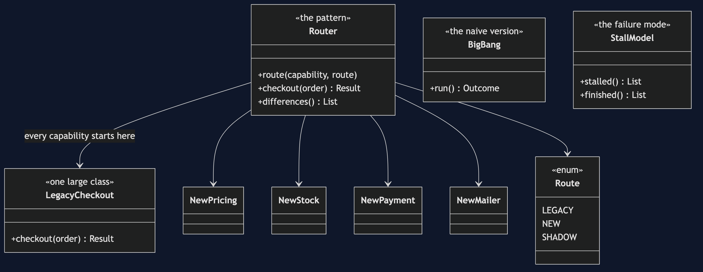
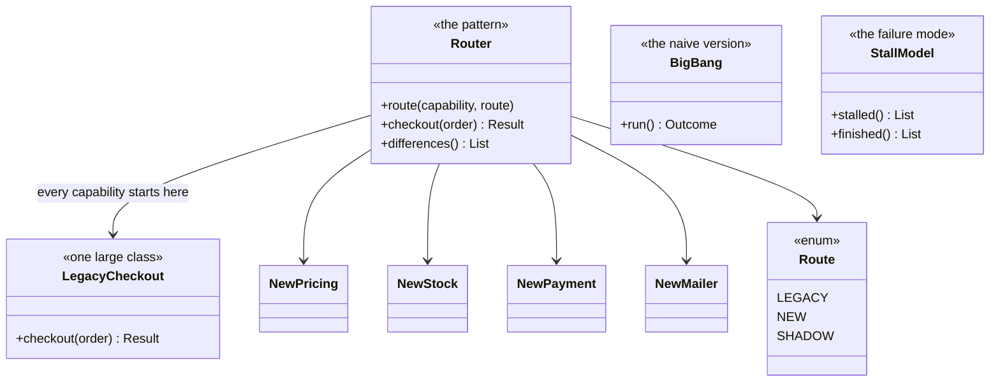

# Strangler Fig Pattern — Class Diagram

The router chooses per capability. Legacy is one class; the new code is four.

Mermaid source

```mermaid
classDiagram
    class Router {
        <<the pattern>>
        +route(capability, route)
        +checkout(order) Result
        +differences() List
    }
    class Route {
        <<enum>>
        LEGACY
        NEW
        SHADOW
    }
    class LegacyCheckout {
        <<one large class>>
        +checkout(order) Result
    }
    class NewPricing
    class NewStock
    class NewPayment
    class NewMailer
    class BigBang {
        <<the naive version>>
        +run() Outcome
    }
    class StallModel {
        <<the failure mode>>
        +stalled() List
        +finished() List
    }
    Router --> LegacyCheckout : every capability starts here
    Router --> NewPricing
    Router --> NewStock
    Router --> NewPayment
    Router --> NewMailer
    Router --> Route
```

