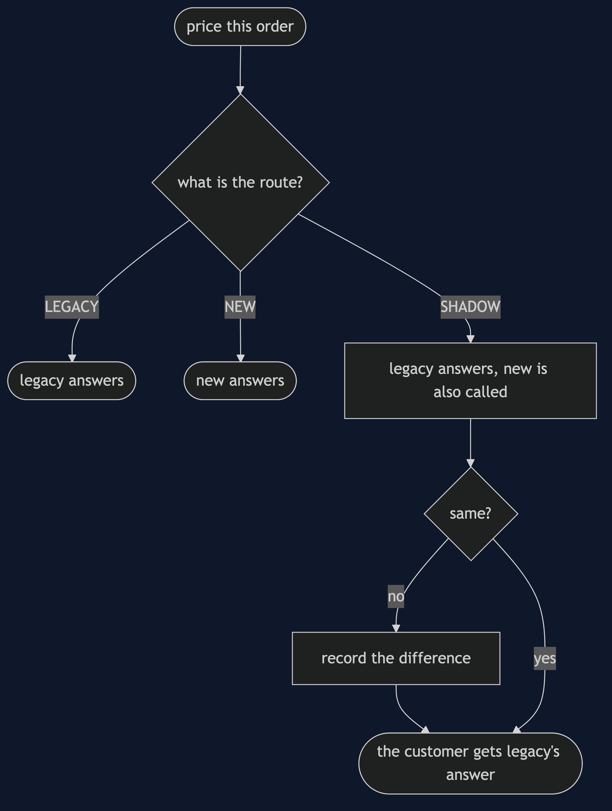
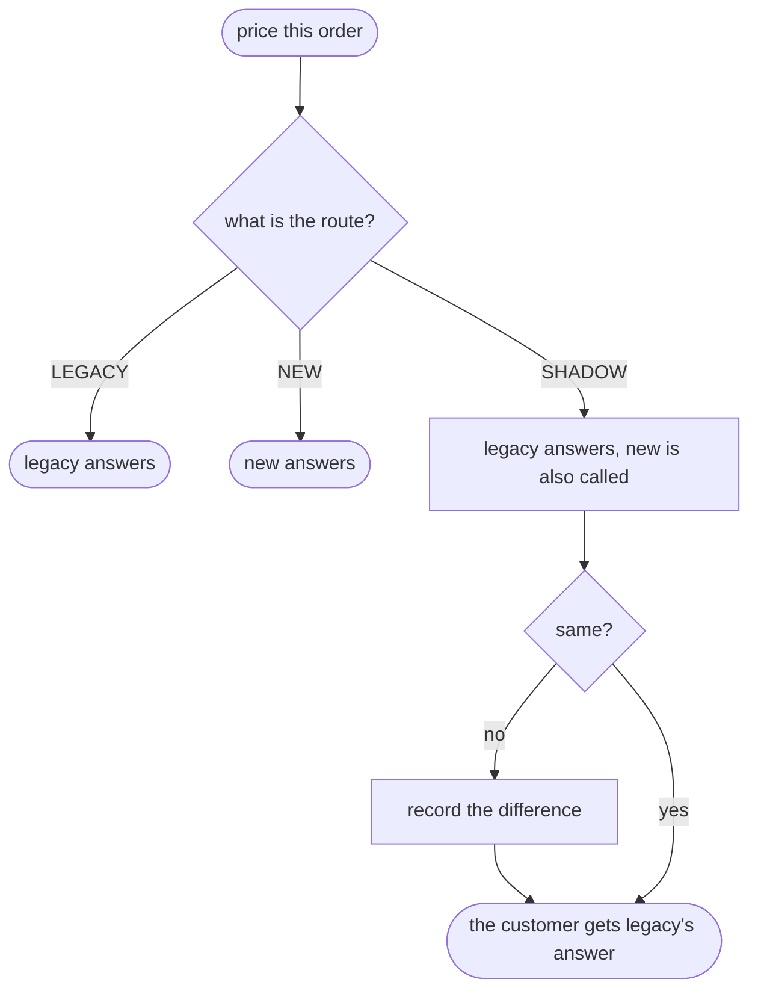

# Strangler Fig Pattern — Data Flow Diagram

One capability in SHADOW: served by legacy, compared with new.

Mermaid source

```mermaid
flowchart TD
    Ask(["price this order"])
    Mode{"what is the route?"}
    Leg(["legacy answers"])
    New(["new answers"])
    Both["legacy answers, new is also called"]
    Same{"same?"}
    Rec["record the difference"]
    Serve(["the customer gets legacy's answer"])
    Ask --> Mode
    Mode -- LEGACY --> Leg
    Mode -- NEW --> New
    Mode -- SHADOW --> Both --> Same
    Same -- no --> Rec --> Serve
    Same -- yes --> Serve
```

