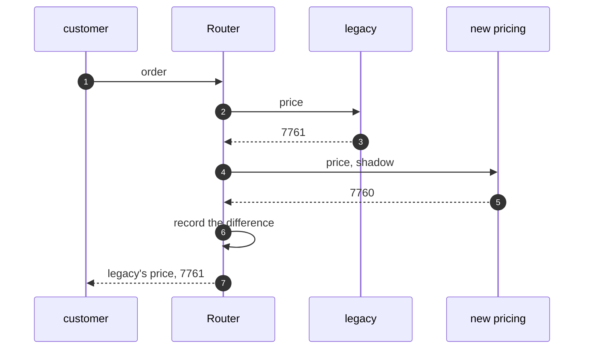

# Strangler Fig Pattern — Sequence Diagram

Written for a listener with the screen off.

Say it in words. An order arrives at the router. Pricing is in shadow mode, so the router asks the legacy code for the price, and also asks the new code. It compares the two. If they differ, it writes the difference down, for the team to look at. Either way, the customer is given the legacy price. Stock, payment and email go to legacy as before. Nothing the customer sees has changed, and the team has learned something.

Mermaid source

The load-bearing sentence: **the customer only ever gets the legacy answer until the evidence says otherwise.**
