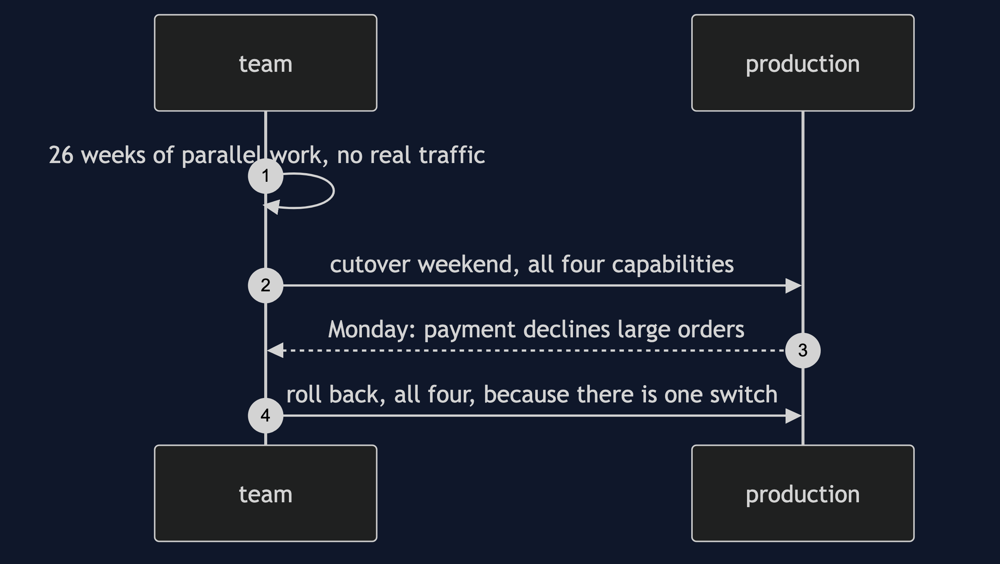
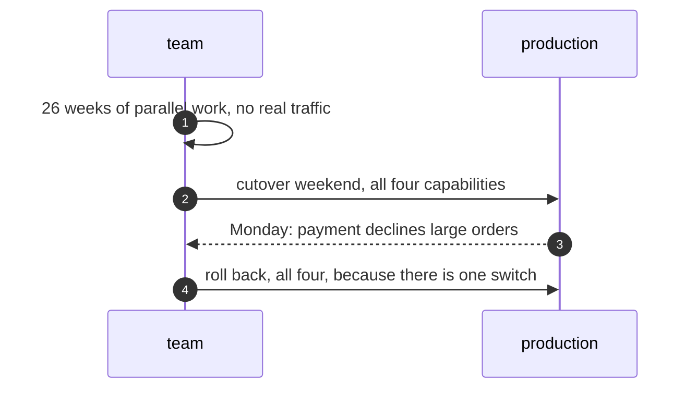
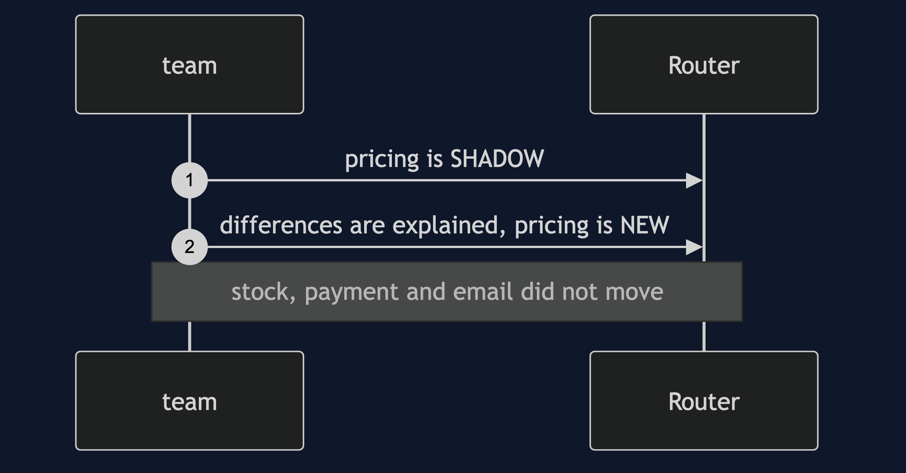
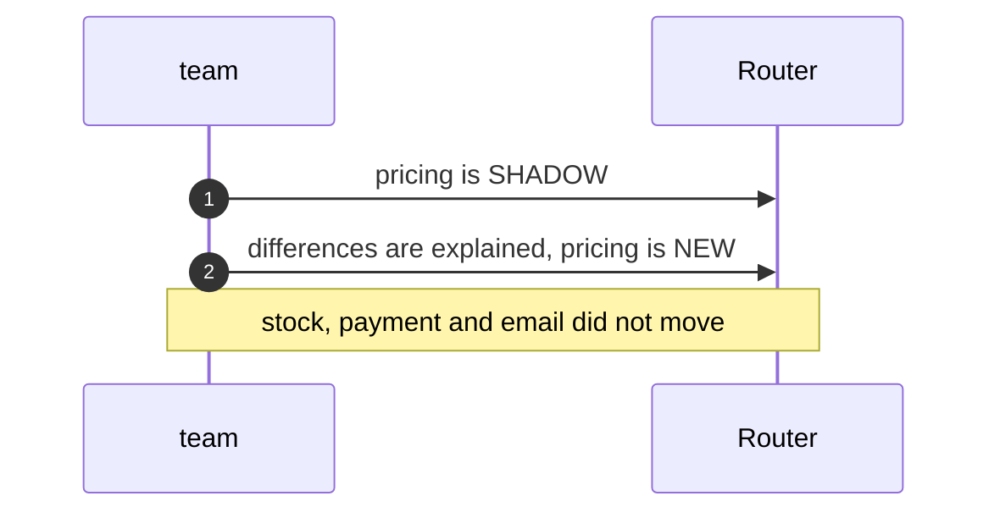
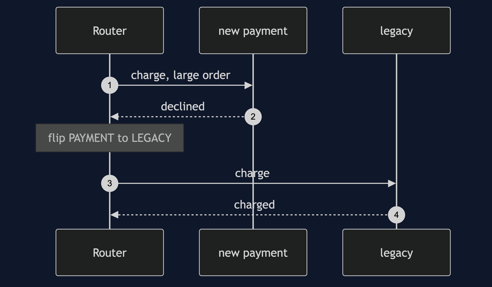
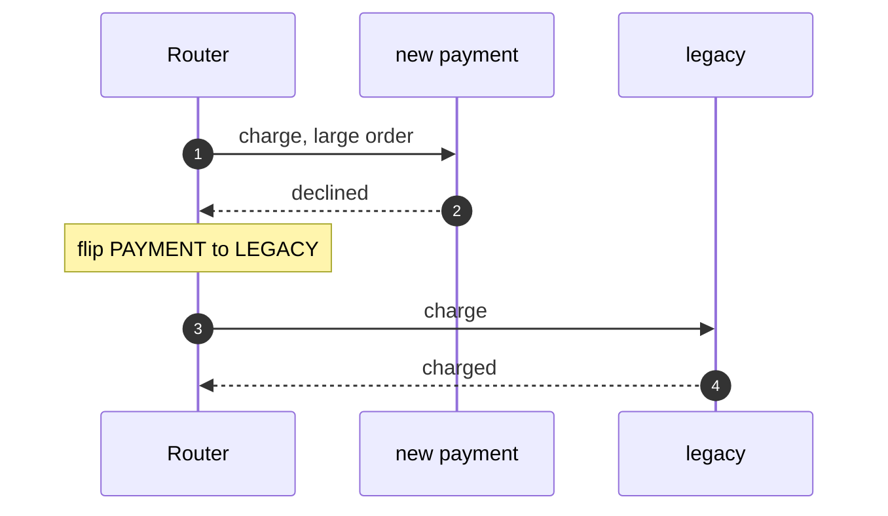
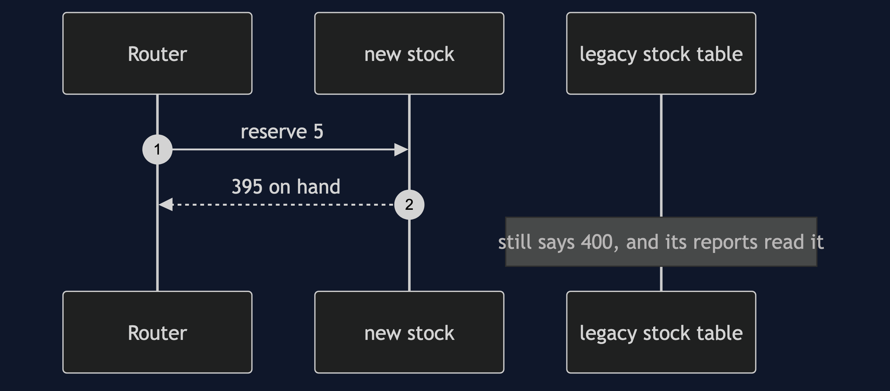
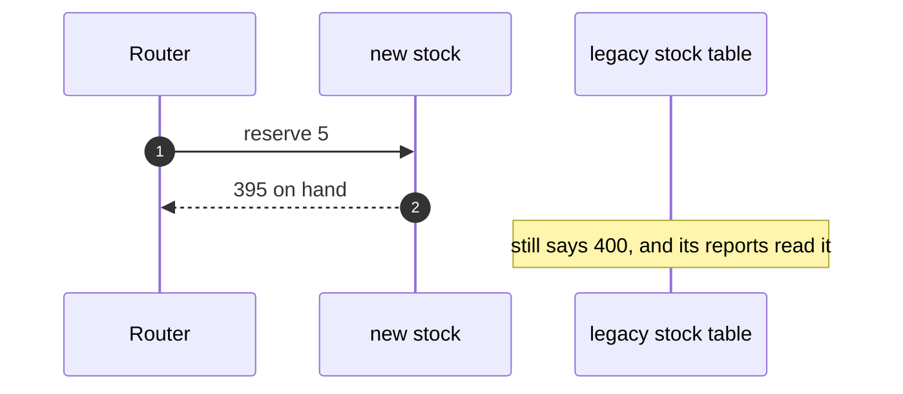

# Strangler Fig Pattern — UML Sequence Diagrams

Four sequences.

## 1. The Big Bang

Mermaid source

## 2. A Move By A Switch

Mermaid source

## 3. A One-Capability Rollback

Mermaid source

## 4. Two Sources Of Truth

Mermaid source

