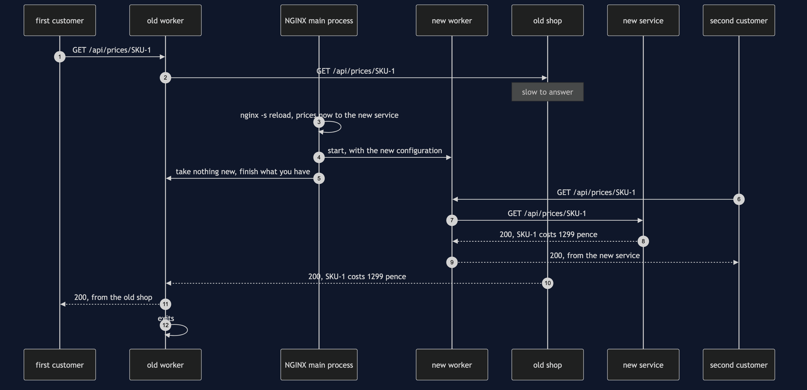
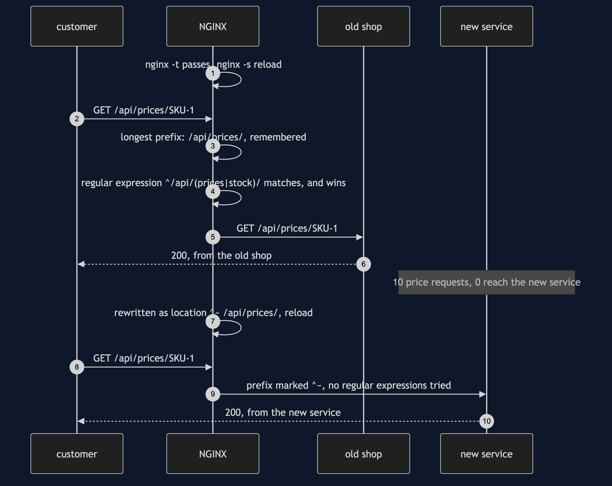
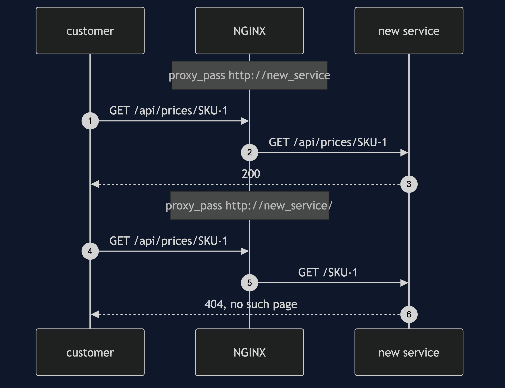
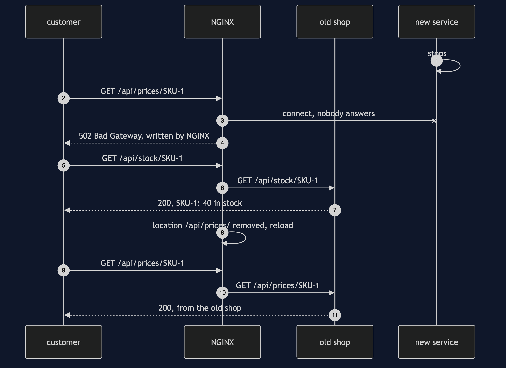
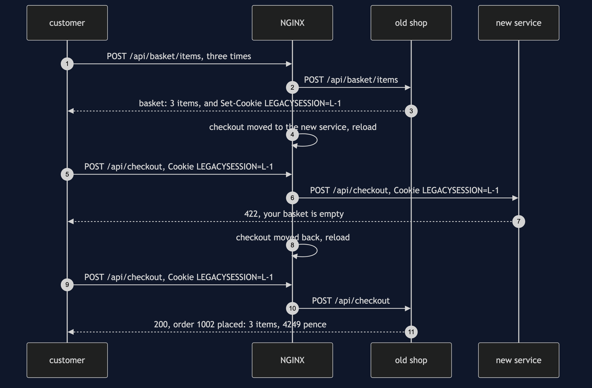

# Strangler Fig with NGINX Pattern

```
src/main/java/com/jk/explore/stranglerfignginx/
├── StranglerFigNginxDemo.java   the six acts
├── NginxConfig.java             the pattern: every route on the old shop, and one location block per route moved
├── NginxRouter.java             starts and stops a real NGINX container; writes its configuration and reloads it
├── OldShop.java                 the old shop: prices, stock, basket, checkout and orders, all in one program
├── NewService.java              the rewrite: prices and checkout so far; writes down every path it receives
├── Browser.java  Answer.java    the customer's side: one request, and who answered it
└── ShopHttp.java  Poll.java     the JDK's built-in HTTP server; every wait is a question asked until the answer is yes
```

**In NGINX, moving a route is one location block and a reload. The old shop keeps serving everything else — but NGINX has its own rules for which block wins, and one old rule can quietly cancel the move.**

**This project needs a container runtime.** Docker Desktop, or anything Docker-compatible, must be running before you start. The demo brings NGINX up in a container and takes it down again at the end; nothing is installed and nothing is left behind. With no runtime, the demo prints two sentences saying what to do, and stops, rather than a stack trace.

This project is the real-infrastructure version of the plain-Java Strangler Fig project in this course. That project built the router as a Java object holding one switch per capability. This one puts a real reverse proxy, NGINX, in front of two real HTTP services — the old shop and the new service, both running inside the demo's own Java program — and moves one route at a time by rewriting NGINX's configuration and telling it to reload. It shows what a switch in a Java object cannot: NGINX's own rules for choosing a route, a path rewritten by one slash, a reload that lets a request already in progress finish on the old configuration, a moved route failing on its own while the rest carry on, and a cookie that means something to one service and nothing to the other.

## Run

```bash
./gradlew run
```

Six acts, against a real NGINX. Every number quoted below, and in every document and slide in this project, comes from this program's own output. Two runs back to back print exactly the same thing.

```
ONE. The big bang.
  NGINX 1.31.6 is running in a container, in front of the old shop. every route goes to the old shop.
  the shop's four pages: prices 200, stock 200, basket 200, orders 200. pages that work: 4 of 4 (4 from the old shop, 0 from the new service).
  Monday: one line sends every route to the new service, which has built only prices and checkout so far.
  the four pages: prices 200, stock 404, basket 404, orders 404. pages that work: 1 of 4 (0 from the old shop, 1 from the new service).
TWO. One route at a time.
  a customer's price request has reached the old shop, and the old shop is slow to answer it.
  the configuration gains location /api/prices/, sent to the new service. nginx -s reload.
  NGINX's main process: number 1 before the reload and number 1 after. nothing restarted.
  while that request is still open: workers still finishing old requests: 1. workers taking new requests: 1.
  a new price request: 200, from the new service.
  the open request then finishes: 200, from the old shop. workers still finishing old requests: 0.
  the four pages now: prices 200, stock 200, basket 200, orders 200. pages that work: 4 of 4 (3 from the old shop, 1 from the new service).
THREE. A regular expression wins.
  the shop's real configuration has one more rule, written years ago to cache catalogue reads: location ~ ^/api/(prices|stock)/
  the same move, location /api/prices/, in that configuration, and a reload. 10 price requests: 10 from the old shop, 0 from the new service.
  NGINX tries its regular-expression rules after finding the longest prefix, and the first one that matches wins. the move did nothing, and nothing said so.
  written as location ^~ /api/prices/, which tells NGINX to stop looking: 10 price requests: 0 from the old shop, 10 from the new service.
FOUR. One slash.
  proxy_pass http://new_service; the new service is asked for /api/prices/SKU-1 and answers 200.
  proxy_pass http://new_service/; the new service is asked for /SKU-1 and answers 404.
  with anything after the address, even one slash, NGINX cuts the matched prefix off the path it passes on.
FIVE. The new service goes down.
  10 price requests: 10 answered 502 Bad Gateway, by NGINX itself. 10 stock requests: 10 answered 200, by the old shop.
  roll back: the one location removed, and a reload. 10 price requests: 10 answered 200, by the old shop.
  the new service comes back, and one more reload moves prices to it again: 10 price requests: 0 from the old shop, 10 from the new service.
SIX. The bill.
  a customer puts 3 items in the basket. the old shop answers "basket: 3 items" and sets the cookie LEGACYSESSION=L-1.
  checkout moves to the new service. it receives the cookie LEGACYSESSION=L-1 and has no use for it: 422, your basket is empty.
  checkout moved back to the old shop: 200, order 1002 placed: 3 items, 4249 pence.
  checkout cannot move until the basket does. the old shop still serves 4 of 5 routes: stock, basket, checkout and orders.
  and three things to run now, not one: 1 NGINX container, the old shop and the new service, and a configuration file that decides who answers.
```

Prices are in pence, as in the twin: 4249 is £42.49, for SKU-1 at 1299, SKU-2 at 450 and SKU-3 at 2500.

The numbers 200, 404, 422 and 502 are HTTP status codes, the three-digit answer every web request gets before anything else. 200 means it worked. 404 means the service has no such page. 422 means the service understood the request and refused it — here, a checkout with an empty basket. 502, Bad Gateway, is NGINX saying it could not get an answer from the service behind it; no shop service sent that one.

Every count in this demo is exact, and the tests assert it exactly. NGINX runs with one worker process, so the second act can count workers; and every reload is waited for properly, as the second act explains, so no request can land on the old configuration by accident.

The first run downloads the NGINX image, about 62 MB once unpacked, and takes longer. After that a run takes about eight seconds, most of it the container starting.

## Test

```bash
./gradlew test
```

3 test classes, 20 test methods. `PlainPartsTest` needs nothing installed: it checks the configuration text the demo writes — that moving a route adds one location block and changes nothing else — and calls the two shop services directly, with no NGINX in front. `RealNginxTest` starts one NGINX for the whole class and asks it directly: the big bang leaves only the routes the new service has built, one moved route leaves every other on the old shop, a reload keeps the main process and lets an open request finish on the old configuration, an old regular-expression rule beats a longer prefix and `^~` stops it, one slash cuts the prefix off the path, a stopped new service gives 502 on its route alone, and the old shop's cookie reaches the new service and means nothing there. `DemoRunsTest` runs the demo and asserts every figure the documents quote.

There is no `Thread.sleep` anywhere under `src/test`. Every wait is a poll on something that can actually be asked — whether NGINX answers with the new configuration's number, whether a held request has reached the old shop, whether an old worker process has exited — with a limit that fails the test rather than hanging it. The tests that need NGINX are skipped when no container runtime is there; the rest still run.

## What the simulation got right, and what it left out

This is the reason this project exists, so it comes before anything else.

**What the plain-Java Strangler Fig project got right.** All of the shape. The new system grows around the old one, one capability at a time, behind a router the customer never sees. Every capability starts on the old system. Moving one is a single switch, and moving it back is the same switch the other way, without disturbing anything else. The big bang, which moves everything at once, fails on everything the new code has not built. And the migration has a bill: two systems to run, and state that belongs to the old one. Every one of those holds on NGINX, and this project's first, second and fifth acts reproduce them: 1 of 4 pages working after the big bang; 4 of 4 working with one route moved; a rollback that is one location removed and one reload.

**What it left out, first, and the headline find: NGINX decides which rule wins, by rules of its own.** In the simulation the router looked up the capability's switch and that was that. NGINX chooses a `location` block by a procedure: it finds the longest matching prefix, remembers it, then tries the regular-expression locations in the order they are written, and the first one that matches wins. A regular expression is a pattern for matching text, written with symbols, such as `^/api/(prices|stock)/`. The third act moves prices with a perfectly ordinary block, `location /api/prices/`, in a configuration that also carries a rule written years ago to cache catalogue reads, `location ~ ^/api/(prices|stock)/`. The reload succeeds. `nginx -t` finds nothing wrong. And 10 price requests out of 10 still go to the old shop, 0 to the new service. The move did nothing, and nothing said so. Writing it `location ^~ /api/prices/` — the `^~` tells NGINX to stop looking once this prefix matches — sends all 10 to the new service. A router that is a map lookup cannot have this bug; a router with its own matching rules has it waiting in every old configuration.

**Second: one slash rewrites the path.** The simulation's router handed the same order object to whichever side it chose. NGINX passes on a web address, and how it passes it depends on how the destination is written. The fourth act writes the new service's address two ways that differ by one character. `proxy_pass http://new_service;` passes the path through untouched, and the new service is asked for `/api/prices/SKU-1` and answers 200. `proxy_pass http://new_service/;`, with a slash, tells NGINX to cut the matched prefix off, and the new service is asked for `/SKU-1` and answers 404. The new service writes down every path it receives, which is how the demo knows.

**Third: moving a route is a reload, and a reload has a shape.** In the simulation a switch flipped between one call and the next. NGINX has a main process that reads the configuration and worker processes that handle requests. On a reload, the main process starts a new worker with the new configuration and tells the old worker to take no new connections and to finish what it has. The second act holds one price request open on the old shop while it moves prices. NGINX's main process is number 1 before and after: nothing restarted. While the request is open there is 1 worker still finishing old requests and 1 taking new ones; a new price request goes to the new service; the open one then finishes on the old shop, with a 200, and the old worker exits. There is also a moment, just after the reload, when both workers take new connections; the demo waits for it to pass, because a request sent in that moment can be answered under either configuration.

**Fourth: the new service can be down while the old one is up.** The simulation's two sides lived in one program, so neither could be down alone. Here the fifth act stops the new service. The moved route answers 502 Bad Gateway, 10 times out of 10, from NGINX itself; the stock route, still on the old shop, answers 200 all 10 times. Rolling back is removing the one location block and reloading, and prices answer 200 again, from the old shop.

**Fifth: state crosses routes, even when the routes are split.** The simulation's bill was two tables claiming the same stock. The real version's bill is quieter. The old shop keeps each basket in its own memory, found by a cookie it sets, `LEGACYSESSION`. A cookie is a small note a site asks the browser to keep and send back with every request. NGINX passes it faithfully to whichever service answers. Move checkout to the new service and it receives `LEGACYSESSION=L-1`, has no idea what it means, and answers 422: your basket is empty, for a customer with 3 items in it. Checkout cannot move until the basket moves, or until the two services agree on a session. The route table says 4 of 5 routes are still the old shop's; the cookie is why.

**What the simulation had that NGINX does not.** The simulation's shadow reads sent an order to both sides and compared the two answers, and found 29 disagreements before any customer saw one. NGINX can send a copy of a request to a second service — its `mirror` directive — but it throws the copy's answer away; comparing the two is a program somebody has to write. And the simulation's model of a migration that stalls half-finished, costing more than either end, is about budgets and people. No proxy shows that.

## Technologies and versions

| What | Version | Why it is here |
| --- | --- | --- |
| Java | 21 | The repository standard, via the Gradle toolchain block |
| Gradle | 9.2.1 | The wrapper in this directory; no separate install needed |
| NGINX | 1.31.6 | The router, as the official `nginx:1.31.6-alpine` container image; the newest release, on Alpine Linux to keep the image small. NGINX publishes two lines: mainline, with odd middle numbers, which NGINX itself recommends for most users, and stable, currently 1.30.5, which takes only important fixes. This project uses mainline, the newest generally available |
| Testcontainers | 2.0.5 | `org.testcontainers:testcontainers`; starts and stops the NGINX container from inside the demo on a free random port, and opens a way from the container back to the two services on this machine. The 2.x line has no NGINX module, so the plain container type is used |
| JDK HTTP server | built into Java 21 | `com.sun.net.httpserver`, the old shop and the new service; no library needed |
| slf4j-simple | 2.0.17 | Logging for Testcontainers, turned off so the demo's own output is the only output |
| JUnit 5 | 5.10.2 | Test runner |
| A container runtime | Docker 24 or later, or compatible | Runs NGINX. Must be running before you start |

Nothing is held back: every version is the newest generally available release. See [`docs/dependencies.md`](docs/dependencies.md) and [`docs/prerequisites.md`](docs/prerequisites.md).

## Learning Material

| Document | What it covers |
| --- | --- |
| [`docs/problem-statement.md`](docs/problem-statement.md) | The twin's version, and what is new |
| [`docs/strangler-fig-with-nginx-pattern-explained.md`](docs/strangler-fig-with-nginx-pattern-explained.md) | NGINX's words in plain language, and six acts |
| [`docs/class-diagram.md`](docs/class-diagram.md) | The types |
| [`docs/architecture-diagram.md`](docs/architecture-diagram.md) | One NGINX, the old shop and the new service |
| [`docs/data-flow-diagram.md`](docs/data-flow-diagram.md) | How NGINX picks a location for one request |
| [`docs/sequence-diagram.md`](docs/sequence-diagram.md) | Written for a listener with the screen off |
| [`docs/uml-diagram.md`](docs/uml-diagram.md) | Four sequences |
| [`docs/animation.html`](docs/animation.html) | The six acts in a browser |
| [`docs/prerequisites.md`](docs/prerequisites.md) | What you need installed, and what you need to know |
| [`docs/session.md`](docs/session.md) | A one-hour taught session |
| [`docs/dependencies.md`](docs/dependencies.md) | What NGINX and Testcontainers are, what they cost, and that skipping this project loses none of the pattern |
| [`docs/spec.md`](docs/spec.md) | The generated specification |
| [`docs/youtube.md`](docs/youtube.md) | Title, description and chapters |

### The pattern in one picture


### Where each piece sits


### How one request moves


### Who calls whom, in order



### All four sequences









### Video

Built from [`video/scenes.py`](video/scenes.py) by
[`video/build_video.sh`](video/build_video.sh). The rendered file is not
committed; see the repository README for why.

## Where you have already met this

Every migration that puts a gateway in front of an old system and sends `/api/v2/...` somewhere new: NGINX, HAProxy, Envoy, a cloud load balancer's path rules, or an API gateway's route table. They all have the same three things this project shows — an order in which rules are matched, a way of rewriting the path on the way through, and a way of changing the rules without dropping requests — and each spells them differently.

## When this is too much

If the old system is small enough to rewrite and replace in a few weeks, the router and the months of running two systems cost more than they save. If the old and new systems cannot share a user's session, as in the sixth act, the routes that depend on it cannot be split until that is solved, and the router alone does not solve it.

## Where this sits

This project pairs with the plain-Java Strangler Fig project in this course, and is its real-infrastructure version in the `platform-design-patterns` category. Everything it teaches is explained in its own files, so it can be read on its own.
