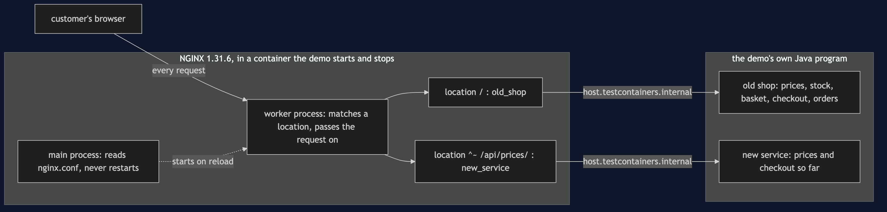

# Strangler Fig with NGINX Pattern — Architecture Diagram

One public address, NGINX, in a container the demo starts and stops. Behind it, the old shop and the new service, both real HTTP servers running in the demo's own Java program. One location block per moved route; everything else falls through to the old shop.

