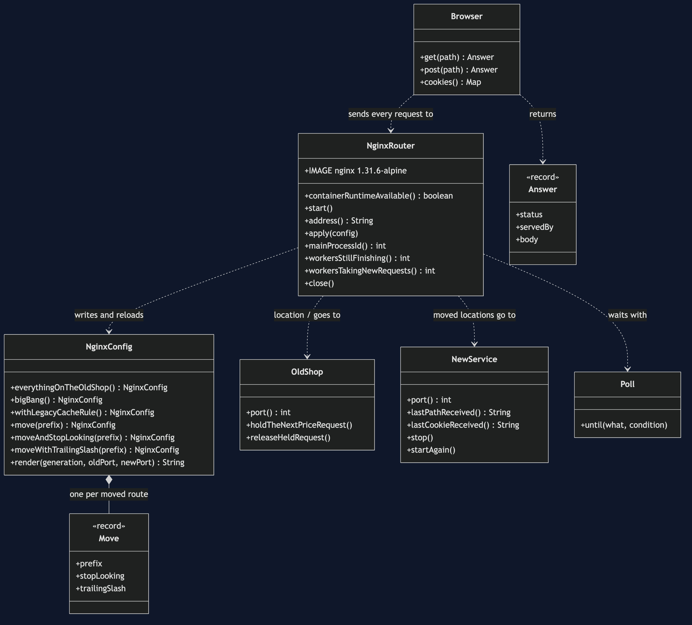

# Strangler Fig with NGINX Pattern — Class Diagram

The pattern is one class, `NginxConfig`: every route on the old shop through one catch-all location, and one location block for each route moved. `NginxRouter` owns the container and applies a configuration with a check and a reload; `OldShop` and `NewService` are the two real HTTP services behind it.

