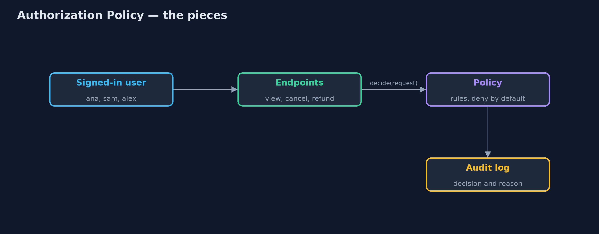
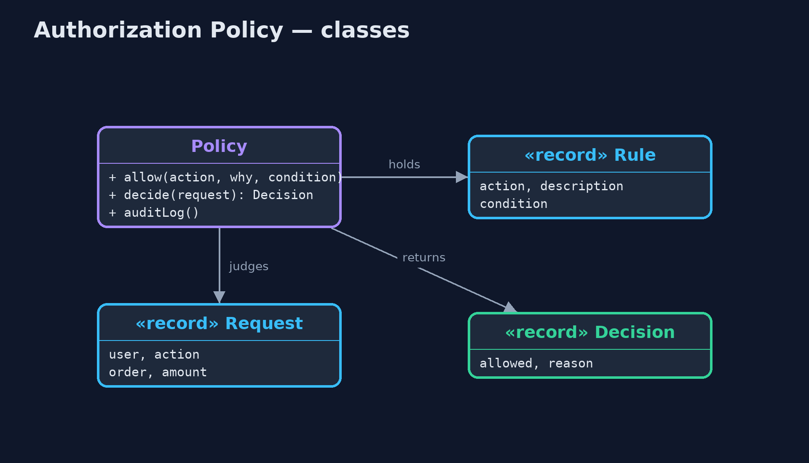
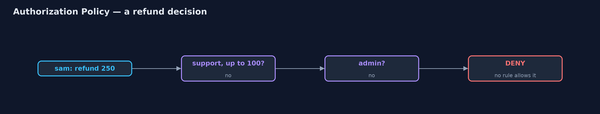
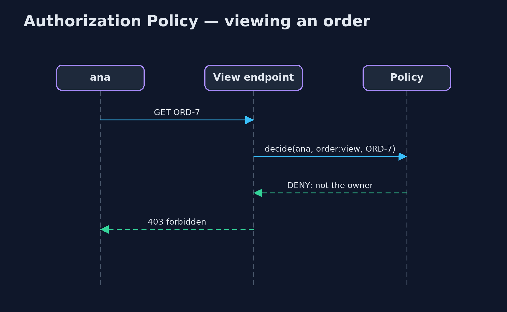

# Authorization Policy Pattern

```
src/main/java/com/jk/explore/authorization/
├── AuthorizationDemo.java  The five acts: checks scattered through the endpoints, roles alone, rules on attributes, one change for every endpoint, and the bill
├── Decision.java           The answer, with the reason, so every decision can be explained and logged
├── Order.java              An order, and the customer who owns it
├── Policy.java             The pattern: every access decision is made here, from rules that can look at the user, the order and the amount (attribute-based access control, ABAC)
├── Request.java            One access question: may this user do this action to this order (for this amount, if it is a refund)?
├── RolePolicy.java         Role-based access control (RBAC): each role is granted a set of actions, and nothing else is looked at
├── Rule.java               One line of the policy: this action is allowed when this condition holds
├── ScatteredChecks.java    Before: each endpoint writes its own access check, and one of them forgot to check ownership
└── User.java               A signed-in user and their role: CUSTOMER, SUPPORT or ADMIN
```

**Make every access decision in one policy, written as rules over roles and attributes, deny anything no rule allows, and have every endpoint ask it.**

Authorization is deciding what a signed-in user is allowed to do. Signing in
proves who you are; authorization decides whether you may view this order or
issue that refund. When each endpoint writes its own `if` statement, the rules
are scattered, inconsistent, and one forgotten check exposes other people's
data.

An Authorization Policy puts every decision in one place. Role-based access
control (RBAC) grants actions to roles: support staff may issue refunds.
Attribute-based access control (ABAC) adds rules over details of the user, the
thing being accessed, and the request: a customer may view an order *they
own*; support may refund *up to 100*. Anything no rule allows is denied.

## The idea in everyday terms

Think of a hotel key-card system. Nobody at a door decides for themselves who
may enter. One system holds the rules: guests open their own room, cleaners
open rooms on their floor during the day, the manager opens everything. Change
a rule once, and every door follows it.

## The scenario

The online store's endpoints each checked access themselves. The cancel
endpoint checked that the customer owned the order. The view endpoint
assumed signing in was enough, so any customer could read anyone's order by
changing the order number in the address. And the refund endpoint let support
staff refund any amount, though the rule was a limit of 100.

## Run

```bash
./gradlew run
```

The demo tells the story in 5 acts, each printing exact numbers that the tests check:

| Act | What it shows |
| --- | --- |
| 1. Checks in every endpoint | Cancel checks the owner, but ana can view ben's order because the view endpoint forgot, and support can refund 250 despite a limit of 100. |
| 2. Roles only | With role-based rules, ana may view ben's order: the CUSTOMER role has order:view, and a role cannot say "their own". |
| 3. Rules on attributes | Attribute rules: ana is denied ben's order, ben is allowed as owner, sam may refund 80 but not 250, and alex the admin may refund 250. |
| 4. Deny by default | Nobody wrote a rule for order:export, so even alex the admin is denied: a new endpoint is closed until the policy opens it. |
| 5. The bill | 6 decisions logged with reasons; the policy is asked on every request, so it must be fast, tested, and kept readable. |

## Test

```bash
./gradlew test
```

6 tests in `DemoRunsTest`, `PolicyTest`. Every number the demo prints is asserted, and nothing depends on the clock, so every run gives the same result.

## Technologies and versions

| Technology | Version | Used for |
| --- | --- | --- |
| Java | 21 | the code (toolchain set in `build.gradle`) |
| Gradle | 9.2.1 (wrapper) | build and run, nothing to install |
| JUnit | 5.10.2 | the tests |
| videokit | repository tool | the narrated video and animation: Piper `en_US-amy-medium`, speed 0.8, longer pauses (the approved `amy-slow` voice) |

## Learning Material

| Document | What it is for |
| --- | --- |
| [Problem statement](docs/problem-statement.md) | the situation and what the project must show |
| [Prerequisites](docs/prerequisites.md) | what you need to know first |
| [Authorization Policy, explained](docs/authorization-policy-pattern-explained.md) | the acts in prose |
| [Session guide](docs/session.md) | a one-hour lesson with exercises |
| [Animated walkthrough](docs/animation.html) | the acts step by step, narrated |
| [Spec](docs/spec.md) | what this project must be true of |

### The pattern in one picture

Every endpoint asks one policy.



### Where each piece sits

Rules over the whole request.



### How the data moves

The first rule that holds allows it; none means deny.



### Who calls whom, in order

Ownership is checked in one place.



### Video

`video/authorization-policy-pattern-explained.mp4` (with `.m4a` audio and `.srt` subtitles) is built by `video/build_video.sh`. Rendered media is not committed.

## What it costs

- **On every request.** The policy is asked every time, so it must be fast and always available.
- **Rules grow.** Attribute rules can become hard to read; keep them named, grouped by action, and tested.
- **Endpoints must ask.** A central policy only protects the endpoints that call it; a new endpoint that forgets is still open, unless the framework asks for it.

## When this is too much

A small internal tool with one kind of user needs no more than a sign-in.
A policy pays off as soon as different users may see or change different
things.

## Where you have already met this

- Spring Security's `@PreAuthorize` and its `AuthorizationManager`.
- Open Policy Agent (OPA) and AWS Cedar, policy engines with their own rule languages.
- Cloud IAM policies: who may do which action on which resource.

## Where this sits

This project is in [security-design-patterns](..), the first project of that
category.
