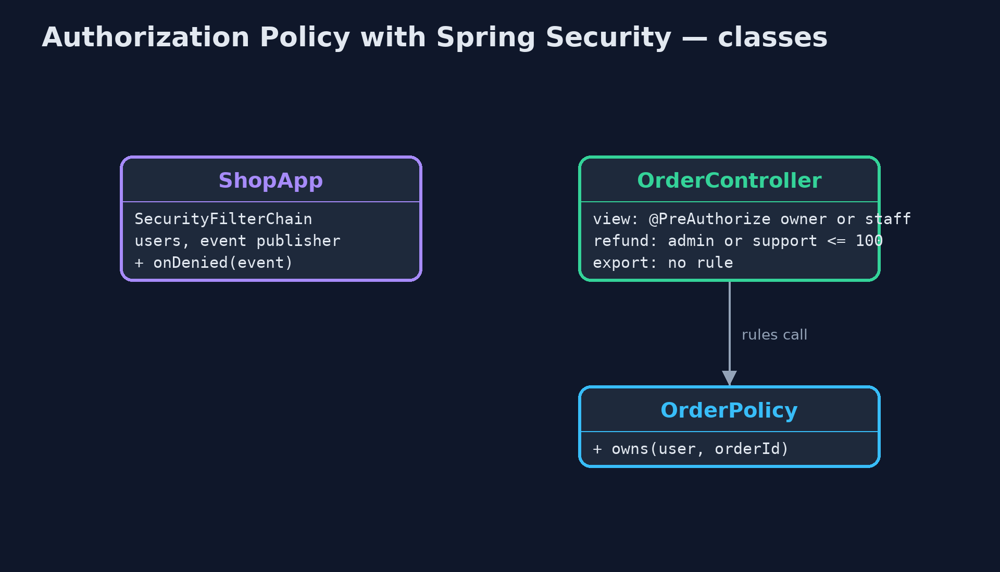
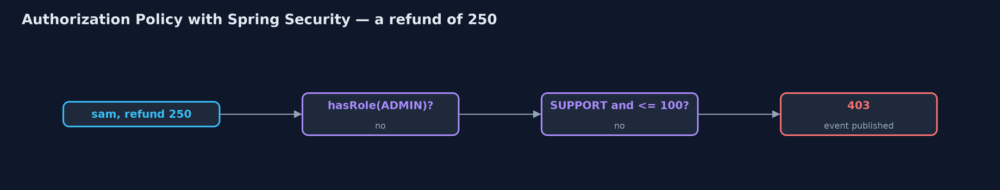
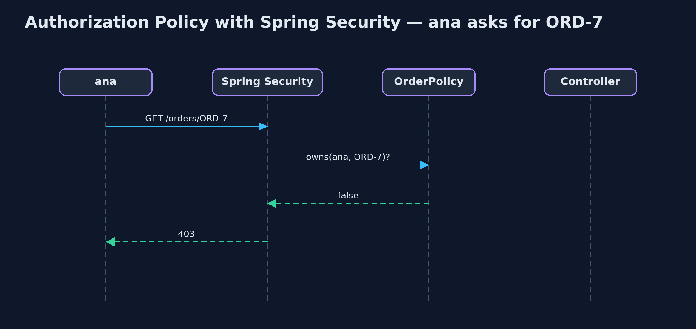

# Authorization Policy with Spring Security Pattern

```
src/main/java/com/jk/explore/authzspring/
├── OrderController.java          The shop's order endpoints, each with its access rule written beside it
├── OrderPolicy.java              The part of the policy that needs the shop's own data: who owns which order
├── ShopApp.java                  The shop's web server with Spring Security deciding access
└── SpringAuthorizationDemo.java  The five acts: a real Spring Boot server with Spring Security, called over HTTP as four users
```

**Let Spring Security make every access decision in the shop: URL rules first, @PreAuthorize rules beside each endpoint for ownership and refund limits, denyAll() for anything nobody wrote a rule for, and an event for every refusal.**

This is the framework version of the Authorization Policy pattern. The plain
Java version, a separate project in this category, writes a policy class with
rules and an audit log. Here Spring Security does the deciding, in a real
Spring Boot web server called over HTTP by four users: two customers, a
support agent and an admin.

The policy has three layers. URL rules in the security configuration decide
broad access, ending with `denyAll()` so anything unlisted is refused.
`@PreAuthorize` rules, written beside each endpoint in Spring's expression
language, decide the details: a customer may view only their own orders, and
support may refund up to 100. And a small policy bean supplies facts from the
shop's data, such as who owns an order. Every refusal is published as an
`AuthorizationDeniedEvent`.

## The idea in everyday terms

Think of a hotel key-card system. The front door lets any guest in; each room
door opens only for its own guest; staff cards open more doors, managers' the
most. A door added to the building opens for nobody until someone programs
it. And the system logs every card that was refused.

## The scenario

The online store's endpoints each checked access in their own code, or
forgot to. Any signed-in customer could read anyone's order by changing the
order number, and support staff could refund any amount, though the rule was
a limit of 100.

## Run

Nothing to install beyond a Java 21 JDK: the demo starts a Spring Boot server
inside the program, on a local port, and calls it over HTTP.

```bash
./gradlew run
```

The demo tells the story in 5 acts, each printing exact numbers that the tests check:

| Act | What it shows |
| --- | --- |
| 1. Signed in is enough | The old view endpoint only requires sign-in: ana views ben's order ORD-7 and gets 200. |
| 2. Roles only | hasRole(CUSTOMER) on the URL: ana still views ben's order, 200; a role cannot say "their own". |
| 3. Rules beside each endpoint | @PreAuthorize: ana on ben's order 403, ben on it 200; sam refunds 80 (200) but not 250 (403); alex refunds 250 (200). |
| 4. Deny by default | The export endpoint has no rule, so anyRequest().denyAll() refuses even alex the admin: 403. |
| 5. The bill | 3 refusals announced as AuthorizationDeniedEvents; rules are SpEL strings checked only at run time; each method rule protects only its method. |

## Test

```bash
./gradlew test
```

1 tests in `DemoRunsTest`. Every result the demo prints is asserted, with a real Spring Boot server on a local port, called over HTTP as four different users.

## What the simulation got right, and what it left out

The plain Java version got the idea right: one policy, rules over roles and
attributes, deny by default, and a reason logged for every decision. What it
left out is how a framework spreads the policy sensibly: broad URL rules in
one place, detailed rules beside each endpoint, and a named bean for facts
only the shop knows. It also found two real traps. Refusals are only
announced as events if you ask for them. And a refused request is forwarded to
Spring's error page, which `denyAll()` refused again, so every refusal was
counted twice until error dispatches were permitted.

## Technologies and versions

| Technology | Version | Used for |
| --- | --- | --- |
| Java | 21 | the code (toolchain set in `build.gradle`) |
| Gradle | 9.2.1 (wrapper) | build and run, nothing to install |
| JUnit | 5.10.2 | the tests |
| Spring Boot | 4.1.1 | the web server |
| Spring Security | 7 (with Boot 4.1.1) | URL rules, @PreAuthorize method security, authorization events |
| videokit | repository tool | the narrated video and animation: Piper `en_US-amy-medium`, speed 0.8, longer pauses (the approved `amy-slow` voice) |

## Learning Material

| Document | What it is for |
| --- | --- |
| [Dependencies](docs/dependencies.md) | what the framework and infrastructure are, and why they are here |
| [Problem statement](docs/problem-statement.md) | the situation and what the project must show |
| [Prerequisites](docs/prerequisites.md) | what you need to know first |
| [Authorization Policy with Spring Security, explained](docs/authorization-policy-with-spring-security-pattern-explained.md) | the acts in prose |
| [Session guide](docs/session.md) | a one-hour lesson with exercises |
| [Animated walkthrough](docs/animation.html) | the acts step by step, narrated |
| [Spec](docs/spec.md) | what this project must be true of |

### The pattern in one picture

URL rules, then method rules, then the endpoint.


### Where each piece sits

Rules where they belong.



### How the data moves

The rule reads the role and the amount.



### Who calls whom, in order

Refused before the controller runs.



### Video

`video/authorization-policy-with-spring-security-pattern-explained.mp4` (with `.m4a` audio and `.srt` subtitles) is built by `video/build_video.sh`. Rendered media is not committed.

## What it costs

- **Rules in strings.** SpEL expressions are checked only when they run; a typo fails at the first request, not at build time.
- **Two places to look.** URL rules and method rules together make the policy; both must be read to know who may do what.
- **Framework details matter.** Without permitting error dispatches, every refusal was denied and counted twice.

## When this is too much

A small internal tool with one kind of user needs only a sign-in. A policy
pays off as soon as different users may see or change different things.

## Where you have already met this

- `@PreAuthorize` and `hasRole` in Spring applications.
- `authorizeHttpRequests` blocks in `SecurityFilterChain` beans.
- Policy engines such as Open Policy Agent, for rules kept outside the code.

## Where this sits

This project is in [security-design-patterns](..). It is the framework
version of the plain Java Authorization Policy project in the same category,
which is left unchanged.
