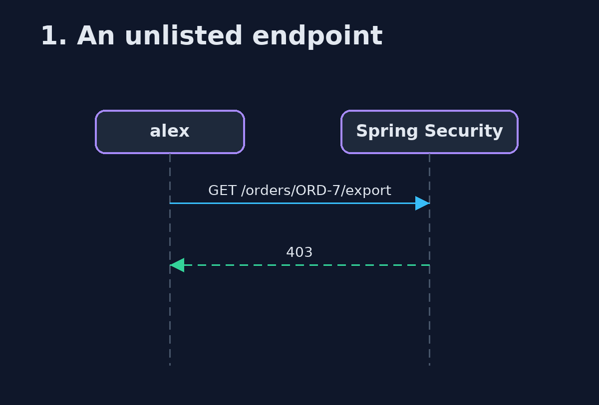
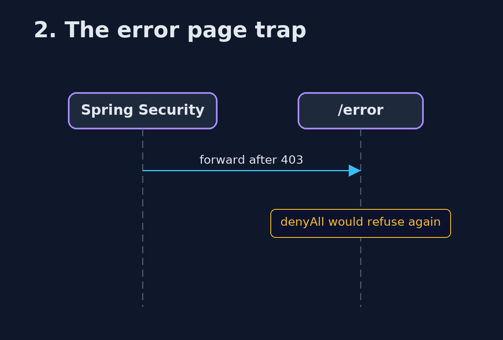

# Authorization Policy with Spring Security Pattern — UML Sequence Diagrams

## 1. 1. An unlisted endpoint

denyAll() closes it.

## 2. 2. The error page trap

Permit error dispatches, or each refusal counts twice.

