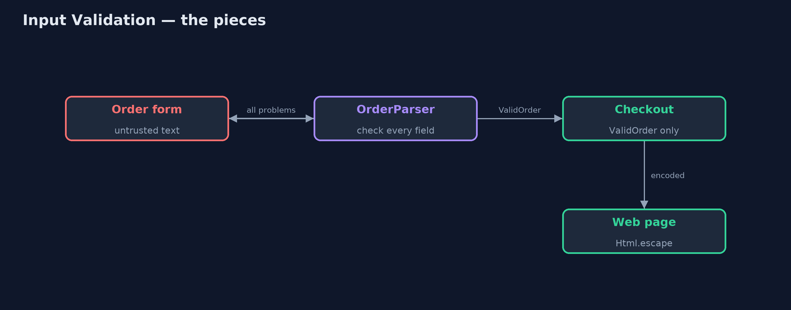
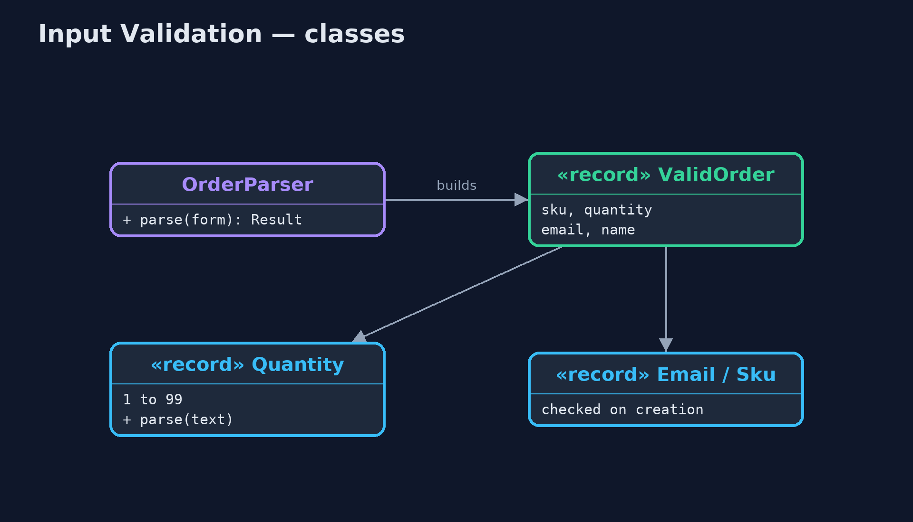
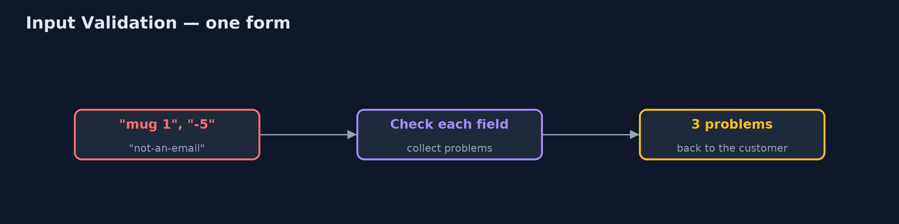
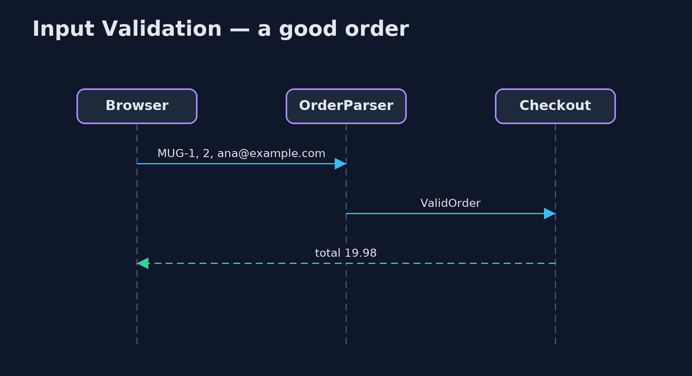

# Input Validation Pattern

```
src/main/java/com/jk/explore/inputvalidation/
├── CustomerName.java         A customer's name: letters from any alphabet, with spaces, apostrophes and hyphens
├── Email.java                An email address: something, an at sign, a domain with a dot, and not absurdly long
├── Html.java                 Output encoding: make text safe to put inside a web page, whatever it contains
├── InputValidationDemo.java  The five acts: trusting the form, checking at the boundary, parsing into safe types, encoding on the way out, and the bill
├── NaiveCheckout.java        Before: the form's text is used as it arrives
├── OrderForm.java            What arrives from the browser: every field is just text, and none of it can be trusted
├── OrderParser.java          The pattern at the boundary: turn untrusted text into checked values, collecting every problem so the customer can fix them all at once
├── Quantity.java             How many of a product: a whole number from 1 to 99
├── Sku.java                  A product code
└── ValidOrder.java           An order made only of checked values
```

**Check everything that comes from outside at the boundary, turn it into types that cannot hold bad values, report every problem at once, and still encode text on its way out.**

Input Validation is the first rule of secure code: nothing that arrives from
outside can be trusted. A browser form, a request to an A P I, a file upload:
every field is just text, and it may be empty, too long, the wrong kind, or
written by an attacker. Input validation checks each field at the boundary,
against rules for what is allowed, before the rest of the program uses it.

This project also shows the stronger form, sometimes called "parse, don't
validate": turn text into small types such as `Quantity` and `Email` that
check themselves when they are made. Once a `Quantity` exists, it is valid,
and no other code needs to check it again. And it shows the partner rule:
text that is valid can still be dangerous somewhere else, so encode it on the
way out.

## The idea in everyday terms

Think of the post room of a large office. Every parcel is checked once, at
the door: the right size, a real address, nothing leaking. Parcels that pass
get a sticker, and nobody upstairs checks them again. But the sticker only
means "fit for the office". Anything sent back out still has to be packed for
its own journey.

## The scenario

The online store's checkout used the form's text as it arrived. A quantity of
minus five mugs gave a total of minus 49.95, so the shop would have paid the
customer. "not-an-email" was saved as an email address. And product reviews
were shown exactly as typed, so a review containing a script tag would run in
other shoppers' browsers.

## Run

```bash
./gradlew run
```

The demo tells the story in 5 acts, each printing exact numbers that the tests check:

| Act | What it shows |
| --- | --- |
| 1. Trusting the form | A quantity of "-5" mugs at 9.99 gives a total of -49.95, and "not-an-email" is saved as the email address. |
| 2. Check at the boundary | Each field is checked where it arrives: 3 problems reported together; a good form is accepted with a total of 19.98. |
| 3. Types that cannot be wrong | new Quantity(-5) is refused with "quantity must be from 1 to 99"; checkout takes a ValidOrder and never checks again. |
| 4. Encode on the way out | A review containing a script tag, shown as typed, would run; HTML-encoded, it is shown as harmless text. |
| 5. The bill | The rule [A-Za-z ] rejects "Siobhán O'Brien"; a rule for letters in any alphabet accepts it; and browser checks can be skipped. |

## Test

```bash
./gradlew test
```

5 tests in `DemoRunsTest`, `OrderParserTest`. Every number the demo prints is asserted, and nothing depends on the clock, so every run gives the same result.

## Technologies and versions

| Technology | Version | Used for |
| --- | --- | --- |
| Java | 21 | the code (toolchain set in `build.gradle`) |
| Gradle | 9.2.1 (wrapper) | build and run, nothing to install |
| JUnit | 5.10.2 | the tests |
| videokit | repository tool | the narrated video and animation: Piper `en_US-amy-medium`, speed 0.8, longer pauses (the approved `amy-slow` voice) |

## Learning Material

| Document | What it is for |
| --- | --- |
| [Problem statement](docs/problem-statement.md) | the situation and what the project must show |
| [Prerequisites](docs/prerequisites.md) | what you need to know first |
| [Input Validation, explained](docs/input-validation-pattern-explained.md) | the acts in prose |
| [Session guide](docs/session.md) | a one-hour lesson with exercises |
| [Animated walkthrough](docs/animation.html) | the acts step by step, narrated |
| [Spec](docs/spec.md) | what this project must be true of |

### The pattern in one picture

Checked at the door, encoded on the way out.



### Where each piece sits

Types that check themselves.



### How the data moves

Text in, checked values or problems out.



### Who calls whom, in order

Parsed once, trusted afterwards.



### Video

`video/input-validation-pattern-explained.mp4` (with `.m4a` audio and `.srt` subtitles) is built by `video/build_video.sh`. Rendered media is not committed.

## What it costs

- **Rules can be unfair.** A rule of plain A to Z letters turned away a real customer called Siobhán O'Brien; allow letters from any alphabet, apostrophes and hyphens.
- **The server must check.** Checks in the browser are only a convenience; a request sent straight to the server skips them.
- **Validation is not enough on its own.** Valid text must still be encoded for web pages, and passed as parameters to databases.

## When this is too much

There is no "too much" for the principle: all outside input must be checked.
What can be overdone is strictness: reject what is truly invalid, not what is
merely unusual.

## Where you have already met this

- Jakarta Bean Validation annotations such as `@Min`, `@Email` and `@Pattern`, and Spring's `@Valid`.
- Value objects in Domain-Driven Design that check themselves when created.
- The OWASP Input Validation and Cross-Site Scripting cheat sheets.

## Where this sits

This project is in [security-design-patterns](..), next to
[Secure Gateway](../secure-gateway-pattern), which rejects badly shaped
requests before they reach a service; this one checks every field inside it.
