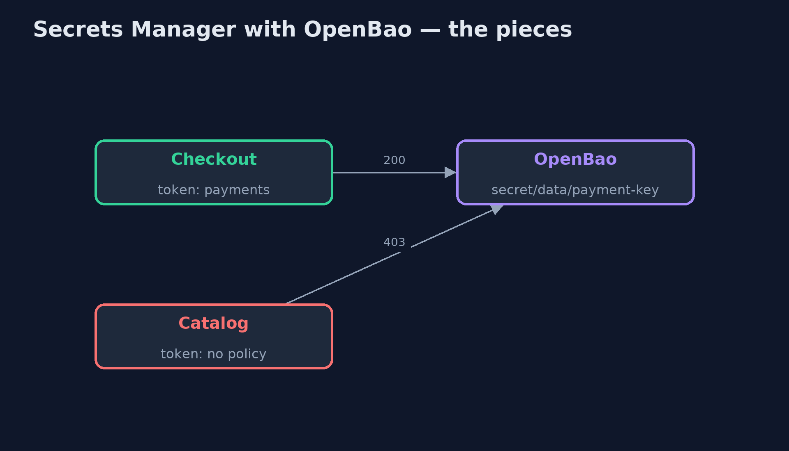
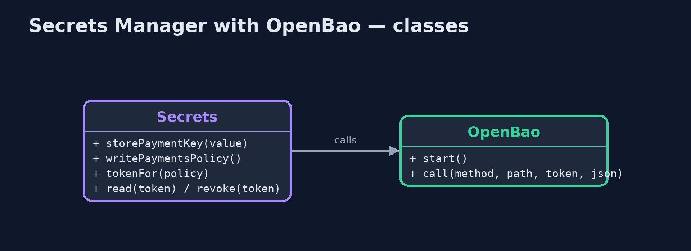
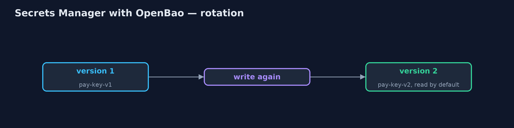
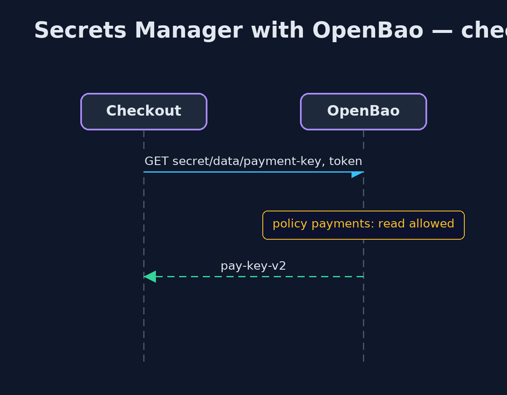

# Secrets Manager with OpenBao Pattern

```
src/main/java/com/jk/explore/secretsopenbao/
├── OpenBao.java             A real OpenBao server, the open-source fork of HashiCorp Vault, in a container that this demo starts and stops itself
├── OpenBaoSecretsDemo.java  The five acts, against a real OpenBao server started and stopped by this program
└── Secrets.java             The shop's side of OpenBao: store and rotate the payment key, write a policy, give each service its own token, read with a token, and revoke a token
```

**Keep the payment key in a real OpenBao server, the open-source fork of HashiCorp Vault: a policy decides which service may read it, each service has its own token, the key is versioned for rotation, and a leaked token is revoked at once.**

This is the real-infrastructure version of the Secrets Manager pattern. The
plain Java version, a separate project in this category, keeps secrets in a
map with grants. Here a real OpenBao server holds them, started in a container
by the demo itself, and the demo talks to it over its HTTP API.

OpenBao is the open-source fork of HashiCorp Vault, run by the Linux
Foundation. It keeps Vault's API and concepts: a key-value store with
versions, policies written as rules over paths, and tokens that carry
policies and can be revoked. It is used here rather than Vault because Vault
is no longer open source: since 2023 it is published under the Business
Source License.

## The idea in everyday terms

Think of a bank's safe-deposit room. Keys to the boxes are not handed out
freely: each person gets a card that opens only the boxes on their list, and
a lost card is cancelled at the desk at once. When a box's lock is changed,
the old combination is kept on file for a while, in case someone still needs
it.

## The scenario

The online store's payment key was written in a configuration file committed
with the code and built into three services. Everyone who could read the
repository could read it, and changing it meant rebuilding every service.

## Run

This project needs a running container runtime, such as Docker Desktop: the
demo starts a real OpenBao 2.7.0 server in a container and removes it again.
Without one, it prints a sentence saying what to start, rather than failing.

```bash
./gradlew run
```

The demo tells the story in 5 acts, each printing exact numbers that the tests check:

| Act | What it shows |
| --- | --- |
| 1. A key in the code | PAYMENT_KEY = "pay-key-v1" is built into three services and readable by anyone with the repository. |
| 2. Policies and tokens | The key is in OpenBao; checkout's token with the payments policy reads it (200), catalog's token without it is refused (403). |
| 3. Versions and rotation | Writing the key again makes version 2, which checkout now reads; version 1 stays readable for a grace period. |
| 4. Revoke a leaked token | Checkout's token leaks and is revoked: the attacker gets 403; checkout gets a new token and reads the key again. |
| 5. The bill | Every service needs a first credential to get a token, and dev mode is in memory with a root token; production needs storage, unsealing and HA. |

## Test

```bash
./gradlew test
```

2 tests in `DemoRunsTest`. Every result the demo prints is asserted against a real OpenBao server. Without a container runtime, the test is skipped rather than failed.

## What the simulation got right, and what it left out

The plain Java version got the idea right: secrets out of code, granted per
service, read at run time, rotated without a rebuild, and a manager every
service now depends on. What it left out is how a real secrets manager does
it. Access is a policy over paths, attached to a token each service holds, and
a service without it gets HTTP 403. Secrets are versioned, so version 1 stays
readable during rotation. A leaked token can be revoked at once, which the
plain version could not show. And development mode, used here, is exactly
what production must not be: in memory, unsealed and with a root token.

## Technologies and versions

| Technology | Version | Used for |
| --- | --- | --- |
| Java | 21 | the code (toolchain set in `build.gradle`) |
| Gradle | 9.2.1 (wrapper) | build and run, nothing to install |
| JUnit | 5.10.2 | the tests |
| OpenBao | 2.7.0 (container image) | the secrets server: KV v2, policies, tokens |
| Java HttpClient | JDK 21 | calls OpenBao's HTTP API directly |
| Testcontainers | 2.0.5 | starts and stops OpenBao from the demo |
| Docker | 24 or later | runs the container |
| videokit | repository tool | the narrated video and animation: Piper `en_US-amy-medium`, speed 0.8, longer pauses (the approved `amy-slow` voice) |

## Learning Material

| Document | What it is for |
| --- | --- |
| [Dependencies](docs/dependencies.md) | what the framework and infrastructure are, and why they are here |
| [Problem statement](docs/problem-statement.md) | the situation and what the project must show |
| [Prerequisites](docs/prerequisites.md) | what you need to know first |
| [Secrets Manager with OpenBao, explained](docs/secrets-manager-with-openbao-pattern-explained.md) | the acts in prose |
| [Session guide](docs/session.md) | a one-hour lesson with exercises |
| [Animated walkthrough](docs/animation.html) | the acts step by step, narrated |
| [Spec](docs/spec.md) | what this project must be true of |

### The pattern in one picture

Tokens carry policies; policies guard paths.



### Where each piece sits

Each method is one HTTP call.



### How the data moves

Versions overlap, then the old one retires.



### Who calls whom, in order

The token is checked against the policy.



### Video

`video/secrets-manager-with-openbao-pattern-explained.mp4` (with `.m4a` audio and `.srt` subtitles) is built by `video/build_video.sh`. Rendered media is not committed.

## What it costs

- **Secret zero.** Each service still needs a first credential to get its token; use the platform's identity, such as AppRole or Kubernetes auth.
- **Critical to run.** Production needs storage, unsealing and high availability, because services cannot start without it.
- **Policies to maintain.** Every service's access is a rule someone writes and reviews.

## When this is too much

A learning project on one laptop can use environment variables. Once a secret
guards real money or data, or is shared by several services, it belongs in a
secrets manager.

## Where you have already met this

- HashiCorp Vault, whose API OpenBao keeps.
- AWS Secrets Manager, Azure Key Vault and Google Secret Manager.
- Spring Cloud Vault, which reads Vault-compatible servers into Spring configuration.

## Where this sits

This project is in [security-design-patterns](..). It is the
real-infrastructure version of the plain Java Secrets Manager project in the
same category, which is left unchanged.
