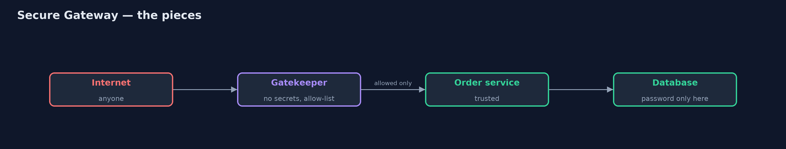
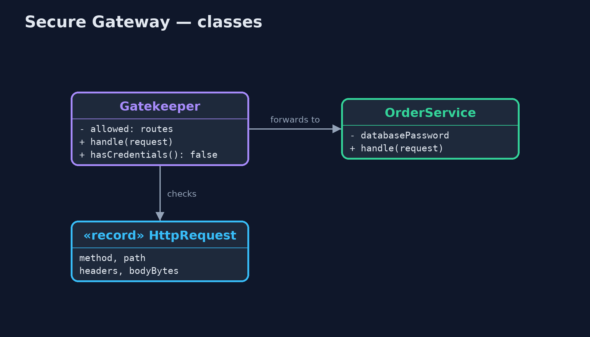
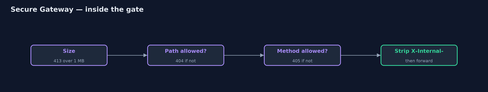
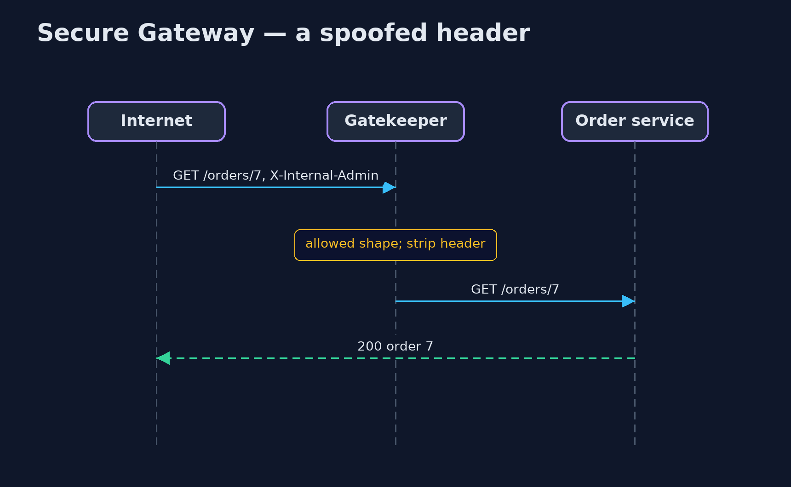

# Secure Gateway Pattern

```
src/main/java/com/jk/explore/securegateway/
├── Gatekeeper.java         The pattern: the only machine the internet can reach
├── HttpRequest.java        A request as it arrives from the internet: method, path, headers and body size
├── OrderService.java       The trusted back-end service
└── SecureGatewayDemo.java  The five acts: the trusted service on the internet, a gatekeeper in front, an allow-list, size and shape limits, and the bill
```

**Put a hardened gatekeeper, holding no secrets and no data, between the internet and the trusted services, and let through only requests of an allowed shape.**

Secure Gateway, also called the Gatekeeper pattern, protects trusted services
by never letting the internet reach them. A separate gatekeeper is the only
machine exposed to the public. It holds no passwords and no data. It checks
every request against a short list of allowed shapes, such as "GET an order by
its number", removes anything meant only for internal use, limits sizes, and
only then passes the request on to the trusted service behind it.

If the gatekeeper is ever broken into, the attacker finds nothing useful on
it: no database password, no customer data, only a narrow path to the
services behind.

## The idea in everyday terms

Think of a bank. Customers never walk into the vault. They talk to a teller
behind a counter, who has no key to the vault and can only pass on a few kinds
of request: pay in, take out, check a balance. Anything else, the teller
simply refuses. Even a robber who got past the counter would not find the
vault key there.

## The scenario

The online store's order service answered the internet directly, and it held
the database password. It also had features meant only for internal tools: a
header that switched on admin mode, and an admin export page. From outside,
anyone could send that header, or reach the export with a path such as
`/orders/../admin/export`, and download every order.

## Run

```bash
./gradlew run
```

The demo tells the story in 5 acts, each printing exact numbers that the tests check:

| Act | What it shows |
| --- | --- |
| 1. The service faces the internet | The order service is public and holds the database password: a spoofed X-Internal-Admin header and the path /orders/../admin/export both export all 12,000 orders. |
| 2. A gatekeeper in front | Only the gatekeeper faces the internet; it strips internal headers, so the spoofed header now just returns order 7. |
| 3. An allow-list | Only GET /orders/<number> and POST /orders pass: the traversal gets 404 and DELETE gets 405 at the gate; POST /orders creates an order. |
| 4. Size and shape limits | A 5 MB body gets 413; /orders/7 OR 1=1 does not match the number pattern and gets 404; 3 passed, 4 refused. |
| 5. The bill | A broken-into gatekeeper holds no credentials; but every request pays an extra hop, and new endpoints wait for the allow-list. |

## Test

```bash
./gradlew test
```

4 tests in `DemoRunsTest`, `GatekeeperTest`. Every number the demo prints is asserted, and nothing depends on the clock, so every run gives the same result.

## Technologies and versions

| Technology | Version | Used for |
| --- | --- | --- |
| Java | 21 | the code (toolchain set in `build.gradle`) |
| Gradle | 9.2.1 (wrapper) | build and run, nothing to install |
| JUnit | 5.10.2 | the tests |
| videokit | repository tool | the narrated video and animation: Piper `en_US-amy-medium`, speed 0.8, longer pauses (the approved `amy-slow` voice) |

## Learning Material

| Document | What it is for |
| --- | --- |
| [Problem statement](docs/problem-statement.md) | the situation and what the project must show |
| [Prerequisites](docs/prerequisites.md) | what you need to know first |
| [Secure Gateway, explained](docs/secure-gateway-pattern-explained.md) | the acts in prose |
| [Session guide](docs/session.md) | a one-hour lesson with exercises |
| [Animated walkthrough](docs/animation.html) | the acts step by step, narrated |
| [Spec](docs/spec.md) | what this project must be true of |

### The pattern in one picture

Only the gatekeeper faces the internet.



### Where each piece sits

The gate forwards; the service holds the secret.



### How the data moves

Four checks before anything is forwarded.



### Who calls whom, in order

Stripped before it reaches the service.



### Video

`video/secure-gateway-pattern-explained.mp4` (with `.m4a` audio and `.srt` subtitles) is built by `video/build_video.sh`. Rendered media is not committed.

## What it costs

- **An extra hop.** Every request passes one more machine, adding a little time.
- **A list to keep in step.** A new endpoint is blocked until someone adds it to the gate's allow-list.
- **Not the only defence.** The trusted services must still check their own inputs and access; the gate reduces risk, it does not remove it.

## When this is too much

A service with no secrets and no private data, such as a public product
catalogue, gains little from a separate gatekeeper. It pays off in front of
services that hold credentials or sensitive data.

## Where you have already met this

- A web application firewall or reverse proxy in a DMZ, in front of internal services.
- NGINX or Envoy configured with an allow-list of paths and methods.
- Cloud API gateways with request validation and size limits.

## Where this sits

This project is in [security-design-patterns](..). It is close to
[Gateway Offloading](../../micro-services-design-patterns/gateway-offloading-pattern),
which moves shared chores into a gateway; this one is about keeping the
trusted services out of reach.
