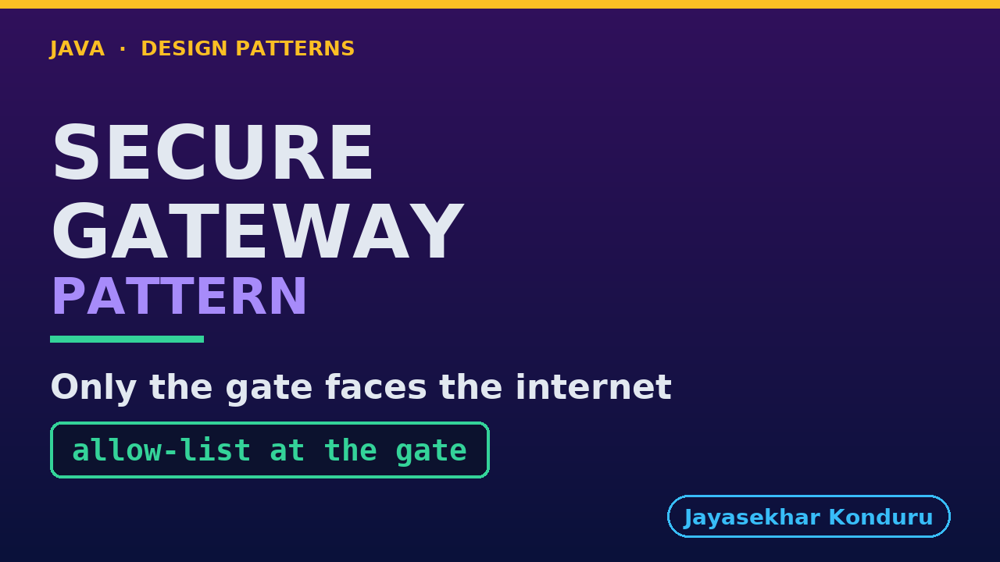

# YouTube — Secure Gateway Pattern

Everything needed to publish `video/secure-gateway-pattern-explained.mp4`. Copy the fields straight out of this file.

Chapter timings are generated from the video's `.srt`. Re-run `python3 docs/make_youtube_docs.py secure-gateway` after any change to the narration, or they will be wrong.

## Title

```
Secure Gateway (Gatekeeper)
```

27 characters — under the 60 YouTube shows before truncating in search results.

## Description

The first two lines are what a viewer sees above the fold, so they carry the hook rather than the boilerplate.

```
Secure Gateway pattern in Java, also called the Gatekeeper: the services holding secrets never face the internet; a separate gatekeeper does, holding no secrets and letting through only requests of a few allowed shapes, like a bank teller with no key to the vault. Explained with an online store order service that holds the database password. We watch two tricks export every order from a service facing the internet, put a gatekeeper in front, write an allow-list, and add size and shape limits. We finish with the bill: let only a gate with nothing to steal face the internet.

CHAPTERS
00:00 Introduction
01:11 The Scenario
01:33 Act One — The service faces the internet
02:21 Act Two — A gatekeeper in front
02:49 Act Three — An allow-list
03:19 Act Four — Size and shape limits
03:47 Act Five — The bill
04:18 The Pattern
04:39 Who Does What
05:03 Where You Have Seen It
05:27 When To Use It
05:49 Thanks for Watching

SOURCE CODE, WRITTEN NOTES AND AN INTERACTIVE ANIMATION
https://github.com/jk-boot-up/java-design-patterns/tree/main/gradle-java/security-design-patterns/secure-gateway-pattern

WHAT YOU NEED FIRST
Java 21 and a working knowledge of classes and interfaces. No prior design-pattern knowledge is assumed. The full prerequisites are in docs/prerequisites.md in the repository.
```

## Chapters

YouTube renders these as chapters only if there are at least three and the first is at `00:00`.

```
00:00 Introduction
01:11 The Scenario
01:33 Act One — The service faces the internet
02:21 Act Two — A gatekeeper in front
02:49 Act Three — An allow-list
03:19 Act Four — Size and shape limits
03:47 Act Five — The bill
04:18 The Pattern
04:39 Who Does What
05:03 Where You Have Seen It
05:27 When To Use It
05:49 Thanks for Watching
```

## Tags

```
secure gateway, gatekeeper pattern, allow list, defense in depth, security, java, design patterns, java design patterns, gang of four, java 21, software design, clean code, object oriented design, java tutorial, ecommerce, programming tutorial
```

243 characters, under YouTube's 500 limit.

## Thumbnail



**Upload `docs/thumbnail.png`** — 1280×720, the size YouTube recommends, generated by `docs/make_thumbnails.py`. It is deliberately not the same image as the video's opening frame: a thumbnail is judged at about 360 pixels wide in a search result, so this one carries only the pattern name, one line of promise and one short piece of code, each set large enough to survive the shrink.

`video/poster.png` is the 1920×1080 opening frame, produced by the video build. It stays in the repository as the title card; it is not what gets uploaded.

YouTube will not pick the thumbnail up on its own — upload it under **Details → Thumbnail → Upload file**. A custom thumbnail requires a verified channel.

## Upload checklist

- [ ] Upload `video/secure-gateway-pattern-explained.mp4` (1080p, H.264, 30 fps, AAC 48 kHz — already YouTube's recommended settings, no re-encode needed)
- [ ] Set the video language to **English** first, or the subtitle option may not appear
- [ ] Add subtitles: *Video elements → Add subtitles → Upload file → With timing* → `video/secure-gateway-pattern-explained.srt`
- [ ] Upload `docs/thumbnail.png` as the thumbnail — do not let YouTube auto-pick a frame
- [ ] Paste the title, description and tags from above
- [ ] Add to the **Java Design Patterns** playlist, in learning order
- [ ] Wait for 1080p processing before sharing the link — code slides are unreadable at 360p

## Cards and end screen

End screen links to whichever pattern video goes up next — set it at upload time rather than assuming an order.

Add a card partway through pointing at the playlist, so a viewer who arrives at this pattern from search can find the rest of the series.

## Runtime

Approximately 06:35, narrated at 145 words per minute.
