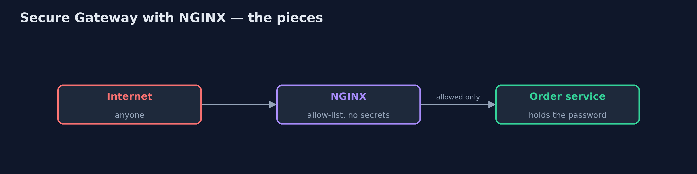
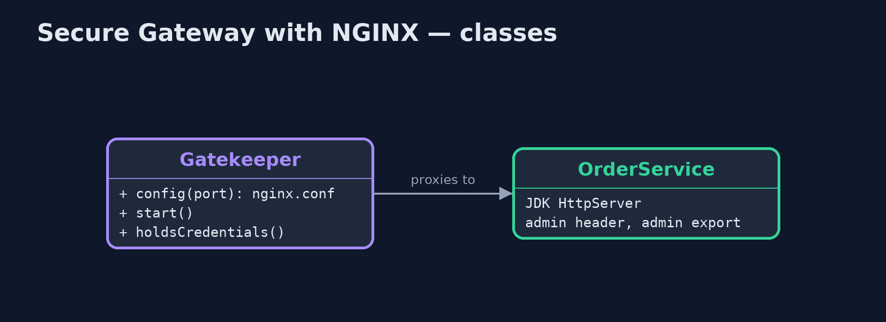
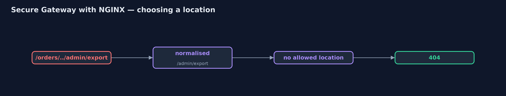
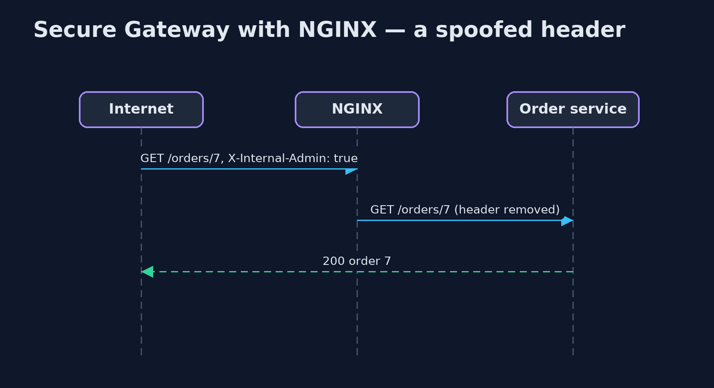

# Secure Gateway with NGINX Pattern

```
src/main/java/com/jk/explore/securenginx/
├── Gatekeeper.java              The gatekeeper: a real NGINX in a container, the only thing the "internet" talks to
├── NginxSecureGatewayDemo.java  The five acts: a real order service, and a real NGINX gatekeeper in front of it
└── OrderService.java            The trusted order service, a real HTTP server on this machine
```

**Put a real NGINX in front of the shop's order service as the gatekeeper: an allow-list of locations, limit_except for methods, client_max_body_size for size, and proxy_set_header to strip internal headers, with no secrets on the gate.**

This is the real-infrastructure version of the Secure Gateway pattern, also
called the Gatekeeper. The plain Java version, a separate project in this
category, writes the gatekeeper as a class. Here the gatekeeper is a real
NGINX, the web server and reverse proxy in front of a large share of the web,
started in a container by the demo itself.

The whole policy is NGINX's configuration file, shown in `Gatekeeper.config`.
Two locations are allowed: GET an order by its number, and POST a new order.
`limit_except` refuses other methods, `client_max_body_size` refuses large
bodies, `proxy_set_header` with an empty value removes the internal admin
header, and every other path gets 404. The NGINX container holds no
passwords at all.

## The idea in everyday terms

Think of a bank teller behind a counter. Customers never walk into the vault;
the teller passes on only a few kinds of request and refuses everything else.
The teller has no vault key, so even a robber who got past the counter would
not find one there.

## The scenario

The online store's order service answered the internet directly, held the
database password, and had features meant only for internal tools: a header
that switched on admin mode, and an admin export page reachable with a path
trick. From outside, anyone could export every order.

## Run

This project needs a running container runtime, such as Docker Desktop: the
demo starts a real NGINX 1.31.6 in a container and removes it again. Without
one, it prints a sentence saying what to start, rather than failing.

```bash
./gradlew run
```

The demo tells the story in 5 acts, each printing exact numbers that the tests check:

| Act | What it shows |
| --- | --- |
| 1. The service faces the internet | Called directly, the order service exports all 12,000 orders for a spoofed X-Internal-Admin header and for /orders/../admin/export. |
| 2. An NGINX gatekeeper | Through NGINX, order 7 still works, and the same spoofed header just returns order 7: proxy_set_header removed it. |
| 3. An allow-list of locations | The dot-dot path gets 404 (NGINX normalises it first), DELETE gets 403 (limit_except), and POST /orders gets 201. |
| 4. Size and shape | A 5 MB body gets 413 (client_max_body_size 1m); /orders/7 OR 1=1 gets 404, because the number must be digits. |
| 5. The bill | The NGINX container's environment holds no credentials; but every request pays an extra hop, and new endpoints wait for the configuration. |

## Test

```bash
./gradlew test
```

2 tests in `DemoRunsTest`. Every result the demo prints is asserted against a real NGINX container. Without a container runtime, the test is skipped rather than failed.

## What the simulation got right, and what it left out

The plain Java version got the idea right: only a secret-free gate faces the
internet, it allow-lists request shapes, strips internal headers and limits
sizes, and the service behind must still check its own inputs. What it left
out is the real tool, where the whole policy is a short configuration file.
NGINX normalises a path before choosing a location, so the dot-dot trick
simply finds no allowed location. Its method limit answers 403 rather than
405. And the check that the gate holds no secrets is a real look at the
container's environment.

## Technologies and versions

| Technology | Version | Used for |
| --- | --- | --- |
| Java | 21 | the code (toolchain set in `build.gradle`) |
| Gradle | 9.2.1 (wrapper) | build and run, nothing to install |
| JUnit | 5.10.2 | the tests |
| NGINX | 1.31.6 (container image nginx:1.31.6-alpine) | the gatekeeper: locations, limit_except, client_max_body_size, proxy_set_header |
| JDK HttpServer | Java 21 | the order service behind the gate |
| Testcontainers | 2.0.5 | starts and stops NGINX from the demo |
| Docker | 24 or later | runs the container |
| videokit | repository tool | the narrated video and animation: Piper `en_US-amy-medium`, speed 0.8, longer pauses (the approved `amy-slow` voice) |

## Learning Material

| Document | What it is for |
| --- | --- |
| [Dependencies](docs/dependencies.md) | what the framework and infrastructure are, and why they are here |
| [Problem statement](docs/problem-statement.md) | the situation and what the project must show |
| [Prerequisites](docs/prerequisites.md) | what you need to know first |
| [Secure Gateway with NGINX, explained](docs/secure-gateway-with-nginx-pattern-explained.md) | the acts in prose |
| [Session guide](docs/session.md) | a one-hour lesson with exercises |
| [Animated walkthrough](docs/animation.html) | the acts step by step, narrated |
| [Spec](docs/spec.md) | what this project must be true of |

### The pattern in one picture

Only NGINX faces the internet.



### Where each piece sits

The policy is a config string.



### How the data moves

Normalise, match, or 404.



### Who calls whom, in order

Removed before forwarding.



### Video

`video/secure-gateway-with-nginx-pattern-explained.mp4` (with `.m4a` audio and `.srt` subtitles) is built by `video/build_video.sh`. Rendered media is not committed.

## What it costs

- **An extra hop.** Every request passes through NGINX first.
- **A list to keep in step.** A new endpoint is blocked until someone adds a location for it.
- **Not the only defence.** The order service must still check its own inputs; the gate reduces risk, it does not remove it.

## When this is too much

A service with no secrets and no private data gains little from a separate
gatekeeper. It pays off in front of services that hold credentials or
sensitive data.

## Where you have already met this

- NGINX or HAProxy as a reverse proxy in a DMZ.
- Web application firewalls such as ModSecurity rules on NGINX.
- Cloud load balancers with path-based rules.

## Where this sits

This project is in [security-design-patterns](..). It is the
real-infrastructure version of the plain Java Secure Gateway project in the
same category, which is left unchanged.
