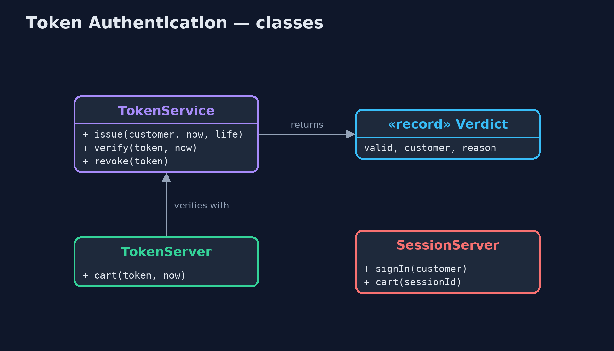
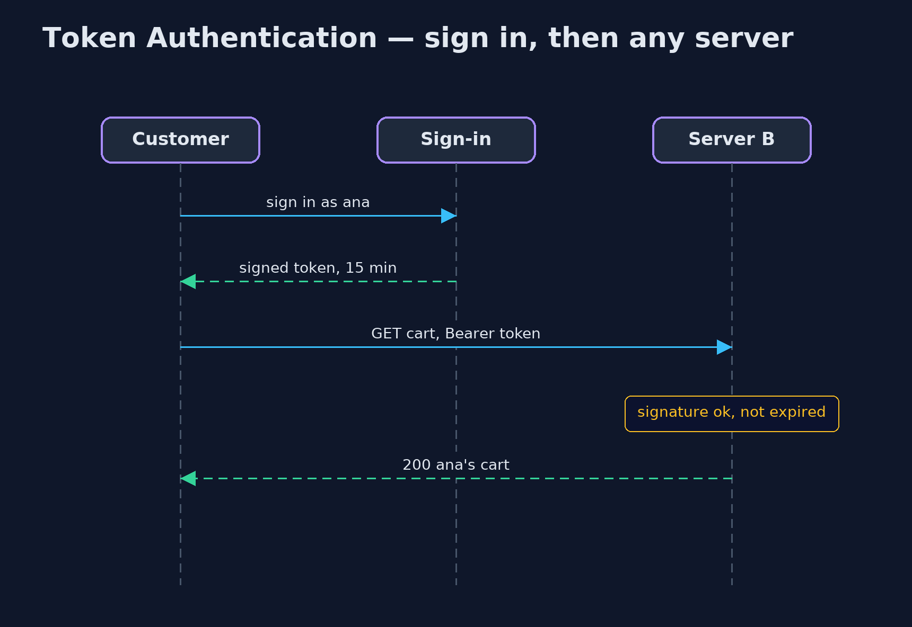

# Token Authentication Pattern

```
src/main/java/com/jk/explore/tokenauth/
├── SessionServer.java  Before: each server remembers its signed-in customers in its own memory, keyed by a session identifier
├── TokenAuthDemo.java  The five acts: sessions stuck on one server, a signed token any server can check, tampering and expiry, signing out early, and the bill
├── TokenServer.java    After: a server that keeps no sessions
├── TokenService.java   The pattern: a signed token in the same shape as a JWT, header.payload.signature
└── Verdict.java        The result of checking a token: the customer it names, or why it was refused
```

**After sign-in, give the client a signed token that says who they are and when it expires, so any server holding the key can check it without a shared session store.**

Token Authentication is how most modern web services remember who you are.
After you sign in, the server gives you a token: a short piece of text that
says who you are and when it expires, with a signature made from a secret key.
You send it with every request. Any server holding the key can check the
signature and trust what the token says, without looking anything up.

The common format is the JSON Web Token (JWT): three parts separated by
dots, a header, a payload and a signature. This project builds one with the
JDK's own HMAC-SHA256, so every step is visible.

## The idea in everyday terms

Think of a wristband at a music festival. At the gate your ticket is checked
once, and you get a wristband printed with the date and a hologram. After
that, any steward at any stage can glance at the band and let you in, without
phoning the gate. The hologram is hard to fake, and the date means yesterday's
band no longer works.

## The scenario

The online store runs its website on two servers behind a load balancer.
When a customer signed in, the server they reached remembered them in its own
memory. If their next request was sent to the other server, it had never heard
of them, and asked them to sign in again.

## Run

```bash
./gradlew run
```

The demo tells the story in 5 acts, each printing exact numbers that the tests check:

| Act | What it shows |
| --- | --- |
| 1. Sessions on one server | ana signs in on server A; the next request to A shows ana's cart, but a request routed to B gets 401 please sign in. |
| 2. A signed token | The token's payload names ana and an expiry 15 minutes ahead; server A and server B both accept it, with no shared session store. |
| 3. Forged and expired | Changing the payload to ben gives 401 bad signature; using the token after 15 minutes gives 401 expired. |
| 4. Signing out early | After ana signs out, the token alone still works; a revoked list stops it on A, but B, with its own list, still accepts it. |
| 5. The bill | The payload is only encoded, so anyone can read it; and anyone who steals the key can sign a token for any customer. |

## Test

```bash
./gradlew test
```

5 tests in `DemoRunsTest`, `TokenServiceTest`. Every number the demo prints is asserted, and nothing depends on the clock, so every run gives the same result.

## Technologies and versions

| Technology | Version | Used for |
| --- | --- | --- |
| Java | 21 | the code (toolchain set in `build.gradle`) |
| Gradle | 9.2.1 (wrapper) | build and run, nothing to install |
| JUnit | 5.10.2 | the tests |
| videokit | repository tool | the narrated video and animation: Piper `en_US-amy-medium`, speed 0.8, longer pauses (the approved `amy-slow` voice) |

## Learning Material

| Document | What it is for |
| --- | --- |
| [Problem statement](docs/problem-statement.md) | the situation and what the project must show |
| [Prerequisites](docs/prerequisites.md) | what you need to know first |
| [Token Authentication, explained](docs/token-authentication-pattern-explained.md) | the acts in prose |
| [Session guide](docs/session.md) | a one-hour lesson with exercises |
| [Animated walkthrough](docs/animation.html) | the acts step by step, narrated |
| [Spec](docs/spec.md) | what this project must be true of |

### The pattern in one picture

Each server checks the token itself.


### Where each piece sits

One service issues and verifies.



### How the data moves

Signature, expiry, revocation, in that order.


### Who calls whom, in order

No shared session store.



### Video

`video/token-authentication-pattern-explained.mp4` (with `.m4a` audio and `.srt` subtitles) is built by `video/build_video.sh`. Rendered media is not committed.

## What it costs

- **Hard to take back.** A token stays valid until it expires; signing out early needs a revoked list, and every server must share it.
- **Readable by anyone.** The payload is only encoded, not encrypted; never put secrets in it.
- **The key is everything.** Anyone who steals the signing key can make a token for any customer, so it belongs in a secrets manager and must be rotated.

## When this is too much

A single server rendering its own pages is well served by an ordinary
session. Tokens pay off with several servers or services, or with mobile
apps and other programs calling an API.

## Where you have already met this

- JWTs in `Authorization: Bearer` headers.
- OAuth 2.0 access tokens and OpenID Connect ID tokens.
- Spring Security's resource-server support and libraries such as jjwt and Nimbus.

## Where this sits

This project is in [security-design-patterns](..), next to
[Authorization Policy](../authorization-policy-pattern), which decides what a
customer may do once the token has said who they are.
