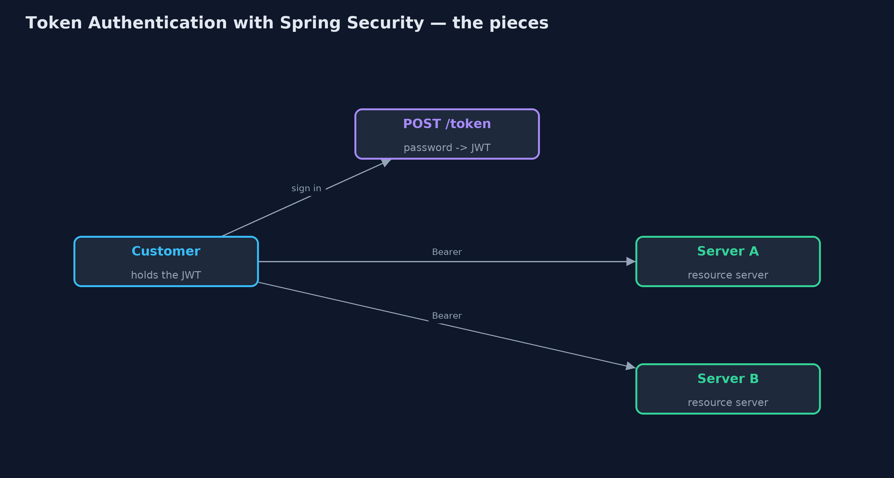
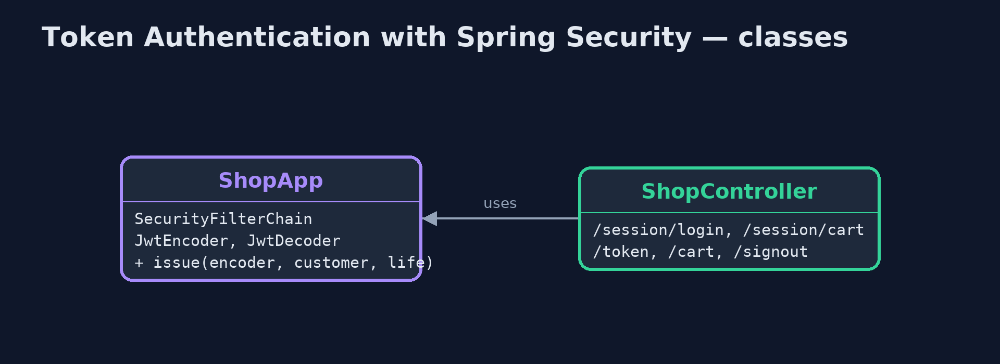
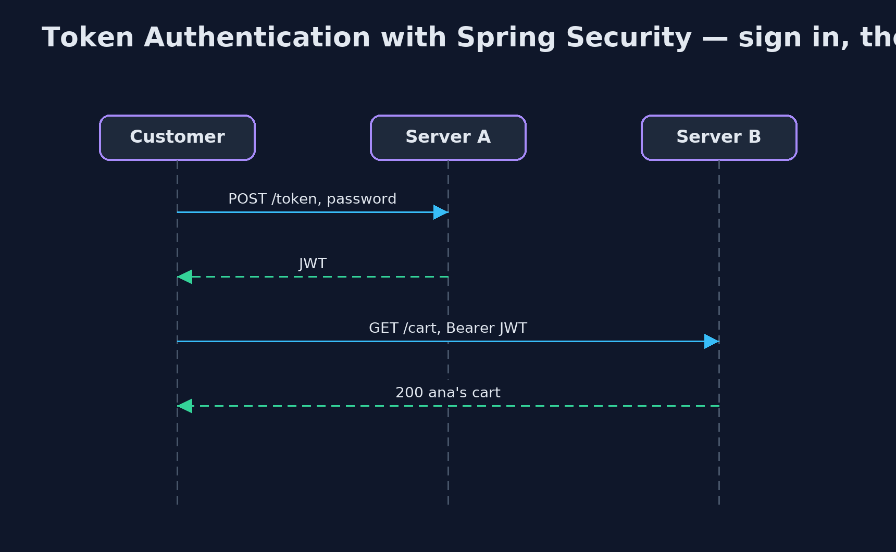

# Token Authentication with Spring Security Pattern

```
src/main/java/com/jk/explore/tokenspring/
├── ShopApp.java              One instance of the shop's web server, secured by Spring Security
├── ShopController.java       The shop's endpoints: the old session-based ones, the sign-in that issues a token, and the cart
└── SpringTokenAuthDemo.java  The five acts: two real instances of the shop's Spring Boot server, called over HTTP
```

**Issue a signed JSON Web Token when a customer signs in, and let Spring Security's resource-server support check it on every instance of the shop: signature, expiry and a revoked list, with no session store.**

This is the framework version of the Token Authentication pattern. The plain
Java version, a separate project in this category, builds and checks tokens
by hand with HMAC-SHA256. Here Spring Security does it, inside two real
Spring Boot instances of the shop's web server, called over HTTP.

Signing in with a password at `/token` returns a JSON Web Token signed with
the shop's secret, using Spring Security's `JwtEncoder`. Every other endpoint
expects that token as a Bearer header, and Spring Security's resource-server
support, backed by the Nimbus library, checks the signature and expiry before
any shop code runs. Both instances hold the same secret, so either accepts a
token issued by the other.

## The idea in everyday terms

Think of a festival wristband. The ticket is checked once at the gate, and
you are given a band with a hologram and a date. Any steward at any stage can
check the band without phoning the gate; a fake band has the wrong hologram,
and yesterday's band has the wrong date.

## The scenario

The online store's website runs on two servers behind a load balancer. With
sessions kept in each server's memory, a customer who signed in on one
server was asked to sign in again whenever a request reached the other.

## Run

Nothing to install beyond a Java 21 JDK: the demo starts two, and at the end
three, Spring Boot instances inside one program, on local ports, and calls
them over HTTP.

```bash
./gradlew run
```

The demo tells the story in 5 acts, each printing exact numbers that the tests check:

| Act | What it shows |
| --- | --- |
| 1. Sessions on one server | ana signs in on server A with a session; A shows ana's cart, but B answers 401 please sign in. |
| 2. A token from Spring Security | POST /token with ana's password returns a JWT; server A and server B both answer 200 ana's cart. |
| 3. Forged and expired | Payload changed to ben: 401 Invalid signature. A token that expired 2 minutes ago: 401 Jwt expired. |
| 4. Signing out early | ana signs out on A, which revokes the token: A answers 401 revoked, B still answers 200. |
| 5. The bill | Anyone can read the payload; and a third instance holding the stolen secret signs a token for ben that server A accepts. |

## Test

```bash
./gradlew test
```

1 tests in `DemoRunsTest`. Every result the demo prints is asserted, with real Spring Boot instances on local ports called over HTTP.

## What the simulation got right, and what it left out

The plain Java version got the idea right: a signed token naming the customer
and an expiry, checked by any server with the key; tampering and expiry
refused; early sign-out needing a revoked list every server shares; a readable
payload and a key that must be guarded. What it left out is how a framework
does it for you. Spring Security issues standard JWTs, rejects bad ones before
your code runs with a clear reason, and lets you add your own check, here the
revoked list, as one validator. It also exposed a real default: Spring allows
60 seconds of clock difference on expiry, which this demo sets to zero.

## Technologies and versions

| Technology | Version | Used for |
| --- | --- | --- |
| Java | 21 | the code (toolchain set in `build.gradle`) |
| Gradle | 9.2.1 (wrapper) | build and run, nothing to install |
| JUnit | 5.10.2 | the tests |
| Spring Boot | 4.1.1 | the web server instances |
| Spring Security | 7 (with Boot 4.1.1) | HTTP Basic sign-in, Bearer token checks, JwtEncoder |
| Nimbus JOSE + JWT | with Spring Security | signing and checking the tokens |
| videokit | repository tool | the narrated video and animation: Piper `en_US-amy-medium`, speed 0.8, longer pauses (the approved `amy-slow` voice) |

## Learning Material

| Document | What it is for |
| --- | --- |
| [Dependencies](docs/dependencies.md) | what the framework and infrastructure are, and why they are here |
| [Problem statement](docs/problem-statement.md) | the situation and what the project must show |
| [Prerequisites](docs/prerequisites.md) | what you need to know first |
| [Token Authentication with Spring Security, explained](docs/token-authentication-with-spring-security-pattern-explained.md) | the acts in prose |
| [Session guide](docs/session.md) | a one-hour lesson with exercises |
| [Animated walkthrough](docs/animation.html) | the acts step by step, narrated |
| [Spec](docs/spec.md) | what this project must be true of |

### The pattern in one picture

Sign in once; every instance checks the token.



### Where each piece sits

Configuration, not hand-written checks.



### How the data moves

Before any shop code runs.


### Who calls whom, in order

No shared session.



### Video

`video/token-authentication-with-spring-security-pattern-explained.mp4` (with `.m4a` audio and `.srt` subtitles) is built by `video/build_video.sh`. Rendered media is not committed.

## What it costs

- **Hard to take back.** A signed-out token still worked on the instance whose revoked list did not have it.
- **Readable by anyone.** The payload, with sub and exp, is only encoded; never put secrets in it.
- **The key is everything.** A third instance holding the stolen secret signed a token for ben, and the shop accepted it.

## When this is too much

A single server rendering its own pages is well served by an ordinary
session. Tokens pay off with several instances or services, or with mobile
apps and other programs calling an API.

## Where you have already met this

- `oauth2ResourceServer().jwt()` in Spring Security configurations.
- OAuth 2.0 access tokens from Keycloak, Auth0 or Okta.
- `Authorization: Bearer eyJ...` headers in browser developer tools.

## Where this sits

This project is in [security-design-patterns](..). It is the framework
version of the plain Java Token Authentication project in the same category,
which is left unchanged.
