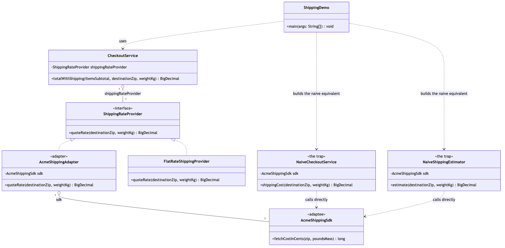

# Adapter Pattern

Demonstrates the Structural **Adapter** design pattern using a checkout
flow that needs shipping rates from an incompatible third-party SDK as an
example.

- `ShippingRateProvider` — the target. The interface checkout already
  expects: `quoteRate(destinationZip, weightKg)` returns a `BigDecimal` in
  dollars.
- `AcmeShippingSdk` — the adaptee. Third-party, incompatible, and
  unmodified: `fetchCostInCents(zip, poundsMass)` takes pounds and returns
  integer cents.
- `AcmeShippingAdapter` — the adapter. Implements `ShippingRateProvider`,
  holds an `AcmeShippingSdk` by composition, and converts kilograms to
  pounds before calling it and cents to dollars after — the only class in
  the codebase that imports `AcmeShippingSdk`.
- `FlatRateShippingProvider` — a second, natively compatible
  implementation of `ShippingRateProvider`, kept for contrast: it proves
  the client cannot distinguish an adapted implementation from a native
  one.
- `CheckoutService` — the client. Depends only on `ShippingRateProvider`
  and adds its quote to an order subtotal.
- `NaiveCheckoutService` / `NaiveShippingEstimator` — the trap, kept for
  contrast. Both call `AcmeShippingSdk` directly and duplicate the exact
  same unit conversion independently.
- `ShippingDemo` — runnable entry point that quotes shipping through both
  the adapted and native providers, isolates a single adapter call, and
  contrasts the adapter approach with the naive one.

## Run

```bash
./gradlew run
```

Which prints:

```text
== Checkout works with any ShippingRateProvider, adapted or native ==
Acme (adapted):  $63.46
Flat rate (native):  $57.48

== The adapter converts units at exactly one seam ==
3.5 kg checkout weight -> AcmeShippingSdk sees pounds, returns cents
Quoted rate: $13.48

== The naive alternative, for comparison ==
NaiveCheckoutService:    $13.48
NaiveShippingEstimator:  $13.48
Same result, but the pounds/cents conversion is duplicated in both classes,
and both are coupled directly to AcmeShippingSdk's shape.
```

Expected output:

```
== Checkout works with any ShippingRateProvider, adapted or native ==
Acme (adapted):  $63.46
Flat rate (native):  $57.48

== The adapter converts units at exactly one seam ==
3.5 kg checkout weight -> AcmeShippingSdk sees pounds, returns cents
Quoted rate: $13.48

== The naive alternative, for comparison ==
NaiveCheckoutService:    $13.48
NaiveShippingEstimator:  $13.48
Same result, but the pounds/cents conversion is duplicated in both classes,
and both are coupled directly to AcmeShippingSdk's shape.
```

## Test

```bash
./gradlew test
```

12 tests, covering the adapter's unit conversion and rounding
(`AcmeShippingAdapterTest`), the adaptee's raw pricing math
(`AcmeShippingSdkTest`), checkout's totals with both an adapted and a
native provider (`CheckoutServiceTest`), the natively compatible provider
(`FlatRateShippingProviderTest`), the naive alternative's matching output
(`NaiveShippingCodeTest`), and the demo's printed output
(`ShippingDemoTest`).

## Learning Material

Start here if you are new to the pattern — the docs are ordered as a
learning path.

| Document | What it covers |
| --- | --- |
| [`docs/prerequisites.md`](docs/prerequisites.md) | What to know and install before you start |
| [`docs/problem-statement.md`](docs/problem-statement.md) | The problem the pattern solves, and why the naive approach hurts |
| [`docs/adapter-pattern-explained.md`](docs/adapter-pattern-explained.md) | The pattern itself, the code walked through, pitfalls, and comparisons |
| [`docs/class-diagram.md`](docs/class-diagram.md) | Static structure |
| [`docs/uml-diagram.md`](docs/uml-diagram.md) | Runtime call flow |
| [`docs/animation.html`](docs/animation.html) | Animated, step-by-step walkthrough — open in a browser. Optional narration via the **Narration** button |
| [`docs/session.md`](docs/session.md) | A 60-minute guided session plan for teaching it |
| [`docs/youtube.md`](docs/youtube.md) | Title, description, chapters and thumbnail for publishing the video |
| [`docs/thumbnail.png`](docs/thumbnail.png) | The 1280×720 image to upload as the YouTube thumbnail |
| [`docs/spec.md`](docs/spec.md) | The project specification — problem, code, video and publishing quality bar. Also as [`spec.html`](docs/spec.html) |
| [`video/`](video/) | A narrated ~6.5 minute video, plus the script and build pipeline |

### The pattern in one picture



### Video

`video/adapter-pattern-explained.mp4` — 1080p, ~6.5 minutes, narrated.
An audio-only version is alongside it. See
[`video/README.md`](video/README.md) to rebuild or re-record it.
