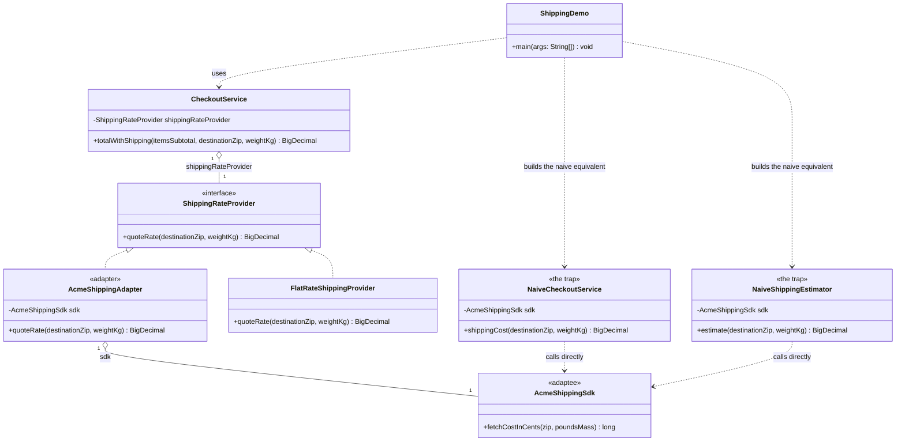

# Adapter Pattern — Class Diagram

Shows the static structure: `AcmeShippingAdapter` implements the
`ShippingRateProvider` target interface and holds an `AcmeShippingSdk`
adaptee by composition, translating every call. `CheckoutService` depends
only on the target interface, so it works identically with the adapted
provider or a natively compatible one. The naive alternative — coupling
directly to `AcmeShippingSdk` — is drawn alongside to show what the
adapter buys you.

Mermaid source

## Notes

- `ShippingRateProvider` is the **Target**: the interface `CheckoutService`
  already expects, expressed in checkout's own units — kilograms in,
  dollars out.
- `AcmeShippingSdk` is the **Adaptee**: an existing, incompatible class
  (pounds in, cents out, differently named method) that we do not control.
- `AcmeShippingAdapter` is the **Adapter**: it implements
  `ShippingRateProvider` and holds an `AcmeShippingSdk`, translating units
  and method shape in exactly one place.
- `FlatRateShippingProvider` implements `ShippingRateProvider` natively —
  no adapting needed — proving the target interface can be satisfied either
  way.
- `CheckoutService` is the **Client**: the composition arrow to
  `ShippingRateProvider` is the only dependency it has on shipping rates at
  all. It never references `AcmeShippingSdk`.
- `NaiveCheckoutService` and `NaiveShippingEstimator` each call
  `AcmeShippingSdk` directly and duplicate the exact same unit-conversion
  arithmetic — which is exactly why a single adapter class is worth having.
