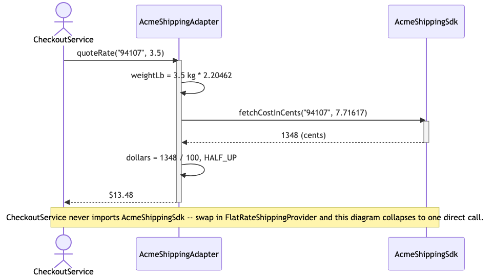
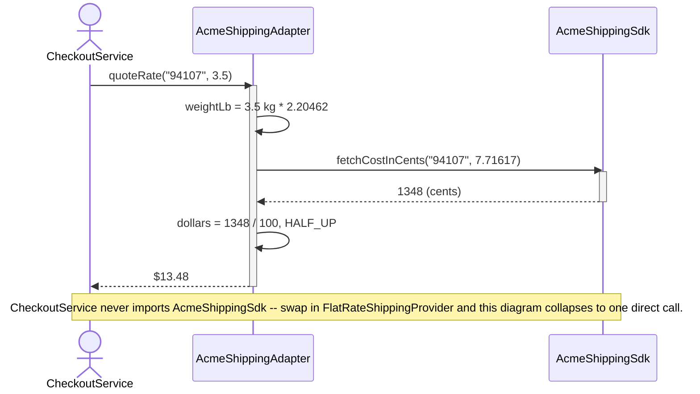

# Adapter Pattern — UML Sequence Diagram

Shows the runtime interaction: `CheckoutService` calls `quoteRate()` once,
on whatever `ShippingRateProvider` it was constructed with, and the
`AcmeShippingAdapter` translates that single call into the shape
`AcmeShippingSdk` actually expects — the caller never sees pounds or
cents.

Mermaid source

## Notes

- The client makes exactly **one** call: `quoteRate(destinationZip,
  weightKg)`. It never calls `fetchCostInCents` and never touches pounds
  or cents.
- The adapter performs the conversion in two places around the single
  delegated call: kilograms → pounds *before* calling the adaptee, and
  cents → dollars *after* the adaptee returns.
- `AcmeShippingSdk` does exactly one thing — compute a price given pounds —
  and has no idea it is being adapted. It is unmodified third-party code.
- If `CheckoutService` were wired to `FlatRateShippingProvider` instead,
  this whole diagram collapses to a single direct call with no
  intermediate translation step — proving the adapter is invisible from
  the client's point of view, not a mandatory extra hop.
