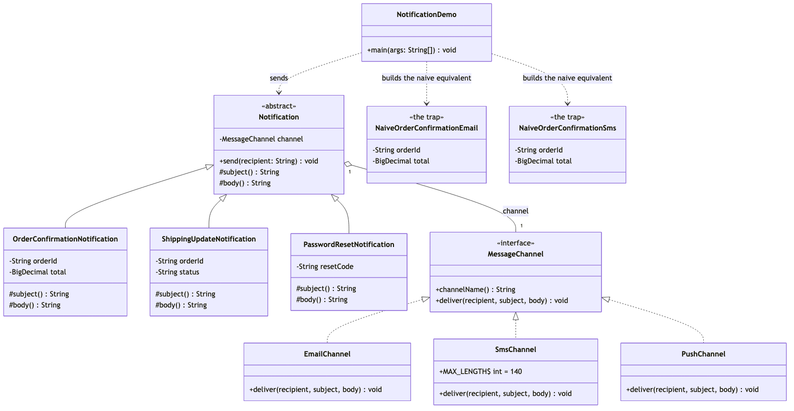

# Bridge Pattern

Demonstrates the Structural **Bridge** design pattern using a notification
system for an e-commerce store as an example.

- `Notification` — the abstraction. Holds a `MessageChannel` by composition
  and delegates delivery to it: `send(recipient)` is `final` and calls
  `channel.deliver(recipient, subject(), body())`.
- `MessageChannel` — the implementor. The one interface every delivery
  mechanism implements: `channelName()`, `deliver(recipient, subject, body)`.
- `OrderConfirmationNotification` / `ShippingUpdateNotification` /
  `PasswordResetNotification` — refined abstractions. Each composes its own
  subject and body; none of them know how delivery works.
- `EmailChannel` / `SmsChannel` / `PushChannel` — concrete implementors.
  Each owns one delivery mechanism's quirks: `SmsChannel` truncates at 140
  characters, `PushChannel` drops the body and shows only the subject,
  `EmailChannel` passes both through unchanged.
- `NaiveOrderConfirmationEmail` / `NaiveOrderConfirmationSms` /
  `NaiveShippingUpdateEmail` / `NaiveShippingUpdateSms` — the trap, kept for
  contrast. One class per (notification, channel) pair, with the SMS
  truncation logic copy-pasted between the two SMS classes.
- `NotificationDemo` — runnable entry point that sends notifications
  through all three channels, demonstrates SMS truncation on a long
  message, and contrasts the bridge approach with the naive one.

## Run

```bash
./gradlew run
```

Which prints:

```text
== Same notification, delivered through three different channels ==
[EMAIL to alex@example.com] Order ORD-1042 confirmed -- Your order ORD-1042 totalling $129.99 has been confirmed.
[SMS to +1-555-0142] Order ORD-1042 confirmed: Your order ORD-1042 totalling $129.99 has been confirmed.
[PUSH to device-9f31] Order ORD-1042 confirmed

== A different notification type, same channels, zero new channel code ==
[EMAIL to alex@example.com] Shipping update for order ORD-1042 -- Order ORD-1042 is now: out for delivery
[SMS to +1-555-0142] Shipping update for order ORD-1042: Order ORD-1042 is now: out for delivery

== A brand-new notification type reuses every existing channel ==
[EMAIL to alex@example.com] Password reset requested -- Use code 384920 to reset your password. It expires in 15 minutes.

== SMS truncates; Email does not -- channel behavior, isolated from notification code ==
[EMAIL to alex@example.com] Shipping update for order ORD-1099 -- Order ORD-1099 is now: delayed at customs due to an incomplete declaration, expect an update within 2 business days
[SMS to +1-555-0142] Shipping update for order ORD-1099: Order ORD-1099 is now: delayed at customs due to an incomplete declaration, expect an update within 2 b…

== The naive alternative, for comparison ==
[EMAIL to alex@example.com] Order ORD-1042 confirmed -- Your order ORD-1042 totalling $129.99 has been confirmed.
[SMS to +1-555-0142] Order ORD-1042 confirmed: Your order ORD-1042 totalling $129.99 has been confirmed.
[EMAIL to alex@example.com] Shipping update for order ORD-1042 -- Order ORD-1042 is now: out for delivery
[SMS to +1-555-0142] Shipping update for order ORD-1042: Order ORD-1042 is now: out for delivery
Four classes just for two notification types across two channels --
adding Push would mean two more, and a third notification type three more.
```

Expected output:

```
== Same notification, delivered through three different channels ==
[EMAIL to alex@example.com] Order ORD-1042 confirmed -- Your order ORD-1042 totalling $129.99 has been confirmed.
[SMS to +1-555-0142] Order ORD-1042 confirmed: Your order ORD-1042 totalling $129.99 has been confirmed.
[PUSH to device-9f31] Order ORD-1042 confirmed

== A different notification type, same channels, zero new channel code ==
[EMAIL to alex@example.com] Shipping update for order ORD-1042 -- Order ORD-1042 is now: out for delivery
[SMS to +1-555-0142] Shipping update for order ORD-1042: Order ORD-1042 is now: out for delivery

== A brand-new notification type reuses every existing channel ==
[EMAIL to alex@example.com] Password reset requested -- Use code 384920 to reset your password. It expires in 15 minutes.

== SMS truncates; Email does not -- channel behavior, isolated from notification code ==
[EMAIL to alex@example.com] Shipping update for order ORD-1099 -- Order ORD-1099 is now: delayed at customs due to an incomplete declaration, expect an update within 2 business days
[SMS to +1-555-0142] Shipping update for order ORD-1099: Order ORD-1099 is now: delayed at customs due to an incomplete declaration, expect an update within 2 b…

== The naive alternative, for comparison ==
[EMAIL to alex@example.com] Order ORD-1042 confirmed -- Your order ORD-1042 totalling $129.99 has been confirmed.
[SMS to +1-555-0142] Order ORD-1042 confirmed: Your order ORD-1042 totalling $129.99 has been confirmed.
[EMAIL to alex@example.com] Shipping update for order ORD-1042 -- Order ORD-1042 is now: out for delivery
[SMS to +1-555-0142] Shipping update for order ORD-1042: Order ORD-1042 is now: out for delivery
Four classes just for two notification types across two channels --
adding Push would mean two more, and a third notification type three more.
```

## Test

```bash
./gradlew test
```

11 tests, covering notification content composition (`NotificationTest`),
each channel's delivery behavior including SMS truncation
(`SmsChannelTest`, `EmailChannelTest`, `PushChannelTest`), the naive
alternative's matching output (`NaiveNotificationsTest`), and the demo's
printed output (`NotificationDemoTest`).

## Learning Material

Start here if you are new to the pattern — the docs are ordered as a
learning path.

| Document | What it covers |
| --- | --- |
| [`docs/prerequisites.md`](docs/prerequisites.md) | What to know and install before you start |
| [`docs/problem-statement.md`](docs/problem-statement.md) | The problem the pattern solves, and why the naive approach hurts |
| [`docs/bridge-pattern-explained.md`](docs/bridge-pattern-explained.md) | The pattern itself, the code walked through, pitfalls, and comparisons |
| [`docs/class-diagram.md`](docs/class-diagram.md) | Static structure |
| [`docs/uml-diagram.md`](docs/uml-diagram.md) | Runtime call flow |
| [`docs/animation.html`](docs/animation.html) | Animated, step-by-step walkthrough — open in a browser. Optional narration via the **Narration** button |
| [`docs/session.md`](docs/session.md) | A 60-minute guided session plan for teaching it |
| [`docs/youtube.md`](docs/youtube.md) | Title, description, chapters and thumbnail for publishing the video |
| [`docs/thumbnail.png`](docs/thumbnail.png) | The 1280×720 image to upload as the YouTube thumbnail |
| [`docs/spec.md`](docs/spec.md) | The project specification — problem, code, video and publishing quality bar. Also as [`spec.html`](docs/spec.html) |
| [`video/`](video/) | A narrated ~7.5 minute video, plus the script and build pipeline |

### The pattern in one picture



### Video

`video/bridge-pattern-explained.mp4` — 1080p, ~7.5 minutes, narrated.
An audio-only version is alongside it. See
[`video/README.md`](video/README.md) to rebuild or re-record it.
