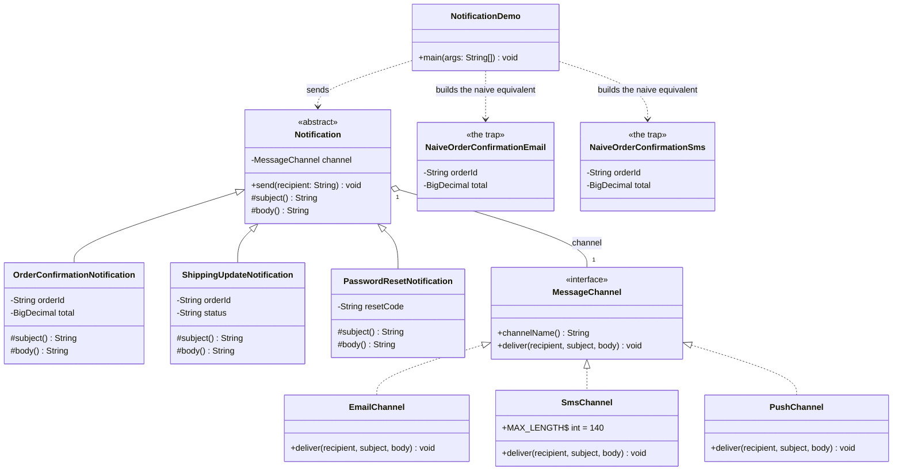

# Bridge Pattern — Class Diagram

Shows the static structure: `Notification` (the abstraction) holds a
`MessageChannel` (the implementor) by composition. Three `Notification`
subclasses vary content; three `MessageChannel` implementations vary
delivery — and neither hierarchy depends on the other's concrete classes.
The naive alternative is drawn alongside to show what the bridge buys you.

Mermaid source

## Notes

- `Notification` is the **Abstraction**: it declares `send()` once, final,
  and delegates to whatever `MessageChannel` it was constructed with. It
  never checks which channel it holds.
- `OrderConfirmationNotification`, `ShippingUpdateNotification`, and
  `PasswordResetNotification` are **Refined Abstractions** — each composes
  its own subject and body, and none of them mention email, SMS, or push.
- `MessageChannel` is the **Implementor**: the seam the two hierarchies
  meet at, declaring only `deliver(recipient, subject, body)`.
- `EmailChannel`, `SmsChannel`, and `PushChannel` are **Concrete
  Implementors** — each owns exactly one delivery mechanism's quirks
  (`SmsChannel` truncates at `MAX_LENGTH`; `PushChannel` drops the body
  entirely).
- The composition arrow (`Notification "1" o-- "1" MessageChannel`) is the
  entire bridge — a single field, connecting two hierarchies that otherwise
  know nothing about each other.
- `NaiveOrderConfirmationEmail` and `NaiveOrderConfirmationSms` have no
  shared implementor type at all — each hardcodes its own delivery logic,
  which is exactly why the SMS truncation rule has to be copy-pasted rather
  than written once.
