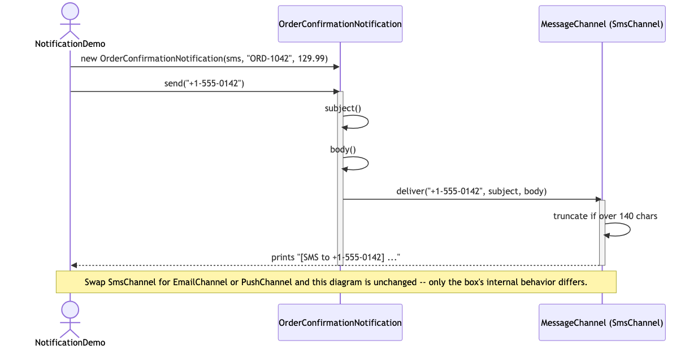
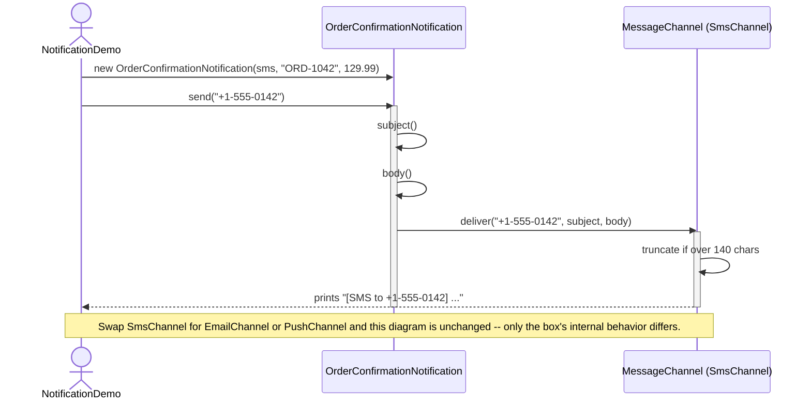

# Bridge Pattern — UML Sequence Diagram

Shows the runtime interaction: `NotificationDemo` calls `send()` once, on a
`Notification`, and the `Notification` delegates delivery to whichever
`MessageChannel` it was constructed with — the caller never branches on
channel type.

Mermaid source

## Notes

- The client makes exactly **two** calls: construct the `Notification` with
  a channel, then `send()`. It never calls anything on `MessageChannel`
  directly, and it never asks the `Notification` which channel it holds.
- `subject()` and `body()` are called by `Notification.send()` itself —
  they are protected, template-style hooks, not part of the public
  contract the client sees.
- `deliver()` is where all channel-specific behavior lives. For
  `SmsChannel` that means an internal truncation check; for `EmailChannel`
  it means passing both strings through unchanged; for `PushChannel` it
  means silently discarding `body` before printing.
- Swapping the concrete `MessageChannel` — email, SMS, push, or a future
  fourth channel — changes nothing about this diagram's shape. Only the
  activation box's internal steps differ, which is the whole point of
  separating the implementor from the abstraction.
