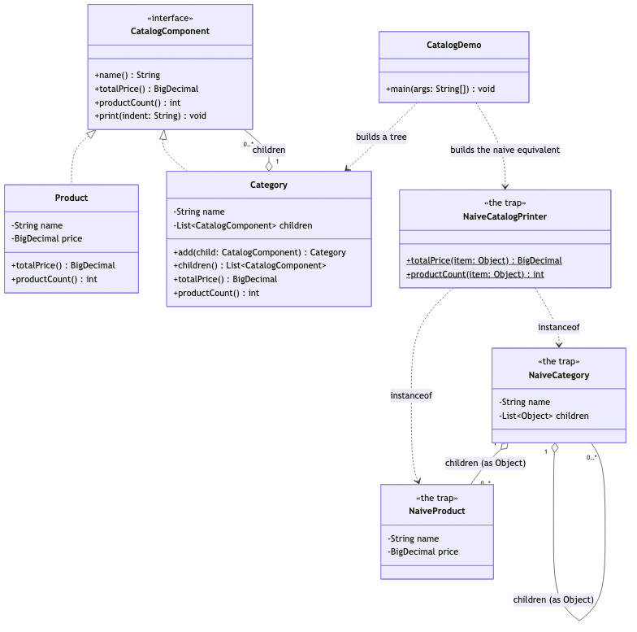
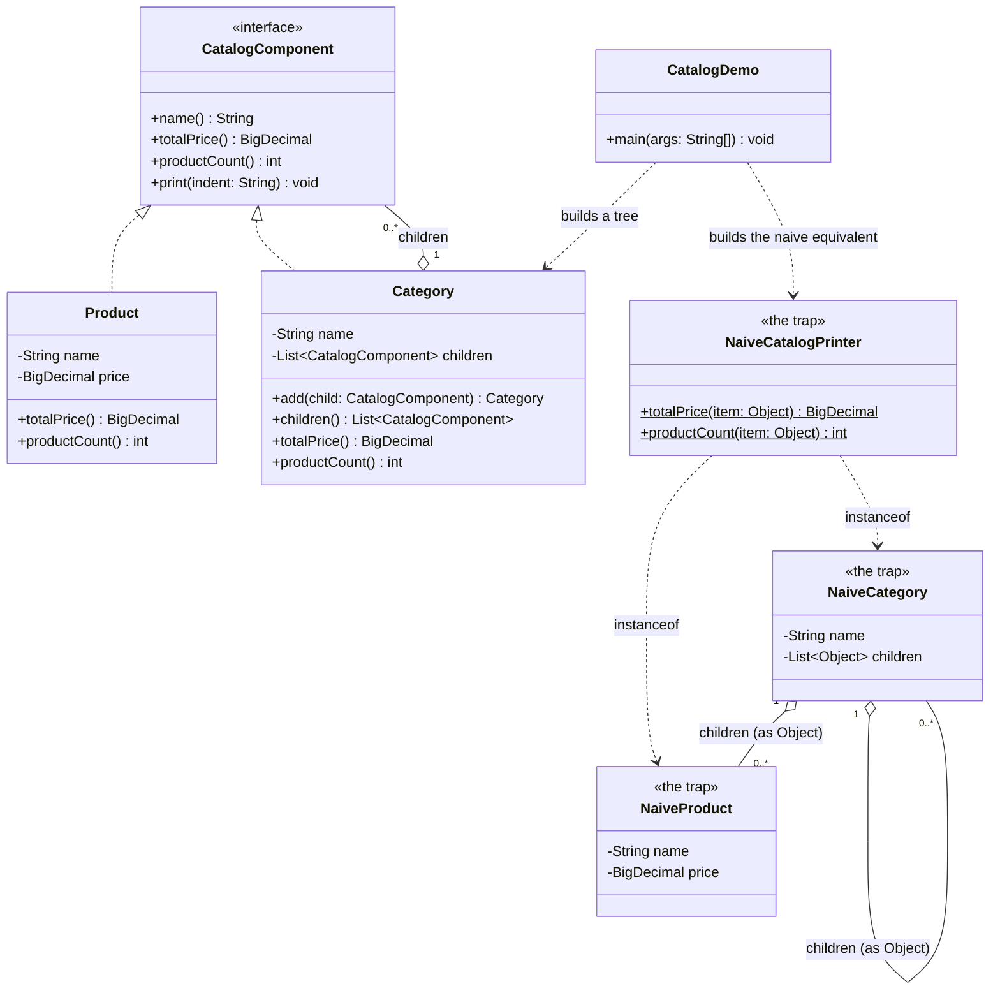

# Composite Pattern — Class Diagram

Shows the static structure: `Product` (the leaf) and `Category` (the
composite) both implement `CatalogComponent`, and a `Category` holds a list
of `CatalogComponent` children — which may themselves be more `Category`
nodes. The naive alternative is drawn alongside to show what a shared
type buys you.

Mermaid source

## Notes

- `CatalogComponent` is the **Component**: the one interface both leaves and
  composites implement, which is what lets `CatalogDemo` call `totalPrice()`
  on either without checking which one it has.
- `Product` is the **Leaf** — no children, so its answers are direct: its
  own price, a product count of exactly one.
- `Category` is the **Composite** — it holds `CatalogComponent` children
  (note the self-referencing association: a `Category`'s children can
  themselves be `Category` nodes) and answers every question by delegating
  to each child and combining the results.
- `NaiveCategory` has to hold `List<Object>` because `NaiveProduct` and
  `NaiveCategory` share no common type — which is exactly why
  `NaiveCatalogPrinter` needs `instanceof` checks that `Category` never
  does.
