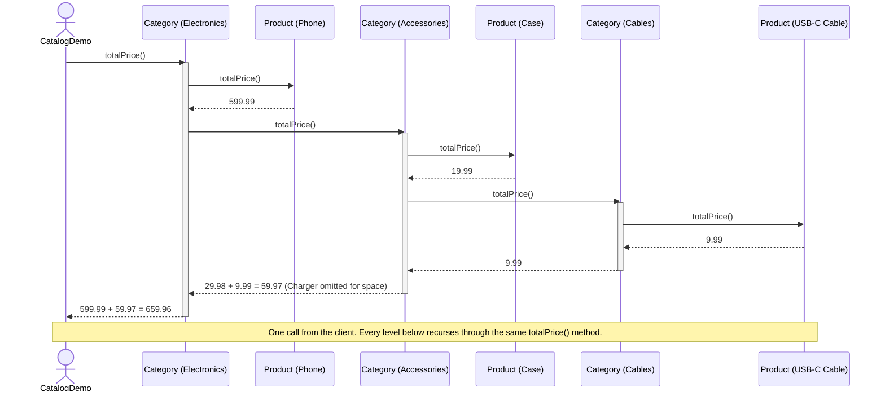

# Composite Pattern — UML Sequence Diagram

Shows the runtime interaction: `CatalogDemo` calls `totalPrice()` once, on
the root `Category`, and the recursion into nested categories and leaf
products happens entirely inside the tree — no caller-side `instanceof`,
no caller-side loop past the first call.

Mermaid source

## Notes

- The client makes exactly **one** call, `electronics.totalPrice()`. Every
  arrow below that is the tree talking to itself — `Category` asking each
  of its children the identical question it was just asked.
- `Product.totalPrice()` never sends any further messages — it is the base
  case of the recursion, answering with its own stored price.
- `Category.totalPrice()` is the recursive case: it waits for every child's
  answer (whether that child is a `Product` or another `Category`) and
  sums them before returning to whoever asked it.
- Nesting one more `Category` (as `Cables` is nested inside `Accessories`)
  adds one more layer to this diagram, but requires no new code — the same
  `totalPrice()` method just gets called one more time.
