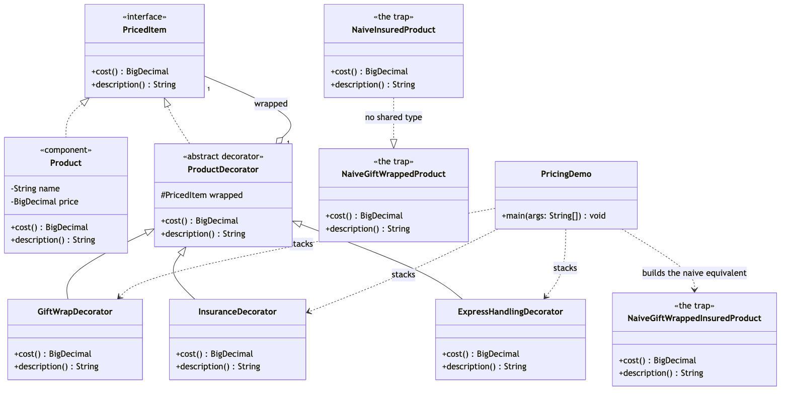
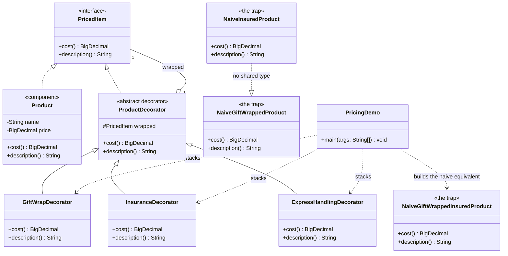

# Decorator Pattern — Class Diagram

Shows the static structure: `Product` and every `ProductDecorator`
subclass implement the shared `PricedItem` interface. Each concrete
decorator holds a `PricedItem` by composition and delegates to it before
adding its own fee. The naive alternative — one hardcoded class per
feature combination — is drawn alongside to show what the pattern buys you.

Mermaid source

## Notes

- `PricedItem` is the **Component**: the interface both plain and decorated
  products share. Client code only ever depends on this.
- `Product` is the **Concrete Component**: a plain item with no extras.
- `ProductDecorator` is the abstract **Decorator**: it implements
  `PricedItem` and holds a `PricedItem` reference, but adds no fee of its
  own — that is left to its subclasses.
- `GiftWrapDecorator`, `InsuranceDecorator`, and `ExpressHandlingDecorator`
  are **Concrete Decorators**: each adds exactly one fee and one
  description suffix on top of whatever it wraps.
- `NaiveGiftWrappedProduct`, `NaiveInsuredProduct`, and
  `NaiveGiftWrappedInsuredProduct` share no common supertype — each
  re-derives its own fee logic independently, which is exactly why the
  decorator stack is worth having.
