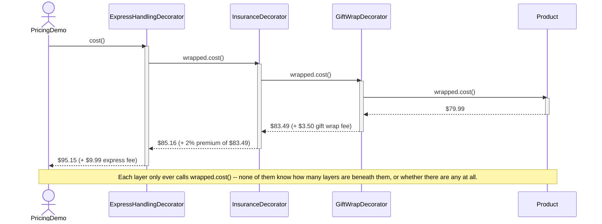

# Decorator Pattern — UML Sequence Diagram

Shows the runtime interaction: calling `cost()` on the outermost decorator
triggers a chain of delegated calls down to the plain `Product`, with each
layer adding its own fee on the way back up.

Mermaid source

## Notes

- The client makes exactly **one** call, `cost()`, on the outermost
  decorator. It never calls into `Product` directly and never knows how
  many decorators are stacked underneath.
- Each decorator delegates to `wrapped.cost()` first, then adds its own
  fee on top of whatever comes back — the call travels all the way down to
  `Product` before any fee is added, and fees accumulate on the way back
  up.
- `InsuranceDecorator`'s premium is computed on `$83.49` — the gift-wrapped
  total — not on the original `$79.99`, because it calls `wrapped.cost()`
  and has no visibility into what `wrapped` actually is.
- If the decorators were stacked in a different order (insurance first,
  then gift wrap), this same diagram shape still applies, but the dollar
  amounts at each step change — see
  [`decorator-pattern-explained.md`](decorator-pattern-explained.md) for
  the side-by-side comparison.
