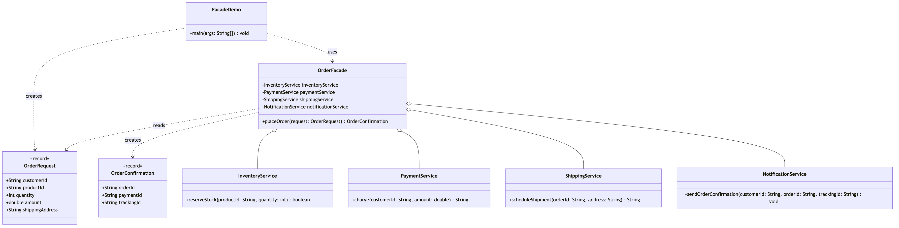

# Facade Pattern

Demonstrates the Structural **Facade** design pattern using an e-commerce
order checkout as an example.

- `InventoryService`, `PaymentService`, `ShippingService`,
  `NotificationService` — the subsystem classes with their own independent,
  more complex APIs.
- `OrderFacade` — provides a single simplified `placeOrder(OrderRequest)`
  method that hides the coordination logic required to reserve stock, take
  payment, schedule shipping and notify the customer.
- `OrderRequest` / `OrderConfirmation` — simple value objects passed to and
  returned from the facade.
- `FacadeDemo` — runnable entry point that exercises the facade.

## Run

```bash
./gradlew run
```

Which prints:

```text
Inventory: reserving 2 unit(s) of SKU-1234
Payment: charged $49.98 to customer CUST-001 (paymentId=PMT-ABE8E8A6)
Shipping: scheduled shipment for order ORD-C07428B5 to 221B Baker Street, London (trackingId=TRK-0A80D1BE)
Notification: emailed customer CUST-001 confirmation for order ORD-C07428B5 (trackingId=TRK-0A80D1BE)
Order placed: OrderConfirmation[orderId=ORD-C07428B5, paymentId=PMT-ABE8E8A6, trackingId=TRK-0A80D1BE]
```

The identifiers are generated per run, so the transaction, order and
tracking codes differ each time; everything else is stable.

## Test

```bash
./gradlew test
```

18 tests. `OrderFacadeTest` pins the sequence the facade exists to hold —
stock before payment, payment before shipment, shipment before the email —
and that a request refused for stock is never charged. `SubsystemsTest`
pins the other half of the pattern: the four services stay public and
usable without the facade.

## Learning Material

Start here if you are new to the pattern — the docs are ordered as a
learning path.

| Document | What it covers |
| --- | --- |
| [`docs/prerequisites.md`](docs/prerequisites.md) | What to know and install before you start |
| [`docs/problem-statement.md`](docs/problem-statement.md) | The problem the pattern solves, and why the naive approach hurts |
| [`docs/facade-pattern-explained.md`](docs/facade-pattern-explained.md) | The pattern itself, the code walked through, pitfalls, and comparisons |
| [`docs/class-diagram.md`](docs/class-diagram.md) | Static structure |
| [`docs/uml-diagram.md`](docs/uml-diagram.md) | Runtime call flow |
| [`docs/animation.html`](docs/animation.html) | Animated, step-by-step walkthrough — open in a browser. Optional narration via the **Narration** button |
| [`docs/session.md`](docs/session.md) | A 60-minute guided session plan for teaching it |
| [`docs/youtube.md`](docs/youtube.md) | Title, description, chapters and thumbnail for publishing the video |
| [`docs/thumbnail.png`](docs/thumbnail.png) | The 1280×720 image to upload as the YouTube thumbnail |
| [`docs/spec.md`](docs/spec.md) | The project specification — problem, code, video and publishing quality bar. Also as [`spec.html`](docs/spec.html) |
| [`video/`](video/) | A narrated ~7 minute video, plus the script and build pipeline |

### The pattern in one picture



### Video

`video/facade-pattern-explained.mp4` — 1080p, ~7 minutes, narrated.
An audio-only version is alongside it. See
[`video/README.md`](video/README.md) to rebuild or re-record it.
