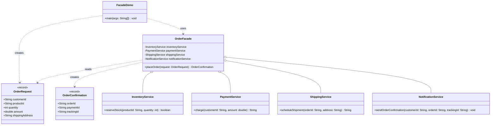

# Facade Pattern — Class Diagram

Shows the static structure: `OrderFacade` composes the four subsystem
services and exchanges data with the client through the `OrderRequest` /
`OrderConfirmation` value objects.

Mermaid source

## Notes

- `OrderFacade` is the **Facade**: it owns the subsystem instances
  (composition, `o--`) and exposes one coarse-grained operation,
  `placeOrder(...)`, instead of letting the client talk to each subsystem
  directly.
- The subsystem classes (`InventoryService`, `PaymentService`,
  `ShippingService`, `NotificationService`) have no knowledge of the facade
  or of each other — they remain independently usable and testable.
- `OrderRequest` and `OrderConfirmation` are immutable `record` value
  objects used purely to pass data across the facade boundary.
