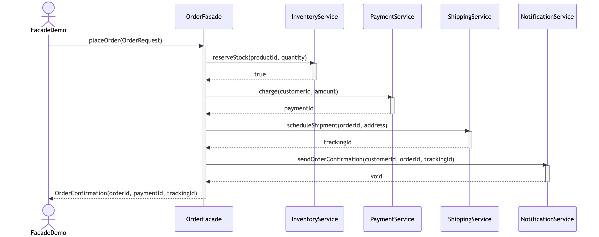
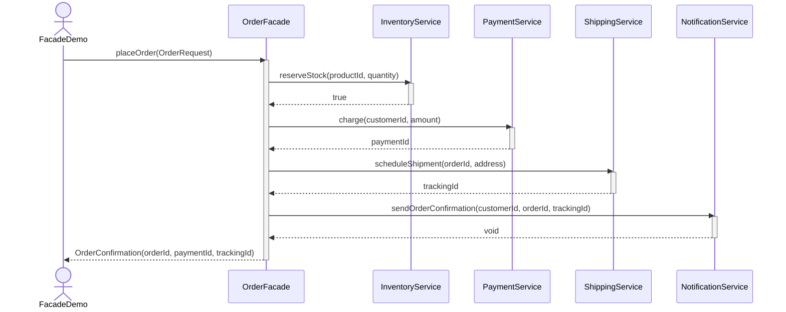

# Facade Pattern — UML Sequence Diagram

Shows the runtime interaction: the client calls the facade once, and the
facade coordinates all four subsystems in the correct order.

Mermaid source

## Notes

- The client (`FacadeDemo`) makes a **single call** to `OrderFacade`; it
  never talks to `InventoryService`, `PaymentService`, `ShippingService`, or
  `NotificationService` directly.
- `OrderFacade` is responsible for calling the subsystems **in the right
  order** and short-circuits with an `IllegalStateException` if
  `reserveStock` returns `false` (not shown above — the happy path).
- This is the core benefit of the Facade pattern: it reduces the client's
  coupling from four subsystem APIs down to one simplified entry point.
