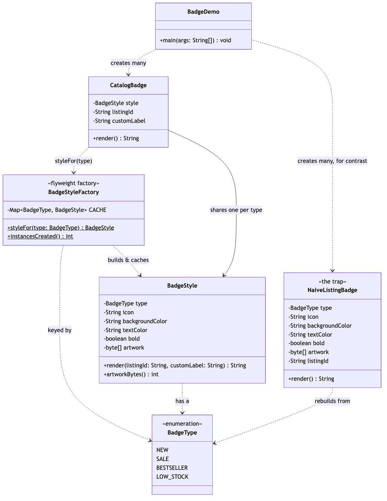

# Flyweight Pattern

Demonstrates the Structural **Flyweight** design pattern using badge
rendering for an e-commerce catalog as an example.

- `BadgeType` — the four badge designs a listing can carry (`NEW`, `SALE`,
  `BESTSELLER`, `LOW_STOCK`).
- `BadgeStyle` — the flyweight. Holds only intrinsic state (icon, colours,
  bold flag, a 64 KB artwork array) and renders using extrinsic state
  (`listingId`, `customLabel`) passed in as parameters.
- `BadgeStyleFactory` — the flyweight factory. `styleFor(BadgeType)` caches
  one `BadgeStyle` per type via `ConcurrentHashMap.computeIfAbsent`, so a
  type is ever built once.
- `CatalogBadge` — the context. Cheap to create in any quantity: it owns a
  listing id and an optional label, and borrows its `BadgeStyle` from the
  factory.
- `NaiveListingBadge` — the trap, kept for contrast. Rebuilds every field,
  including a full 64 KB artwork copy, per listing instead of per badge
  type.
- `BadgeDemo` — runnable entry point that renders sample badges, proves the
  sharing with `==`, and prints the memory arithmetic for a
  100,000-listing catalog.

## Run

```bash
./gradlew run
```

Which prints:

```text
== Rendering badges for five listings ==
[NEW] ✨ NEW on LST-1001 (bg=#2563EB, fg=#FFFFFF)
[SALE] ★ SALE on LST-1002 (bg=#DC2626, fg=#FFFFFF)
[SALE] ★ FLASH SALE on LST-1003 (bg=#DC2626, fg=#FFFFFF)
[BESTSELLER] 👑 BESTSELLER on LST-1004 (bg=#D97706, fg=#111827)
[LOW_STOCK] ⚠ Only 2 left on LST-1005 (bg=#6B7280, fg=#FFFFFF)

== Proving the sharing ==
styleFor(SALE) == styleFor(SALE): true
sample.get(1).style() == sample.get(2).style(): true
BadgeStyle instances actually created: 4

== The naive alternative, for comparison ==
naiveA == naiveB (both SALE): false

== Memory arithmetic for a 100000-listing catalog ==
Naive:      100,000 badges x 64 KB artwork each = 6,250 MB
Flyweight:  4 styles x 64 KB artwork each     = 256 KB
Savings:    6,249 MB avoided by sharing 4 instances instead of 100,000
```

Expected output:

```
== Rendering badges for five listings ==
[NEW] ✨ NEW on LST-1001 (bg=#2563EB, fg=#FFFFFF)
[SALE] ★ SALE on LST-1002 (bg=#DC2626, fg=#FFFFFF)
[SALE] ★ FLASH SALE on LST-1003 (bg=#DC2626, fg=#FFFFFF)
[BESTSELLER] 👑 BESTSELLER on LST-1004 (bg=#D97706, fg=#111827)
[LOW_STOCK] ⚠ Only 2 left on LST-1005 (bg=#6B7280, fg=#FFFFFF)

== Proving the sharing ==
styleFor(SALE) == styleFor(SALE): true
sample.get(1).style() == sample.get(2).style(): true
BadgeStyle instances actually created: 4

== The naive alternative, for comparison ==
naiveA == naiveB (both SALE): false

== Memory arithmetic for a 100000-listing catalog ==
Naive:      100,000 badges x 64 KB artwork each = 6,250 MB
Flyweight:  4 styles x 64 KB artwork each     = 256 KB
Savings:    6,249 MB avoided by sharing 4 instances instead of 100,000
```

## Test

```bash
./gradlew test
```

16 tests, covering single-threaded sharing (`assertSame`/`assertNotSame`
identity checks), concurrent sharing (30 threads racing on the same badge
type), and the naive class's independent, non-shared construction.

## Learning Material

Start here if you are new to the pattern — the docs are ordered as a
learning path.

| Document | What it covers |
| --- | --- |
| [`docs/prerequisites.md`](docs/prerequisites.md) | What to know and install before you start |
| [`docs/problem-statement.md`](docs/problem-statement.md) | The problem the pattern solves, and why the naive approach hurts |
| [`docs/flyweight-pattern-explained.md`](docs/flyweight-pattern-explained.md) | The pattern itself, the code walked through, pitfalls, and comparisons |
| [`docs/class-diagram.md`](docs/class-diagram.md) | Static structure |
| [`docs/uml-diagram.md`](docs/uml-diagram.md) | Runtime call flow |
| [`docs/animation.html`](docs/animation.html) | Animated, step-by-step walkthrough — open in a browser. Optional narration via the **Narration** button |
| [`docs/session.md`](docs/session.md) | A 60-minute guided session plan for teaching it |
| [`docs/youtube.md`](docs/youtube.md) | Title, description, chapters and thumbnail for publishing the video |
| [`docs/thumbnail.png`](docs/thumbnail.png) | The 1280×720 image to upload as the YouTube thumbnail |
| [`docs/spec.md`](docs/spec.md) | The project specification — problem, code, video and publishing quality bar. Also as [`spec.html`](docs/spec.html) |
| [`video/`](video/) | A narrated ~7.5 minute video, plus the script and build pipeline |

### The pattern in one picture



### Video

`video/flyweight-pattern-explained.mp4` — 1080p, ~7.5 minutes, narrated.
An audio-only version is alongside it. See
[`video/README.md`](video/README.md) to rebuild or re-record it.
