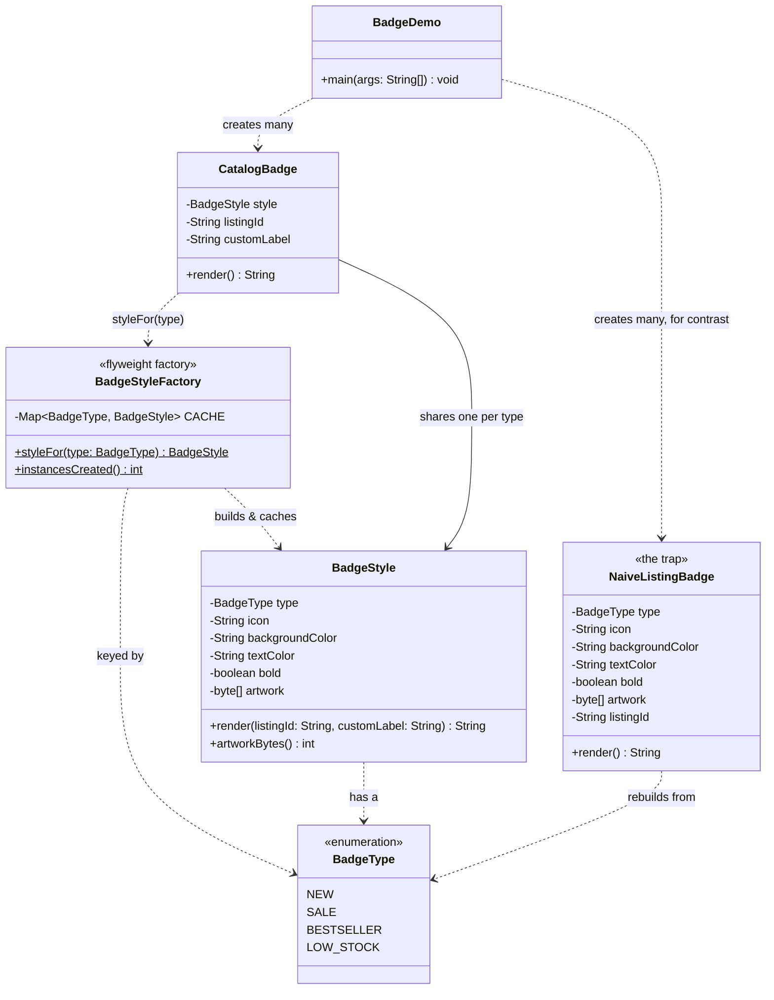

# Flyweight Pattern — Class Diagram

Shows the static structure: many `CatalogBadge` contexts, each holding its
own extrinsic state, all pointing at a small, shared pool of `BadgeStyle`
flyweights handed out by `BadgeStyleFactory`. `NaiveListingBadge` is drawn
alongside as the shape that shares nothing.

Mermaid source

## Notes

- `BadgeStyle` is the **Flyweight**: every field on it is intrinsic state —
  identical for every listing of the same `BadgeType` — and its one method
  takes the extrinsic state (`listingId`, `customLabel`) as parameters
  instead of storing them.
- `BadgeStyleFactory` is the **flyweight factory**: it is the only place a
  `BadgeStyle` is constructed, and its cache is why one hundred thousand
  `CatalogBadge`s share as few as four `BadgeStyle` instances.
- `CatalogBadge` is the **context**: cheap to create in any quantity,
  because the field that would be expensive — `BadgeStyle` — is a shared
  reference, not owned state.
- `NaiveListingBadge` has the identical fields `BadgeStyle` has, but one full
  copy *per instance* — there is no factory in front of it, so nothing is
  ever shared.
