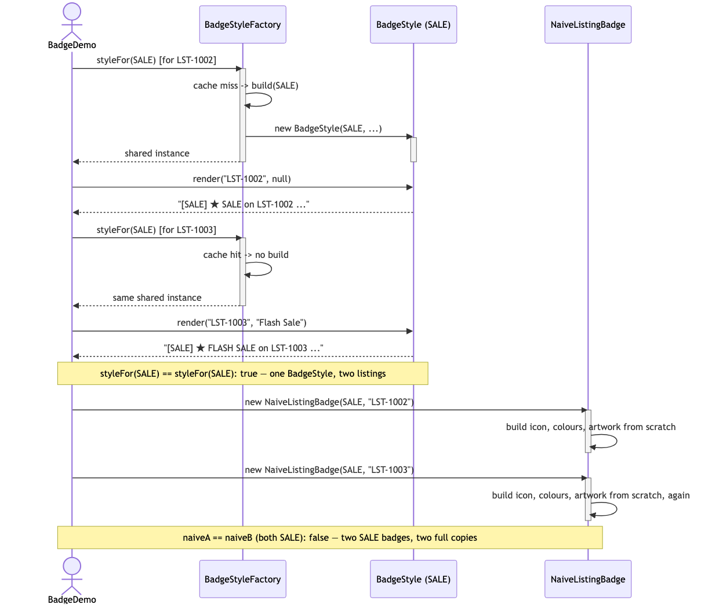
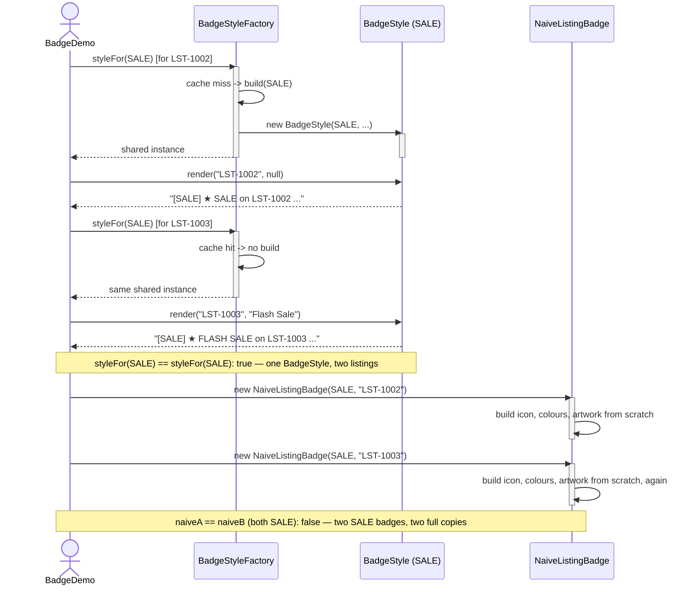

# Flyweight Pattern — UML Sequence Diagram

Shows the runtime interaction: two different listings ask for a `SALE`
badge, the factory builds the shared `BadgeStyle` only on the first request,
and both listings render through the same instance. The naive path is shown
alongside for contrast — no factory, no cache, no sharing.

Mermaid source

## Notes

- The **second** `styleFor(SALE)` call does no construction at all — the
  cache hit is the entire point of routing every lookup through
  `BadgeStyleFactory` instead of calling `new BadgeStyle(...)` directly.
- Both listings render through the *same* `BadgeStyle` object, passing their
  own `listingId` and `customLabel` as arguments — the extrinsic state never
  touches the shared instance.
- The naive path on the right has no factory step at all: every
  `NaiveListingBadge` repeats the full construction, because there is
  nowhere for a cache to intercept the call.
