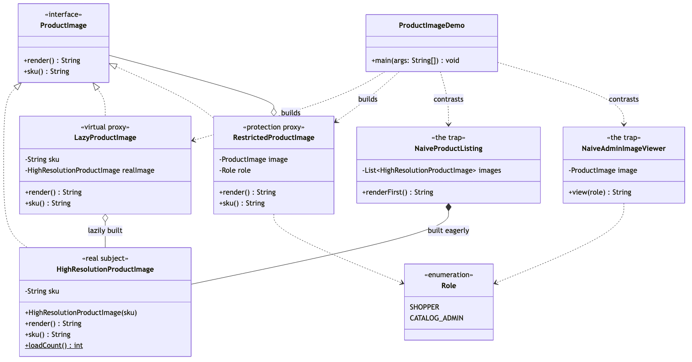

# Proxy Pattern

Demonstrates the Structural **Proxy** design pattern using a product listing
backed by expensive full-resolution images as an example.

- `ProductImage` — the subject. The interface the real image and every stand-in
  share: `render()` returns a `String`, `sku()` returns a `String`.
- `HighResolutionProductImage` — the real subject. The expensive object being
  stood in for; its constructor increments a static load count, which is
  how the demo and the tests can prove when a load did or did not happen.
- `LazyProductImage` — a virtual proxy. Holds only a SKU until `render()`
  is called for the first time, then builds the `HighResolutionProductImage` and
  caches it. `sku()` answers from the proxy's own field, so a cheap
  question never triggers an expensive load.
- `RestrictedProductImage` — a protection proxy. Refuses `render()`
  for anything but `Role.CATALOG_ADMIN`, throwing before the call reaches the
  image it wraps. It takes a `ProductImage`, not a `HighResolutionProductImage`, which
  is what lets it wrap a `LazyProductImage` and get both behaviours at once.
- `Role` — the two-value enum the protection proxy checks.
- `NaiveProductListing` / `NaiveAdminImageViewer` — the trap, kept for
  contrast. One eagerly loads every image in its constructor; the other
  writes the role check inline, where the next screen has to copy it.
- `ProductImageDemo` — runnable entry point that contrasts eager loading
  with lazy loading, shows the protection proxy allowing an admin and
  refusing a shopper, composes the two proxies, and ends on the naive
  alternative for comparison.

## Run

```bash
./gradlew run
```

Which prints:

```text
== Naive listing -- eagerly loads every image, even ones never scrolled to ==
Images loaded eagerly, before rendering anything: 3
Naive listing render: Rendering SKU-1042 hero image (1920x1080)

== Virtual proxy -- loads an image only when it's actually rendered ==
Images loaded so far (real subject not yet touched): 0
Proxy render: Rendering SKU-1042 hero image (1920x1080)
Images loaded after first render: 1
Proxy render (again): Rendering SKU-1042 hero image (1920x1080)
Images loaded after second render (unchanged -- cached): 1

== Protection proxy -- controls access to render() based on role ==
Catalog admin can render: Rendering SKU-2087 hero image (1920x1080)
Shopper denied: Only catalog admins may view SKU-2087

== Composing proxies -- protection proxy wrapping a virtual proxy ==
Total images loaded so far: 2 -- SKU-9001 is not among them yet, still lazy
Admin render through both proxies: Rendering SKU-9001 hero image (1920x1080)
Total images loaded after admin render: 3

== The naive alternative for access control, for comparison ==
Naive viewer denied: Only catalog admins may view SKU-9001
Same check, duplicated in every screen that needs it -- a protection proxy centralises it once, for any ProductImage.
```

Expected output:

```
== Naive listing -- eagerly loads every image, even ones never scrolled to ==
Images loaded eagerly, before rendering anything: 3
Naive listing render: Rendering SKU-1042 hero image (1920x1080)

== Virtual proxy -- loads an image only when it's actually rendered ==
Images loaded so far (real subject not yet touched): 0
Proxy render: Rendering SKU-1042 hero image (1920x1080)
Images loaded after first render: 1
Proxy render (again): Rendering SKU-1042 hero image (1920x1080)
Images loaded after second render (unchanged -- cached): 1

== Protection proxy -- controls access to render() based on role ==
Catalog admin can render: Rendering SKU-2087 hero image (1920x1080)
Shopper denied: Only catalog admins may view SKU-2087

== Composing proxies -- protection proxy wrapping a virtual proxy ==
Total images loaded so far: 2 -- SKU-9001 is not among them yet, still lazy
Admin render through both proxies: Rendering SKU-9001 hero image (1920x1080)
Total images loaded after admin render: 3

== The naive alternative for access control, for comparison ==
Naive viewer denied: Only catalog admins may view SKU-9001
Same check, duplicated in every screen that needs it -- a protection proxy centralises it once, for any ProductImage.
```

## Test

```bash
./gradlew test
```

6 test classes, covering the real subject and its load counting
(`HighResolutionProductImageTest`), lazy construction and caching
(`LazyProductImageTest`), the role check and the fact that denial happens before
any load (`RestrictedProductImageTest`), the two naive alternatives
(`NaiveProductListingTest`, `NaiveAdminImageViewerTest`), and the demo's
printed output (`ProductImageDemoTest`).

## Learning Material

Start here if you are new to the pattern — the docs are ordered as a
learning path.

| Document | What it covers |
| --- | --- |
| [`docs/prerequisites.md`](docs/prerequisites.md) | What to know and install before you start |
| [`docs/problem-statement.md`](docs/problem-statement.md) | The problem the pattern solves, and why the naive approach hurts |
| [`docs/proxy-pattern-explained.md`](docs/proxy-pattern-explained.md) | The pattern itself, the code walked through, pitfalls, and comparisons |
| [`docs/class-diagram.md`](docs/class-diagram.md) | Static structure |
| [`docs/uml-diagram.md`](docs/uml-diagram.md) | Runtime call flow |
| [`docs/animation.html`](docs/animation.html) | Animated, step-by-step walkthrough — open in a browser. Optional narration via the **Narration** button |
| [`docs/session.md`](docs/session.md) | A 60-minute guided session plan for teaching it |
| [`docs/youtube.md`](docs/youtube.md) | Title, description, chapters and thumbnail for publishing the video |
| [`docs/thumbnail.png`](docs/thumbnail.png) | The 1280×720 image to upload as the YouTube thumbnail |
| [`docs/spec.md`](docs/spec.md) | The project specification — problem, code, video and publishing quality bar. Also as [`spec.html`](docs/spec.html) |
| [`video/`](video/) | A narrated ~7.5 minute video, plus the script and build pipeline |

### The pattern in one picture



### Video

`video/proxy-pattern-explained.mp4` — 1080p, ~7.5 minutes, narrated.
An audio-only version is alongside it. See
[`video/README.md`](video/README.md) to rebuild or re-record it.
