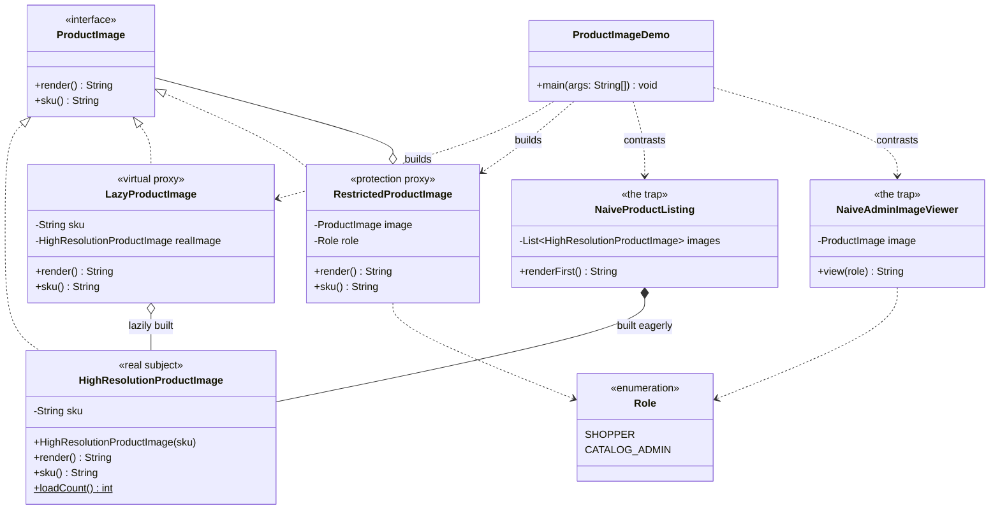

# Proxy Pattern — Class Diagram

Shows the static structure: `HighResolutionProductImage` and both proxies
implement the shared `ProductImage` interface identically. `LazyProductImage` holds
nothing but a SKU until it needs to build the real subject;
`RestrictedProductImage` holds any `ProductImage` — including another proxy —
by composition, which is what lets the two proxies stack. The naive traps
that skip each proxy are drawn alongside to show what the pattern buys you.

Mermaid source

## Notes

- `ProductImage` is the **Subject**: the interface the real image and every proxy
  implement identically. Client code depends only on this.
- `HighResolutionProductImage` is the **Real Subject**: expensive to construct,
  modelled with a static load counter rather than an actual delay.
- `LazyProductImage` is a **virtual proxy**: it holds only a SKU until
  `render()` is first called, at which point it builds and caches the
  real subject.
- `RestrictedProductImage` is a **protection proxy**: it holds *any*
  `ProductImage` — a real one or another proxy — and only delegates if the role
  check passes.
- `NaiveProductListing` and `NaiveAdminImageViewer` share no relationship
  with the proxies — each re-implements, inline, the exact concern its
  corresponding proxy was built to centralise.
