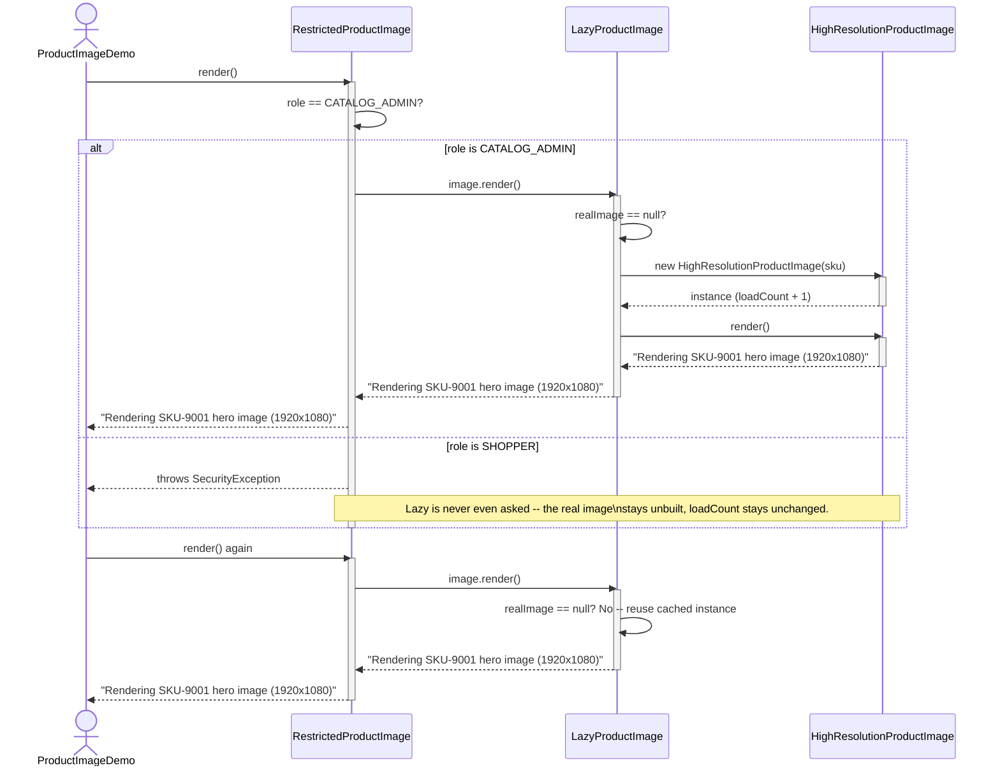

# Proxy Pattern — UML Sequence Diagram

Shows the runtime interaction for the composed case: an
`RestrictedProductImage` wrapping a `LazyProductImage` wrapping the real
`HighResolutionProductImage`. The role check happens first, and the expensive
load only happens if it passes — and only on the first call.

Mermaid source

## Notes

- The client makes exactly **one** call, `render()`, on the outermost
  proxy. It never touches `LazyProductImage` or `HighResolutionProductImage` directly.
- `RestrictedProductImage` checks the role *before* delegating —
  if the check fails, the call never reaches `LazyProductImage`, so the
  expensive real subject is never built, however many times a denied
  shopper tries.
- `LazyProductImage` checks `realImage == null` on every `render()` call. The
  first call builds and caches the real subject; every call after that
  reuses it, with no further construction cost.
- Two independent decisions — "is this allowed?" and "has this been built
  yet?" — happen in two independent classes, each unaware the other
  exists. That is what makes the composition possible without either
  proxy special-casing the other.
