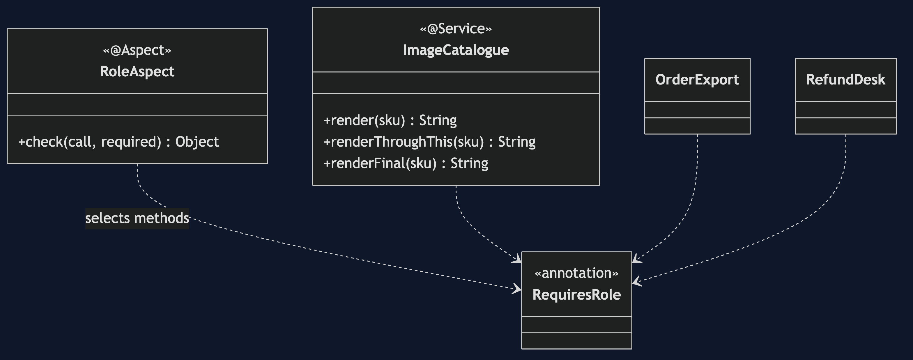
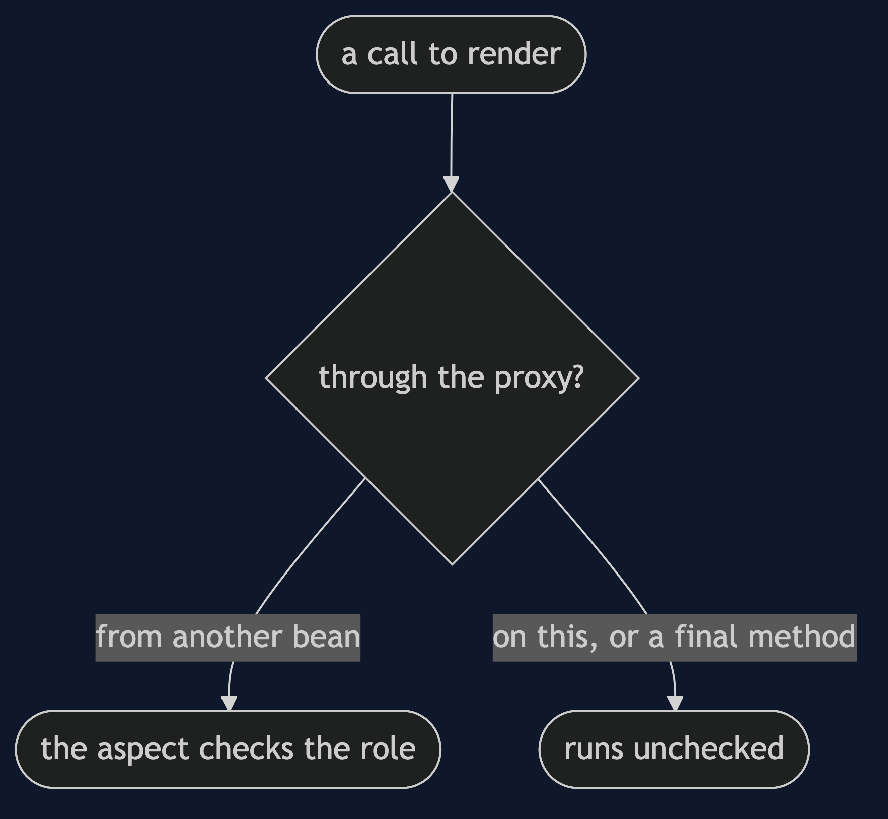
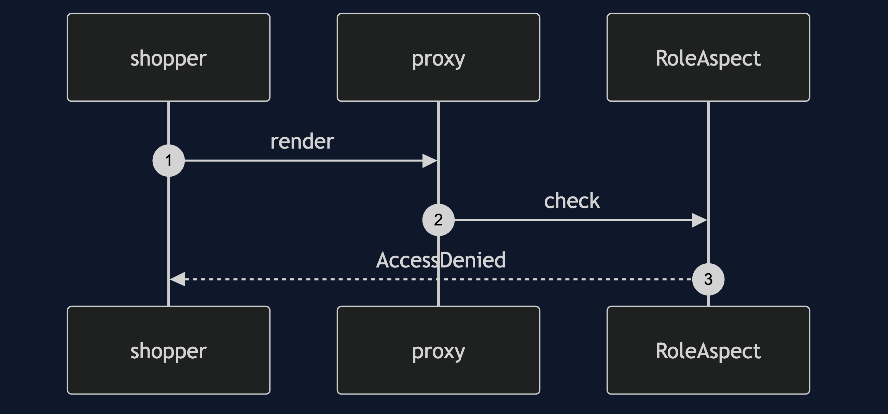
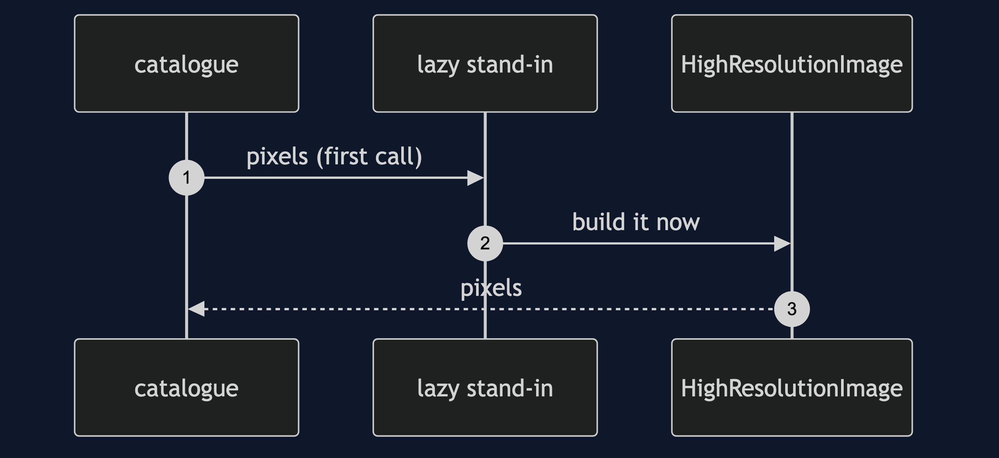

# Proxy with Spring Pattern

```
src/main/java/com/jk/explore/proxyspring/
├── ImageApplication.java        the Spring Boot entry point and the six acts
├── RoleAspect.java              the protection proxy, written once
├── RequiresRole.java  Role.java  AccessDenied.java  Session.java
├── ImageCatalogue.java          a bean with protected and unprotected methods
├── HighResolutionImage.java     the costly real subject, @Lazy
└── OrderExport.java  RefundDesk.java    two more beans, protected by the same aspect
```

**Spring generates the proxy and runs your aspect on each call. Only calls that go through the proxy are covered.**

This project is the framework version of [Proxy](../proxy-pattern). That project built the mechanism by hand. This one shows the same idea inside Spring Boot. It does not re-teach the pattern. It shows what Spring Boot adds, the failures that are its own, and what it costs.

## Run

```bash
./gradlew run
```

Six acts. The partner project, Proxy, built the mechanism by hand. Here the same idea runs through Spring Boot, and every count comes from real output.

```
ONE. The bean is not your class.
  is a generated proxy: true
  its class is a subclass of ImageCatalogue: true
  the class Spring wrapped: ImageCatalogue
TWO. Protection, written once.
  admin: full-resolution pixels of MUG-BLUE
  shopper: refused: render needs CATALOG_ADMIN but the caller is SHOPPER
THREE. Lazy loading.
  after startup: 0 images loaded.
  a cheap question, owner(): catalogue. images loaded: 0.
  after the first render: 1 image loaded.
FOUR. One aspect, three screens.
  catalogue: refused: render needs CATALOG_ADMIN but the caller is SHOPPER
  export: refused: exportAll needs CATALOG_ADMIN but the caller is SHOPPER
  refunds: refused: refund needs CATALOG_ADMIN but the caller is SHOPPER
  the check was written once, in RoleAspect.
FIVE. A call on this skips the proxy.
  render, called from outside: refused: render needs CATALOG_ADMIN but the caller is SHOPPER
  renderThroughThis, a shopper: full-resolution pixels of MUG-BLUE
  the shopper got the image. nothing was logged.
SIX. A final method is not proxied.
  renderFinal, a shopper: NullPointerException: the proxy instance has no fields of its own
```

## Test

```bash
./gradlew test
```

2 test classes, 7 test methods, offline, with each Spring context started inside the test, and no server.

## Technologies and versions

| What | Version | Why it is here |
| --- | --- | --- |
| Java | 21 | The repository standard, via the Gradle toolchain block |
| Gradle | 9.2.1 | The wrapper in this directory; no separate install needed |
| Spring Boot | 4.1.1 | The container and its proxy support |
| spring-boot-starter-aspectj | 4.1.1 | `@Aspect` and `@Around` |
| JUnit 5 | 5.10.2 | Test runner |

See [`docs/dependencies.md`](docs/dependencies.md).

## Learning Material

| Document | What it covers |
| --- | --- |
| [`docs/problem-statement.md`](docs/problem-statement.md) | The partner's proxies, and what is new |
| [`docs/proxy-with-spring-pattern-explained.md`](docs/proxy-with-spring-pattern-explained.md) | A generated proxy, and two ways past it |
| [`docs/class-diagram.md`](docs/class-diagram.md) | The types |
| [`docs/architecture-diagram.md`](docs/architecture-diagram.md) | Caller, generated proxy, real bean |
| [`docs/data-flow-diagram.md`](docs/data-flow-diagram.md) | A call that goes through the proxy, and one that does not |
| [`docs/sequence-diagram.md`](docs/sequence-diagram.md) | Written for a listener with the screen off |
| [`docs/uml-diagram.md`](docs/uml-diagram.md) | Four sequences |
| [`docs/animation.html`](docs/animation.html) | The six acts in a browser |
| [`docs/prerequisites.md`](docs/prerequisites.md) | What you need to know |
| [`docs/session.md`](docs/session.md) | A one-hour taught session |
| [`docs/spec.md`](docs/spec.md) | The generated specification |
| [`docs/youtube.md`](docs/youtube.md) | Title, description and chapters |
| [`docs/dependencies.md`](docs/dependencies.md) | What Spring Boot is, what it costs, and that skipping this project loses none of the pattern |

### The pattern in one picture



### Where each piece sits


### How one request moves



### Who calls whom, in order


### All four sequences






### Video

Built from [`video/scenes.py`](video/scenes.py) by
[`video/build_video.sh`](video/build_video.sh). The rendered file is not
committed; see the repository README for why.

## Where you have already met this

Every `@Transactional` method. It is a proxy that opens and closes the transaction around your call.

## When this is too much

For one class with one rule, a hand-written wrapper is easier to read than an aspect.

## Where this sits

This project pairs with [Proxy](../proxy-pattern), and is a framework version in [`structural`](..).
