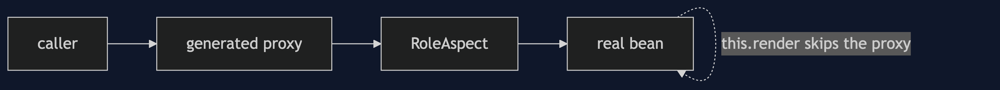
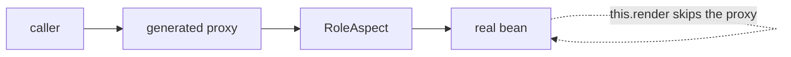

# Proxy with Spring Pattern — Architecture Diagram

A generated proxy sits between every caller and the real bean.

Mermaid source

```mermaid
flowchart LR
    C["caller"] --> P["generated proxy"]
    P --> A["RoleAspect"]
    A --> B["real bean"]
    B -.->|this.render skips the proxy| B
```

