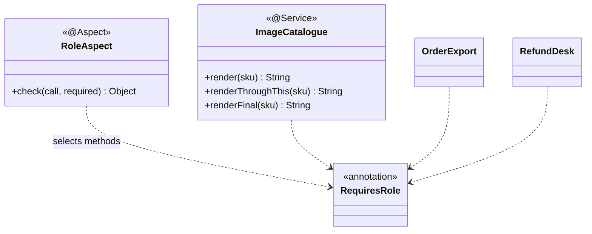

# Proxy with Spring Pattern — Class Diagram

The aspect is the protection proxy. The beans only carry the annotation.

Mermaid source

```mermaid
classDiagram
    class RoleAspect {
        <<@Aspect>>
        +check(call, required) Object
    }
    class RequiresRole {
        <<annotation>>
    }
    class ImageCatalogue {
        <<@Service>>
        +render(sku) String
        +renderThroughThis(sku) String
        +renderFinal(sku) String
    }
    class OrderExport
    class RefundDesk
    RoleAspect ..> RequiresRole : selects methods
    ImageCatalogue ..> RequiresRole
    OrderExport ..> RequiresRole
    RefundDesk ..> RequiresRole
```

