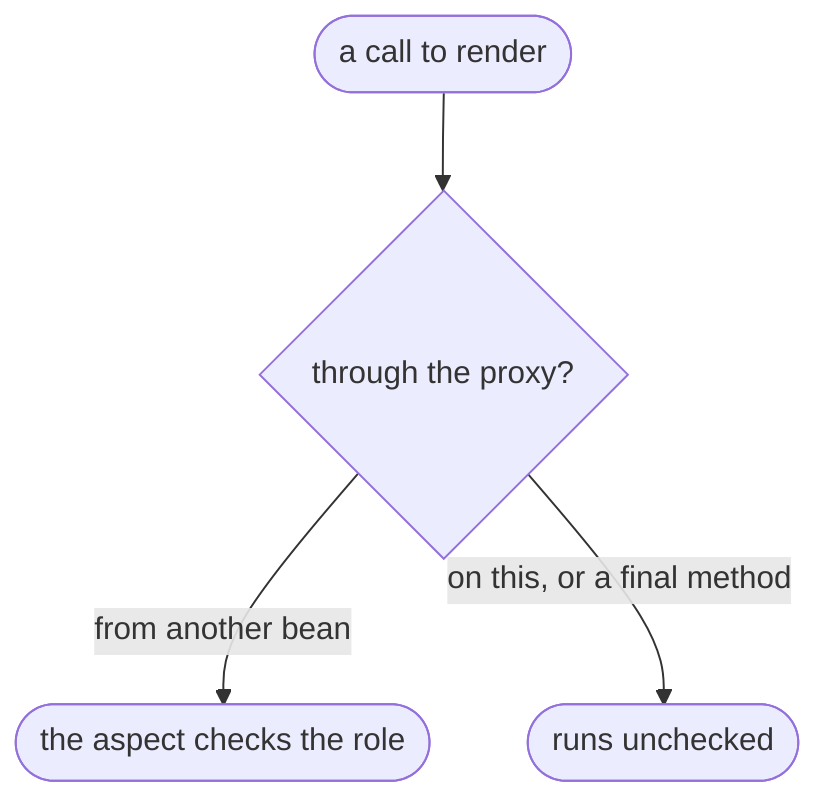

# Proxy with Spring Pattern — Data Flow Diagram

Whether a call is checked.

Mermaid source

```mermaid
flowchart TD
    Call(["a call to render"])
    Via{"through the proxy?"}
    Checked(["the aspect checks the role"])
    Free(["runs unchecked"])
    Call --> Via
    Via -- from another bean --> Checked
    Via -- on this, or a final method --> Free
```

