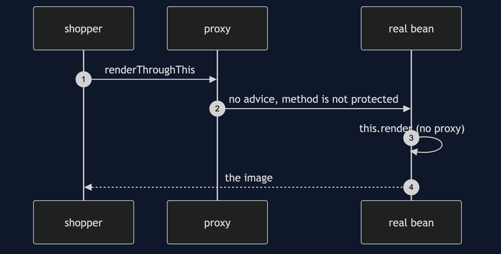
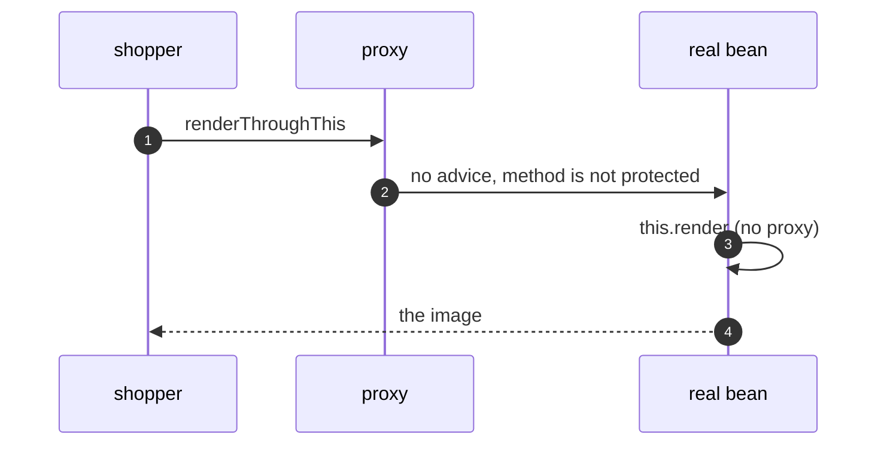

# Proxy with Spring Pattern — Sequence Diagram

Written for a listener with the screen off.

Say it in words. A shopper calls a method on the catalogue that is not protected, and that method calls its own protected method on this. The call goes straight to the real object. It never passes through the generated proxy, so the aspect never runs, and the shopper receives the image.

Mermaid source

The load-bearing sentence: **a call on this never meets the aspect.**
