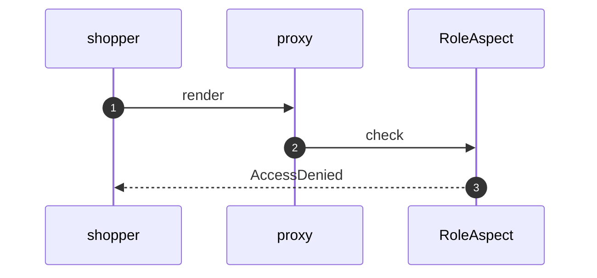
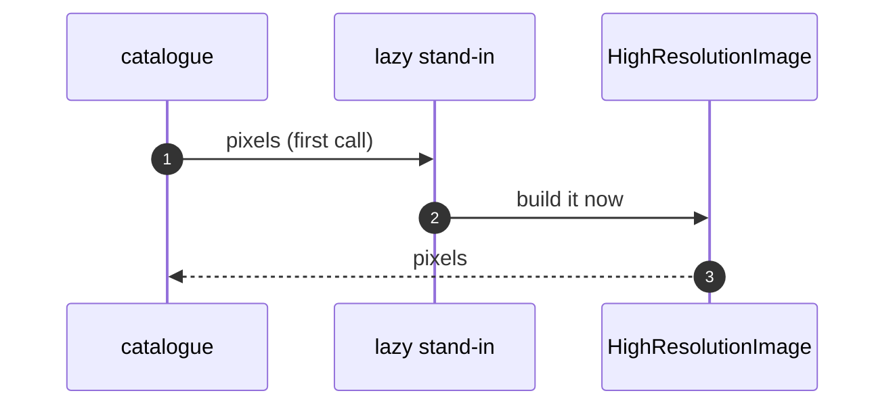

# Proxy with Spring Pattern — UML Sequence Diagrams

Four sequences.

## 1. A Refused Call

Mermaid source

```mermaid
sequenceDiagram
    autonumber
    participant S as shopper
    participant P as proxy
    participant A as RoleAspect
    S->>P: render
    P->>A: check
    A-->>S: AccessDenied
```

## 2. A Lazy Image

Mermaid source

```mermaid
sequenceDiagram
    autonumber
    participant C as catalogue
    participant L as lazy stand-in
    participant I as HighResolutionImage
    C->>L: pixels (first call)
    L->>I: build it now
    I-->>C: pixels
```

