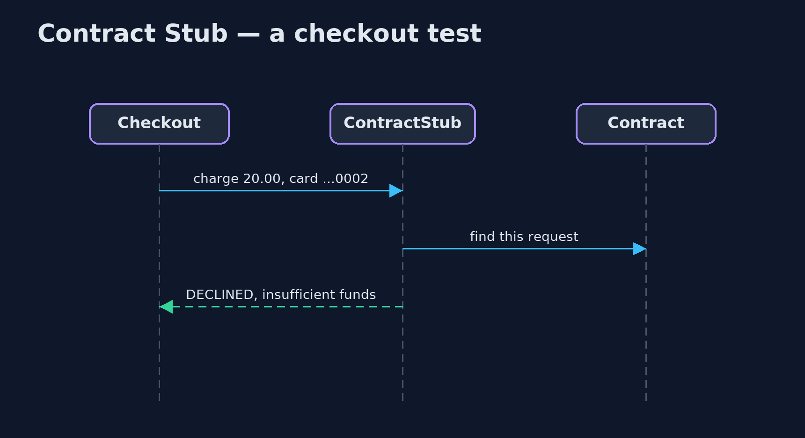

# Contract Stub Pattern

```
src/main/java/com/jk/explore/contractstub/
├── Checkout.java            The consumer: checkout charges the card and reads the payment service's reply
├── Contract.java            The contract between checkout and payments, written once and used on both sides: checkout tests run against a stub made from it, and the payment service is checked against it
├── ContractStub.java        The pattern: a stub made from the contract
├── ContractStubDemo.java    The five acts: a hand-written stub that drifted, a stub made from the contract, the provider checked against the same contract, a strict stub, and the bill
├── HandWrittenStub.java     Before: the checkout team's own stub, written once from the payment docs and never checked again
├── Interaction.java         One agreed exchange: for this request, the provider replies with this
├── PaymentProvider.java     The payment service as checkout sees it: a request of named fields in, a reply of named fields out, the way a JSON call over HTTP would look
├── ProviderVerifier.java    The other half: replays every interaction in the contract against the real provider, in the provider's own build, and reports each reply that differs
└── RealPaymentService.java  The payment team's real service
```

**Make the stub your tests use from the same written contract that the real service is checked against, so the stub and the real service can never quietly drift apart.**

Contract Stub is a testing pattern for services that call other services.
To test checkout without calling the real payment service, teams use a stub:
a stand-in that returns canned replies. The danger is that a hand-written stub
is only as correct as the day it was written. When the real service changes,
the stub does not, and the tests stay green while production breaks.

A contract stub is made from a written contract: a list of agreed requests
and replies. The consumer's tests run against a stub built from that
contract, and the provider's own build replays the same contract against the
real service. If the real service stops matching, its build fails, before the
change reaches anyone.

## The idea in everyday terms

Think of a fire drill that uses the building's real floor plan. If the drill
used an old copy of the plan, everyone would practise walking to an exit that
has since been bricked up. A contract stub is a drill that is always run from
the current plan, and the builders are not allowed to change the building
without updating the plan.

## The scenario

The online store's checkout team tested against their own hand-written stub
of the payment service. The payment team released version 2, which renamed
the reply field "result" to "outcome". The checkout tests stayed green,
because the stub still said "result", and in production every payment left
the order stuck.

## Run

```bash
./gradlew run
```

The demo tells the story in 5 acts, each printing exact numbers that the tests check:

| Act | What it shows |
| --- | --- |
| 1. A stub that drifted | Against the hand-written stub, checkout confirms the order; against payment version 2, which renamed result to outcome, the order is stuck. |
| 2. A stub made from the contract | The contract lists 3 interactions; the stub made from it gives checkout: confirmed, declined for no funds, rejected for a zero amount. |
| 3. The provider is checked too | Replayed against payments version 1, 3 of 3 interactions match; against version 2, 0 of 3, so the rename fails the payment team's build. |
| 4. A strict stub | A charge in USD: the hand-written stub approves it; the contract stub refuses it, because no interaction covers it. |
| 5. The bill | Both teams must share, version and run the contract; it covers only the listed interactions, not speed or the real network. |

## Test

```bash
./gradlew test
```

5 tests in `ContractTest`, `DemoRunsTest`. Every number the demo prints is asserted, and nothing depends on the clock, so every run gives the same result.

## Technologies and versions

| Technology | Version | Used for |
| --- | --- | --- |
| Java | 21 | the code (toolchain set in `build.gradle`) |
| Gradle | 9.2.1 (wrapper) | build and run, nothing to install |
| JUnit | 5.10.2 | the tests |
| videokit | repository tool | the narrated video and animation: Piper `en_US-amy-medium`, speed 0.8, longer pauses (the approved `amy-slow` voice) |

## Learning Material

| Document | What it is for |
| --- | --- |
| [Problem statement](docs/problem-statement.md) | the situation and what the project must show |
| [Prerequisites](docs/prerequisites.md) | what you need to know first |
| [Contract Stub, explained](docs/contract-stub-pattern-explained.md) | the acts in prose |
| [Session guide](docs/session.md) | a one-hour lesson with exercises |
| [Animated walkthrough](docs/animation.html) | the acts step by step, narrated |
| [Spec](docs/spec.md) | what this project must be true of |

### The pattern in one picture

One contract, used on both sides.


### Where each piece sits

Stub and verifier share the contract.


### How the data moves

Caught in the provider's build, not in production.


### Who calls whom, in order

The stub answers from the contract.



### Video

`video/contract-stub-pattern-explained.mp4` (with `.m4a` audio and `.srt` subtitles) is built by `video/build_video.sh`. Rendered media is not committed.

## What it costs

- **Shared work.** Both teams must share and version the contract, and run it in both builds.
- **Only what is listed.** The contract covers its interactions, not the ones nobody wrote down, and says nothing about speed or the real network.
- **A strict stub.** Any request not in the contract fails, so new needs must be agreed before they can be tested.

## When this is too much

When one team owns both sides and deploys them together, an ordinary
integration test is simpler. Contract stubs pay off when separate teams
release separately and a mismatch would only show in production.

## Where you have already met this

- Spring Cloud Contract, which generates WireMock stubs from contracts.
- Pact, whose consumer tests produce the contract the provider verifies.
- OpenAPI-based mock servers checked against the real service.

## Where this sits

This project is in [testing-design-patterns](..). The
[Consumer-Driven Contract](../../platform-design-patterns/consumer-driven-contract-pattern)
project shows who writes the contract; this one focuses on the stub made from
it.
