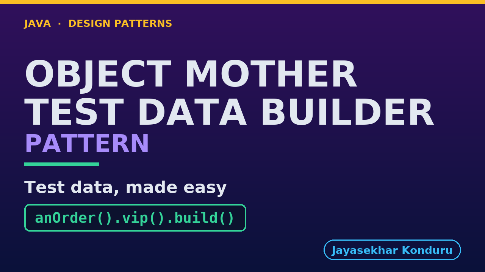

# YouTube — Object Mother Pattern

Everything needed to publish `video/object-mother-pattern-explained.mp4`. Copy the fields straight out of this file.

Chapter timings are generated from the video's `.srt`. Re-run `python3 docs/make_youtube_docs.py object-mother` after any change to the narration, or they will be wrong.

## Title

```
Object Mother and Test Data Builder
```

35 characters — under the 60 YouTube shows before truncating in search results.

## Description

The first two lines are what a viewer sees above the fold, so they carry the hook rather than the boilerplate.

```
Object Mother and Test Data Builder patterns in Java, explained with an online store's tests. Both help tests create the objects they need: an Object Mother is a class of ready-made objects with clear names, and a Test Data Builder starts from sensible defaults so each test changes only what it cares about, like a chef's shelf of ready-made sauces and a cook making the usual without onions. We watch test data built by hand bury the point, add an Object Mother, see it multiply, and switch to a builder. We finish with the bill: a test should only show the details it depends on.

CHAPTERS
00:00 Introduction
01:20 The Scenario
01:41 Act One — Built by hand
02:18 Act Two — An Object Mother
02:47 Act Three — The mother multiplies
03:14 Act Four — A Test Data Builder
03:52 Act Five — The bill
04:30 The Pattern
04:53 Who Does What
05:18 Where You Have Seen It
05:42 When To Use It
06:05 Thanks for Watching

SOURCE CODE, WRITTEN NOTES AND AN INTERACTIVE ANIMATION
https://github.com/jk-boot-up/java-design-patterns/tree/main/gradle-java/testing-design-patterns/object-mother-pattern

WHAT YOU NEED FIRST
Java 21 and a working knowledge of classes and interfaces. No prior design-pattern knowledge is assumed. The full prerequisites are in docs/prerequisites.md in the repository.
```

## Chapters

YouTube renders these as chapters only if there are at least three and the first is at `00:00`.

```
00:00 Introduction
01:20 The Scenario
01:41 Act One — Built by hand
02:18 Act Two — An Object Mother
02:47 Act Three — The mother multiplies
03:14 Act Four — A Test Data Builder
03:52 Act Five — The bill
04:30 The Pattern
04:53 Who Does What
05:18 Where You Have Seen It
05:42 When To Use It
06:05 Thanks for Watching
```

## Tags

```
object mother, test data builder, unit testing, junit, test fixtures, java, design patterns, java design patterns, gang of four, java 21, software design, clean code, object oriented design, java tutorial, ecommerce, programming tutorial
```

237 characters, under YouTube's 500 limit.

## Thumbnail



**Upload `docs/thumbnail.png`** — 1280×720, the size YouTube recommends, generated by `docs/make_thumbnails.py`. It is deliberately not the same image as the video's opening frame: a thumbnail is judged at about 360 pixels wide in a search result, so this one carries only the pattern name, one line of promise and one short piece of code, each set large enough to survive the shrink.

`video/poster.png` is the 1920×1080 opening frame, produced by the video build. It stays in the repository as the title card; it is not what gets uploaded.

YouTube will not pick the thumbnail up on its own — upload it under **Details → Thumbnail → Upload file**. A custom thumbnail requires a verified channel.

## Upload checklist

- [ ] Upload `video/object-mother-pattern-explained.mp4` (1080p, H.264, 30 fps, AAC 48 kHz — already YouTube's recommended settings, no re-encode needed)
- [ ] Set the video language to **English** first, or the subtitle option may not appear
- [ ] Add subtitles: *Video elements → Add subtitles → Upload file → With timing* → `video/object-mother-pattern-explained.srt`
- [ ] Upload `docs/thumbnail.png` as the thumbnail — do not let YouTube auto-pick a frame
- [ ] Paste the title, description and tags from above
- [ ] Add to the **Java Design Patterns** playlist, in learning order
- [ ] Wait for 1080p processing before sharing the link — code slides are unreadable at 360p

## Cards and end screen

End screen links to whichever pattern video goes up next — set it at upload time rather than assuming an order.

Add a card partway through pointing at the playlist, so a viewer who arrives at this pattern from search can find the rest of the series.

## Runtime

Approximately 06:53, narrated at 145 words per minute.
