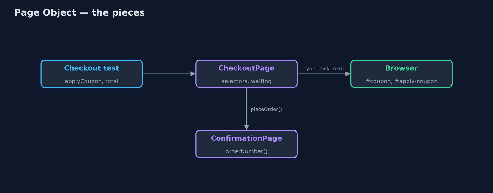
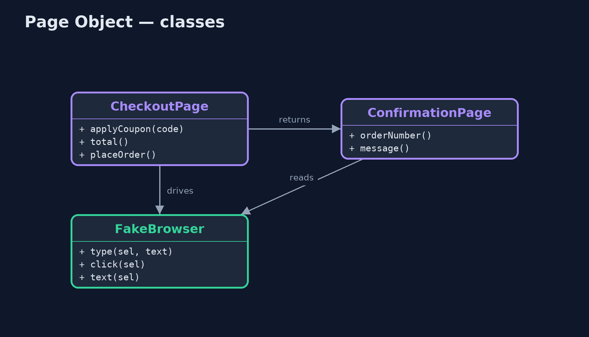
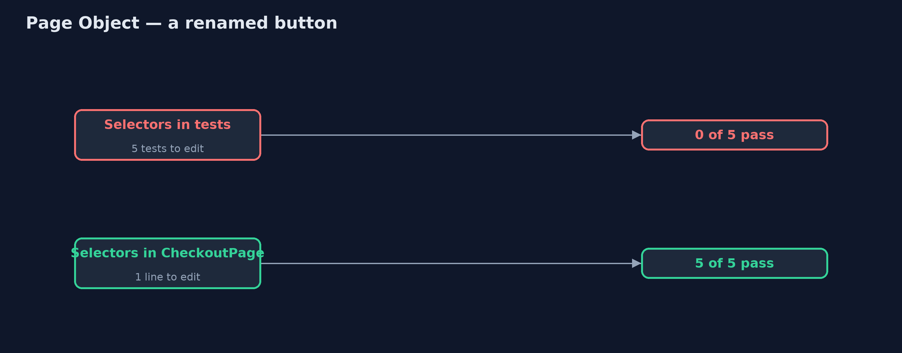
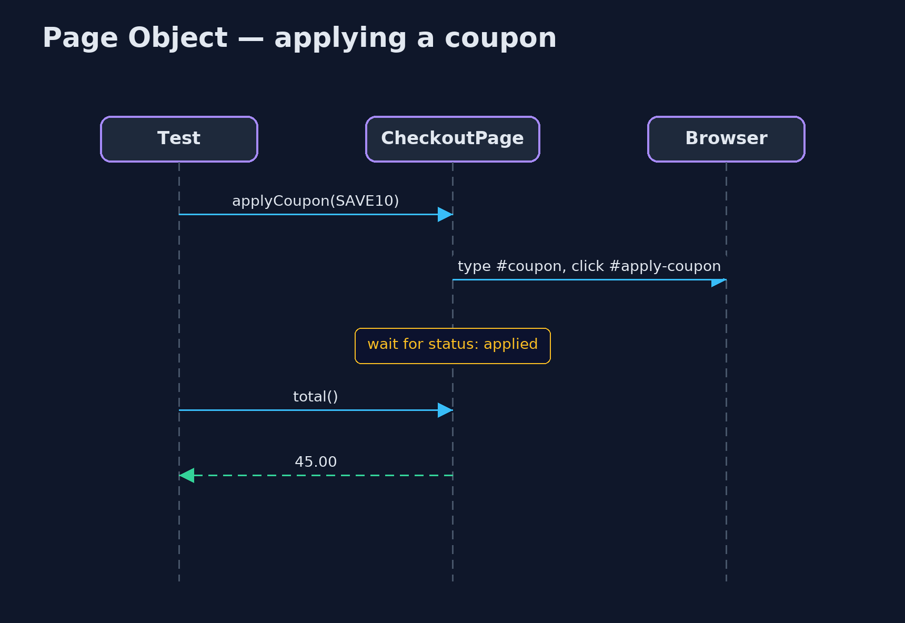

# Page Object Pattern

```
src/main/java/com/jk/explore/pageobject/
├── CheckoutPage.java      The Page Object for the checkout page: the only class that knows its selectors and its timing
├── ConfirmationPage.java  The Page Object for the page shown after placing an order
├── FakeBrowser.java       A tiny stand-in for a real browser driver such as Selenium's WebDriver, showing the store's checkout page
└── PageObjectDemo.java    The five acts: tests full of selectors, a renamed button, the page object, waiting in one place, and the bill
```

**Wrap each page of a web interface in a class that knows its selectors and its timing, so browser tests speak in the shop's words and a page change is fixed in one place.**

Page Object is a pattern for browser tests. A browser test drives the web
page the way a person would: type into this box, click that button, read that
text. Each box and button is found with a selector, such as `#apply-btn`.
When every test names the selectors itself, the tests are hard to read, and
when a designer renames one button, every test that clicks it breaks.

A Page Object is a class for one page. It is the only place that knows the
page's selectors and how long it takes to update. Tests call its methods,
such as `applyCoupon("SAVE10")` and `total()`, and read like a description of
what a shopper does.

## The idea in everyday terms

Think of a hotel guest who asks the concierge for a taxi. The guest does not
need to know the taxi firm's phone number, or that the line is always busy at
six. The concierge knows those details. If the taxi firm changes its number,
only the concierge needs to know. The page object is the concierge.

## The scenario

The online store has automated browser tests for its checkout page. Each test
typed the coupon, clicked `#apply-btn`, and read `#total` itself. Some read
the total before the page had finished updating and saw the old price. Then
the designers renamed the button to `#apply-coupon`, and every coupon test
failed at once.

## Run

```bash
./gradlew run
```

The demo tells the story in 5 acts, each printing exact numbers that the tests check:

| Act | What it shows |
| --- | --- |
| 1. Tests click selectors | A test types the coupon, clicks #apply-btn and reads #total at once: 50.00, because the page had not finished updating. |
| 2. A button is renamed | The designers rename #apply-btn to #apply-coupon: 0 of 5 coupon tests pass, and each must be found and edited. |
| 3. A Page Object | CheckoutPage holds the selectors and waits for updates: one selector changed, 5 of 5 tests pass, and applyCoupon("SAVE10").total() is 45.00. |
| 4. Return the next page | checkout.placeOrder() returns a ConfirmationPage showing ORD-1042 and "Thank you for your order". |
| 5. The bill | Every page needs its object, kept in step with the real page; page objects report, and the checks stay in the tests. |

## Test

```bash
./gradlew test
```

5 tests in `CheckoutPageTest`, `DemoRunsTest`. Every number the demo prints is asserted, and nothing depends on the clock, so every run gives the same result.

## Technologies and versions

| Technology | Version | Used for |
| --- | --- | --- |
| Java | 21 | the code (toolchain set in `build.gradle`) |
| Gradle | 9.2.1 (wrapper) | build and run, nothing to install |
| JUnit | 5.10.2 | the tests |
| videokit | repository tool | the narrated video and animation: Piper `en_US-amy-medium`, speed 0.8, longer pauses (the approved `amy-slow` voice) |

## Learning Material

| Document | What it is for |
| --- | --- |
| [Problem statement](docs/problem-statement.md) | the situation and what the project must show |
| [Prerequisites](docs/prerequisites.md) | what you need to know first |
| [Page Object, explained](docs/page-object-pattern-explained.md) | the acts in prose |
| [Session guide](docs/session.md) | a one-hour lesson with exercises |
| [Animated walkthrough](docs/animation.html) | the acts step by step, narrated |
| [Spec](docs/spec.md) | what this project must be true of |

### The pattern in one picture

Tests never touch selectors.



### Where each piece sits

One class per page.



### How the data moves

Five edits, or one.



### Who calls whom, in order

The page object waits so the test does not.



### Video

`video/page-object-pattern-explained.mp4` (with `.m4a` audio and `.srt` subtitles) is built by `video/build_video.sh`. Rendered media is not committed.

## What it costs

- **Another layer to maintain.** Each page needs its own object, kept in step with the real page.
- **Bloat.** Page objects that grow to cover everything become hard to use; split them by page or component.
- **Checks belong in tests.** A page object reports what the page shows; if it starts deciding what is correct, tests lose their meaning.

## When this is too much

For one or two throwaway checks of a page, the extra class is not worth it.
Page objects pay off once several tests use the same page, and the page keeps
changing.

## Where you have already met this

- Selenium's documentation recommends page objects.
- Playwright and Cypress projects organised into page or component classes.
- The Screenplay pattern, a later refinement built around actors and tasks.

## Where this sits

This project is in [testing-design-patterns](..), next to
[Object Mother / Test Data Builder](../object-mother-pattern), which hides how
test data is made, where this one hides how a page is driven.
