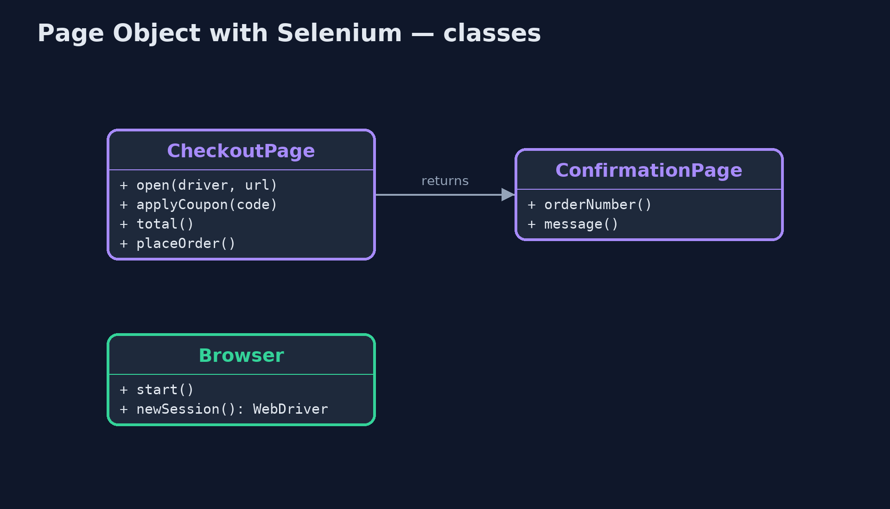
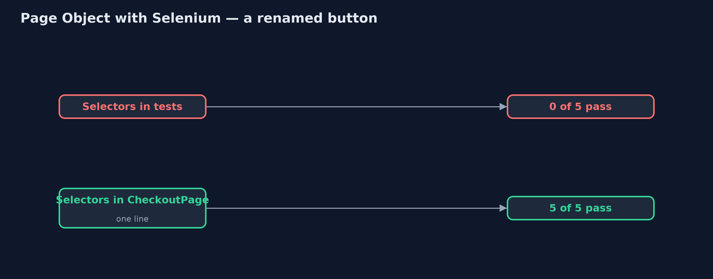
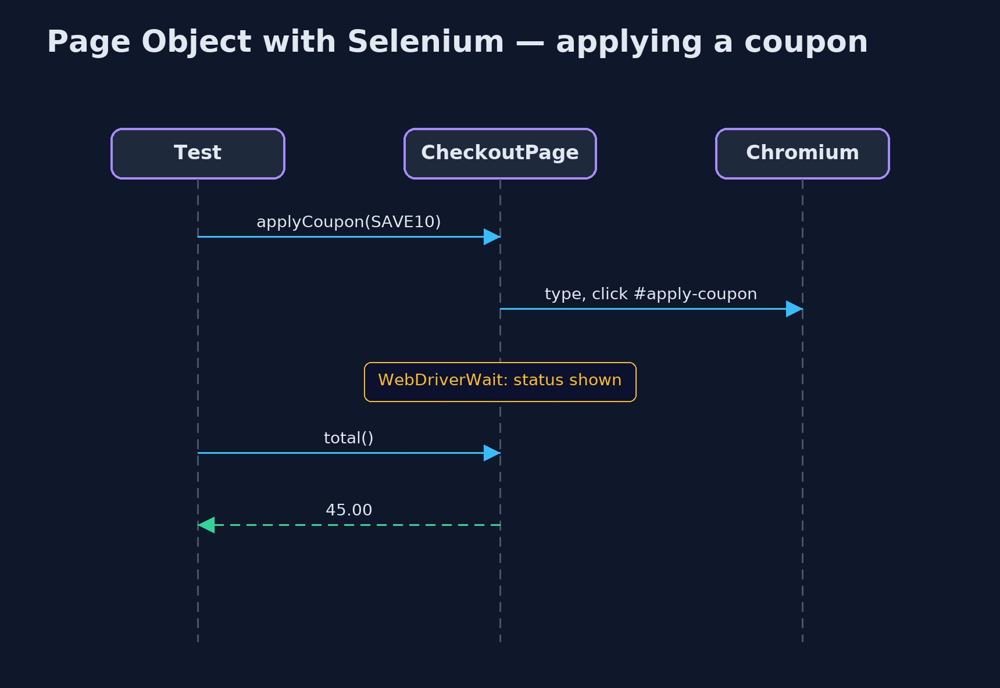

# Page Object with Selenium Pattern

```
src/main/java/com/jk/explore/pageobjectselenium/
├── Browser.java                 A real Chromium browser with a WebDriver server, in a container that this demo starts and stops
├── CheckoutPage.java            The Page Object for the checkout page: the only class that knows its selectors and its timing
├── ConfirmationPage.java        The Page Object for the page shown after placing an order
├── SeleniumPageObjectDemo.java  The five acts: a real Chromium browser, driven by Selenium, on the shop's real checkout page
└── ShopSite.java                The shop's checkout and confirmation pages, served over HTTP
```

**Drive the shop's real checkout page in a real Chromium browser with Selenium WebDriver, and wrap each page in a page object that knows its selectors and waits for the page, so tests speak in shop terms.**

This is the real-browser version of the Page Object pattern. The plain Java
version, a separate project in this category, drives a pretend browser in
memory. Here Selenium WebDriver drives a real Chromium browser, started in a
container by the demo itself, against the shop's checkout page, which the
demo serves over HTTP. Applying a coupon updates the total from JavaScript a
moment later, exactly the kind of timing that trips up browser tests.

`CheckoutPage` is the page object: the only class that knows the page's
selectors, and the only place that waits, with Selenium's `WebDriverWait`,
until the page has answered. Tests call `applyCoupon("SAVE10")` and `total()`,
and `placeOrder()` returns the next page's object, `ConfirmationPage`.

## The idea in everyday terms

Think of a hotel guest who asks the concierge for a taxi. The guest does not
need the taxi firm's number, or to know that the line is always busy at six;
the concierge handles both. If the number changes, only the concierge needs to
know.

## The scenario

The online store has automated browser tests for its checkout page. Each test
found the coupon box and the apply button itself and read the total straight
away, sometimes before the page had updated. When the designers renamed the
apply button, every coupon test failed at once.

## Run

This project needs a running container runtime, such as Docker Desktop: the
demo starts a real Chromium 152 browser with its WebDriver server in a
container, and removes it again. Without one, it prints a sentence saying what
to start, rather than failing. The first run downloads a large image.

```bash
./gradlew run
```

The demo tells the story in 5 acts, each printing exact numbers that the tests check:

| Act | What it shows |
| --- | --- |
| 1. Selectors in the test | In a real browser, a test types the coupon, clicks #apply-btn and reads #total at once: 50.00, before JavaScript updated it. |
| 2. A button is renamed | The designers rename the button to #apply-coupon: 0 of 5 raw tests pass, each failing with NoSuchElementException. |
| 3. A Page Object | CheckoutPage holds the selectors and waits with WebDriverWait: one selector changed, 5 of 5 pass, and the total is 45.00. |
| 4. Return the next page | checkout.placeOrder() returns a ConfirmationPage, which shows ORD-1042 and "Thank you for your order". |
| 5. The bill | Every page needs its object; checks stay in the tests; and browser tests are slow, with a real browser and page loads. |

## Test

```bash
./gradlew test
```

2 tests in `DemoRunsTest`. Every result the demo prints is asserted in a real Chromium browser in a container. Waits are Selenium waits for real conditions. Without a container runtime, the browser test is skipped rather than failed.

## What the simulation got right, and what it left out

The plain Java version got the idea right: selectors and timing in one class
per page, tests in shop terms, a rename fixed in one place, and navigation
returning the next page object. What it left out is a real browser. Here the
stale read is real: JavaScript updated the total 300 milliseconds after the
click, and the raw test read 50.00. The renamed button raises Selenium's
NoSuchElementException. And the page object waits with WebDriverWait on a real
condition, the status text, rather than a fixed pause.

## Technologies and versions

| Technology | Version | Used for |
| --- | --- | --- |
| Java | 21 | the code (toolchain set in `build.gradle`) |
| Gradle | 9.2.1 (wrapper) | build and run, nothing to install |
| JUnit | 5.10.2 | the tests |
| Selenium WebDriver | 4.49.0 | driving the browser: findElement, click, WebDriverWait |
| Chromium with Selenium server | 152.0 (container image selenium/standalone-chromium) | the real browser |
| Testcontainers | 2.0.5 | starts and stops the browser container |
| Docker | 24 or later | runs the container |
| JDK HttpServer | Java 21 | serves the shop's checkout and confirmation pages |
| videokit | repository tool | the narrated video and animation: Piper `en_US-amy-medium`, speed 0.8, longer pauses (the approved `amy-slow` voice) |

## Learning Material

| Document | What it is for |
| --- | --- |
| [Dependencies](docs/dependencies.md) | what the framework and infrastructure are, and why they are here |
| [Problem statement](docs/problem-statement.md) | the situation and what the project must show |
| [Prerequisites](docs/prerequisites.md) | what you need to know first |
| [Page Object with Selenium, explained](docs/page-object-with-selenium-pattern-explained.md) | the acts in prose |
| [Session guide](docs/session.md) | a one-hour lesson with exercises |
| [Animated walkthrough](docs/animation.html) | the acts step by step, narrated |
| [Spec](docs/spec.md) | what this project must be true of |

### The pattern in one picture

Tests never touch selectors.


### Where each piece sits

One class per page.



### How the data moves

Five edits, or one.



### Who calls whom, in order

The page object waits so the test does not.



### Video

`video/page-object-with-selenium-pattern-explained.mp4` (with `.m4a` audio and `.srt` subtitles) is built by `video/build_video.sh`. Rendered media is not committed.

## What it costs

- **Slow and heavy.** A real browser in a container, and a real page load for every test.
- **Another layer.** Every page needs its object, kept in step with the real page.
- **Report, don't assert.** Page objects report what the page shows; tests decide whether it is right.

## When this is too much

For one or two checks of a page, the extra class is not worth it, and many
checks are better done without a browser at all. Page objects pay off once
several browser tests share a page that keeps changing.

## Where you have already met this

- Selenium's own documentation, which recommends page objects.
- Playwright and Cypress projects organised into page classes.
- The Screenplay pattern, a later refinement.

## Where this sits

This project is in [testing-design-patterns](..). It is the real-browser
version of the plain Java Page Object project in the same category, which is
left unchanged.
