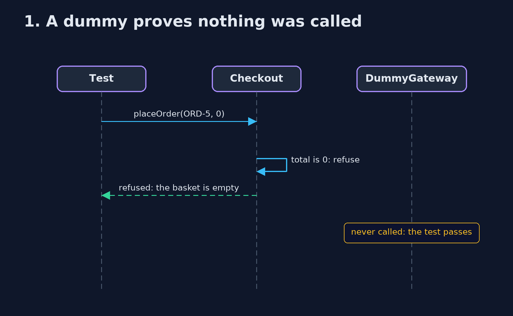
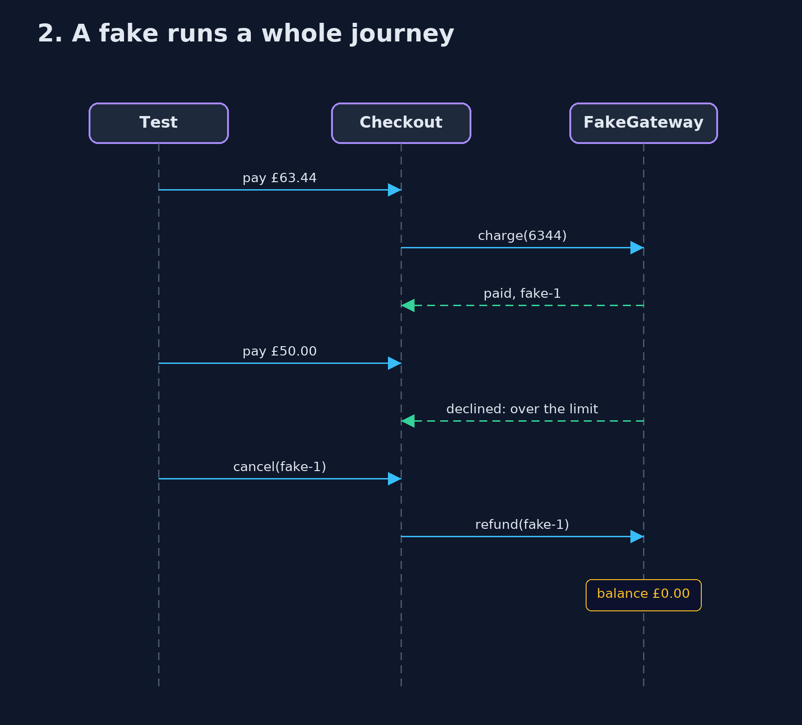

# Test Double Pattern — UML Sequence Diagrams

## 1. 1. A dummy proves nothing was called

The empty basket is refused before checkout reaches the gateway, so the dummy is never touched.

## 2. 2. A fake runs a whole journey

The fake keeps a real balance, so declines and refunds behave like the real provider.

